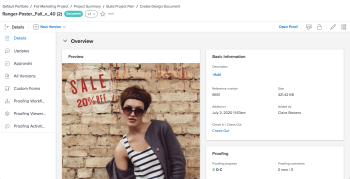

# Document Details overview

The Document Details page lets you view, communicate about, and manage the properties of a document attached to a Adobe Workfront object.

## Open the Document Details page

{{step1-to-documents}}

1. Hover over the document, then click **Document Details**.

   

## Perform basic actions for documents and proofs

You can perform the following actions for both documents and proofsfrom the Document Details page:

* Create a simple or advanced Proof
* Create a new version
* Make an approval decision
* Preview a document
* Edit the document description
* Check in or check out a document

In addition, you can use the More icon  next to the document name to perform the following actions:

* Share
* Move
* Delete
* Download
* Send

## Perform actions specific to proofs

You can perform the following actions from the document details page if your on the proof workflow:

* View Sent, Opened, Comment, Decision (SOCD) details
* Open a proof
* Open the Print Summary
* Lock or unlock a proof
* Edit Proofing Custom Fields

  Proofing Custom Fields must be set up in Workfront Proof. For more information, see [Create and manage custom fields in Workfront Proof](../../workfront-proof/wp-acct-admin/account-settings/create-and-manage-custom-fields.md).
