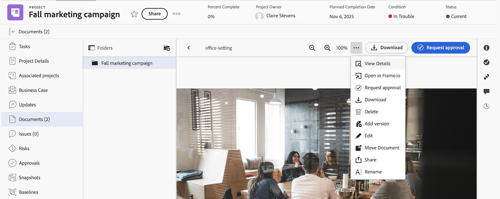

# Document Details overview

{{highlighted-preview}}

The Document Details page lets you view, communicate about, and manage the properties of a document attached to an Adobe Workfront object.

## Legacy documents area

If your organization is on legacy Workfront storage, you will see the legacy documents area when you access documents in Workfront. For more information about legacy Workfront storage, see [Differences between legacy Workfront storage and Adobe cloud storage](/help/quicksilver/review-and-approve-work/esm-overview.md).

### Perform basic actions for documents and proofs

You can perform the following actions for both documents and proofs from the Document Details page:

* Create a simple or advanced Proof
* Create a new version
* Make an approval decision
* Preview a document
* Edit the document description
* Check in or check out a document

In addition, you can use the More icon  next to the document name to perform the following actions:

* Share
* Move
* Delete
* Download
* Send

### Perform actions specific to proofs

You can perform the following actions from the document details page if you are on the proof workflow:

* View Sent, Opened, Comment, Decision (SOCD) details
* Open a proof
* Open the Print Summary
* Lock or unlock a proof
* Edit Proofing Custom Fields

  Proofing Custom Fields must be set up in Workfront Proof. For more information, see [Create and manage custom fields in Workfront Proof](../../workfront-proof/wp-acct-admin/account-settings/create-and-manage-custom-fields.md).

### Open the Document Details page in the legacy documents area

{{step1-to-documents}}

1. Hover over the document, then click **Document Details**.

   

## New Documents area

If your organization uses Adobe cloud storage, you will see the new Documents area when you access documents in Workfront. For more information about Adobe cloud storage, see [Adobe cloud storage overview](/help/quicksilver/review-and-approve-work/esm-overview.md).

You can perform the following actions for documents from the Document Details page:

<table style="border: none; width: 80%; margin: 0 auto;">
<tr style="border: none;">
<td style="border: none; width: 50%; padding-right: 20px;">
<ul>
<li>Open in Frame.io.  You must have a Frame.io enterprise license to use this feature.</li>
<li>Delete a document</li>
<li>Edit a document</li>
</ul>
</td>
<td style="border: none; width: 50%; padding-left: 20px;">
<ul>
<li>Move a document</li>
<li>Send a document to Experience Manager Access</li>
<li>Share a document</li>
</ul>
</td>
</tr>
</table>

### Open the Document Details panel in the new Documents area

1. Go to the project, task, or issue that contains the document, then select **Documents** in the left panel.
1. Select the document, then click **Show Details** in the left sidebar.

   

### View the Print Summary in the new Documents area

After a document has an approval, you can open the Frame.io Print Comments page to view the asset preview, comments, and approval decisions in a printable format.

1. Go to the project, task, or issue that contains the document, then select **Documents** in the left panel.
1. Select the document, then click **Show Details** in the left sidebar.

   

1. In the **Overview** section, click **Open Print Summary**.

>[!NOTE]
>
>The Print summary link only appears after an approval has been added to the document.

