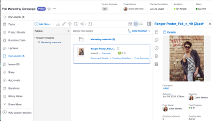

# The Documents area

In the Documents area, you can organize, manage, and view metadata for documents uploaded to Adobe Workfront. You can also see the proof decision.

There are two types of Documents areas. Features and functionality are the same for both:

* **Documents area in a program, portfolio, project, task, or issue:** Lists all documents that you have access to for a particular project, task, or issue. To access this area, click **Documents**  in the left panel while viewing a project, task, or issue.

* **Global Documents area:** Lists all documents that you have access to&nbsp;in Workfront. To access this area, click **Documents**  in the Main Menu .

For information about uploading documents to Workfront, see [Add documents to Adobe Workfront from your file system](../../documents/adding-documents-to-workfront/add-documents-from-file-system.md).

The documents area records a count of the following items:

- Workfront folders
- Files uploaded from the file system
- Files added to Workfront from integrations
- Linked Experience Manager Assets

## Summary panel

When you select a document in the documents area, you can use the Summary on the right to view document Details, manage document updates and approvals, view versions of the document, and add and edit Custom Forms for the document.

If proofing is set up for the document, the Details section includes information such as the proofing due date and current proofing progress.

You can click the Details heading to go to the full Document Details area when you need all of the information about a document.

For information about the Summary, see [Summary for documents overview](../../documents/managing-documents/summary-for-documents.md).

## Proof decision

Once a proof decision is made, it appears in the Document list.

## Folders

On a project, task, or issue where documents are uploaded, you can set up folders to organize the documents. For more information, see [Create document folders](../../documents/organizing-documents/create-documents-folder.md).

In the global Documents area, you can set up two types of folders to organize the documents you have access to:

* **Smart Folders:** Show only the documents that you want to see. For more information, see [Create and Manage Smart Folders](../../documents/organizing-documents/create-manage-smart-folders.md).

* **My Folders:**&nbsp;Organize documents the way you want them. For more information, see [Create document folders](../../documents/organizing-documents/create-documents-folder.md).

## Expanded Document Details

The Document Details page provides a more full-scale version of the Document Details in the Summary on the right.
