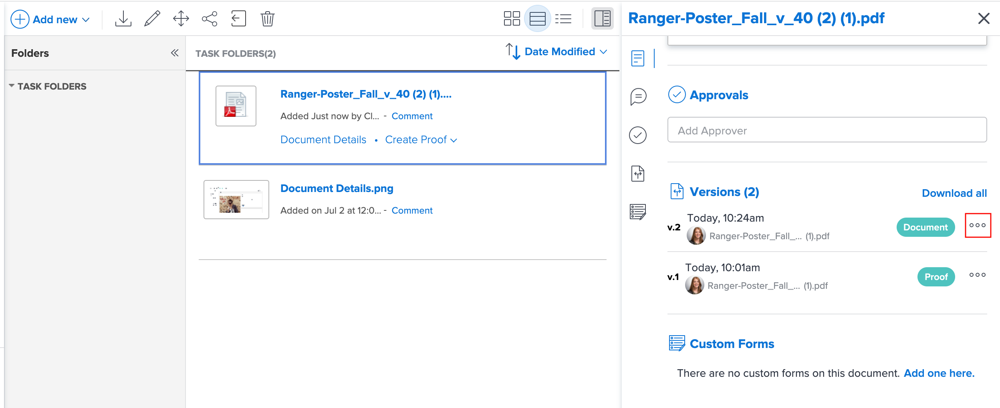

# Manage document versions

<!-- Audited: 5/2025 -->

You can manage multiple versions of a document in Workfront.

## Access requirements

+++ Expand to view access requirements for the functionality in this article.

You must have the following:

<table style="table-layout:auto"> 
 <col> 
 <col> 
 <tbody> 
  <tr> 
   <td role="rowheader">Adobe Workfront plan</td> 
   <td> 
 Any
 </td> 
  </tr> 
  <tr> 
   <td role="rowheader">Adobe Workfront licenses</td> 
   <td> 
   
New: Contributor or higher

   
Or

   
Current: Request or higher 

   
   
   </td> 
  </tr> 
  <tr> 
   <td role="rowheader">Access level configurations</td> 
   <td> 
View access to Documents
 
Note: If you still don't have access, ask your Workfront administrator if they set additional restrictions in your access level. For information on how a Workfront administrator can modify your access level, see <a href="../../administration-and-setup/add-users/configure-and-grant-access/create-modify-access-levels.md" class="MCXref xref">Create or modify custom access levels</a>.
 </td> 
  </tr> 
  <tr> 
   <td role="rowheader">Object permissions</td> 
   <td> 
View access to the Document
 
For information on requesting additional access, see <a href="../../workfront-basics/grant-and-request-access-to-objects/request-access.md" class="MCXref xref">Request access to objects </a>.
 </td> 
  </tr> 
 </tbody> 
</table>

For more detail about the information in this table, see [Access requirements in Workfront documentation](/help/quicksilver/administration-and-setup/add-users/access-levels-and-object-permissions/access-level-requirements-in-documentation.md).

+++

## Prerequisites

* This article assumes that the document has multiple versions.

  If you need information about uploading new versions of a document to Workfront, see [Upload a new version of a document](../../documents/managing-documents/upload-new-document-version.md).

## View a list of all versions of a document

{{step1-to-documents}}

1. On the **Documents** page, select a document in the list. 

1. In the upper-right corner of the page, click the **Open Summary** icon . The **Document Summary** side panel opens.

1. Scroll down to the **Versions** section to view all the document versions.

## View and manage details for a previous document version

{{step1-to-documents}}

1. Hover over the document, then click **Document Details**.

1. Near the top of the **Document Details** page, click the drop-down menu next to the name, then click the name of the version you want to view and manage.

   

   Along with viewing the version's details, you can make changes to the version, such as its name, metadata, and proofing settings (if it's a document proof).

## Download a single document version

{{step1-to-documents}}

1. On the **Documents** page, select a document in the list. 

1. In the upper-right corner of the page, click the **Open Summary** icon . The **Document Summary** side panel opens.

1. In the **Versions** section, click the click the **More** menu  to the right of the version, then click **Download** in the drop-down list that appears.

   

## Download all versions of a document

{{step1-to-documents}}

1. On the **Documents** page, select a document in the list. 

1. In the upper-right corner of the page, click the **Open Summary** icon . The **Document Summary** side panel opens.

1. Scroll down to the **Versions** section and then click **Download All**.

## Delete a document version

If you upload a version of a document by mistake, or a version is no longer needed, you can delete the version and maintain the original document.

>[!IMPORTANT]
>
>You can't recover a document version that you delete individually.

Keep the following in mind when you consider deleting a document version:

* Only one version can be deleted at a time. If a version is deleted, this action appears in the Updates section on the document. 
* If you upload a new version after deleting a version, the new version receives the next sequential number. For example, if there are 3 versions of a document and you delete version 3, the next document uploaded will be version 4.
* System updates and comments made on a version are retained in Workfront after the version is deleted.

  <!--
  <li data-mc-conditions="QuicksilverOrClassic.Draft mode">Deleting a document version in Workfront does not delete the Proof version.&nbsp;</li>
  -->

To delete a document version:

{{step1-to-documents}}

1. On the **Documents** page, select the document from the list. 

1. In the upper-right corner of the page, click the **Open Summary** icon . The **Document Summary** side panel opens.

1. Scroll down to the **Versions** section to view all the document versions.
1. In the **Versions** section, click the click the **More** menu  to the right of the version, then click **Delete** in the drop-down list that appears.

   >[!NOTE]
   >
   >* The **Delete** option is visible only if there are at least 2 versions.
   >* If the document is linked to an outside source, that link is deleted and the document is no longer accessible through Workfront.

   
