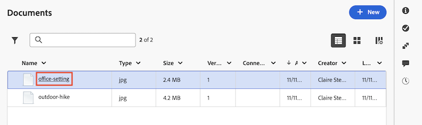

# Preview documents

You can preview a document from the Documents area. This is especially useful for images.

## Access requirements

+++ Expand to view access requirements for the functionality in this article.

<table style="table-layout:auto"> 
 <col> 
 </col> 
 <col> 
 </col> 
 <tbody> 
  <tr> 
   <td role="rowheader">Adobe Workfront package</td> 
   <td> 
 Any
 </td> 
  </tr> 
  <tr> 
   <td role="rowheader">Adobe Workfront licenses</td> 
   <td> 
Any
 </td> 
  </tr> 
  <tr data-mc-conditions=""> 
   <td role="rowheader">Access level configurations*</td> 
   <td> 
Edit access to Documents
 </td> 
  </tr> 
  <tr data-mc-conditions=""> 
   <td role="rowheader">Object permissions</td> 
   <td> 
View access to the object associated with the document
 </td> 
  </tr> 
 </tbody> 
</table>

For more detail about the information in this table, see [Access requirements in Workfront documentation](/help/quicksilver/administration-and-setup/add-users/access-levels-and-object-permissions/access-level-requirements-in-documentation.md). 

+++

## Preview a document in the legacy documents area

If your organization is on legacy Workfront storage, you will see the legacy documents area when you access documents in Workfront. For more information about legacy Workfront storage, see [Differences between legacy Workfront storage and Adobe enterprise storage](/help/quicksilver/review-and-approve-work/esm-overview.md).

To preview a document:

1. In a document list, hover over the row containing the document , then click **Document Details**.
1. On the page that appears, click the document's thumbnail image.

   * If you have not prepared the document for review, it displays in a new browser tab.
   * If you have prepared the document for review, the proofing viewer opens to display it.

   The following file formats are unable to display in the preview window:

   * .mp4
   * .gif
   * .jpeg
   * .png
   * .tiff
   * .plain
   * .pdf

## Preview a document in the new documents area

If your organization uses enterprise storage, you will see the new documents area when you access documents in Workfront. For more information about enterprise storage, see [Enterprise Storage overview](/help/quicksilver/review-and-approve-work/esm-overview.md).

Some file formats cannot be previewed.

+++Expand to view unsupported file formats for previewing documents.

 The following file formats are unable to display in the preview window:

<table style="border: none; width: 80%; margin: 0 auto;">
<tr style="border: none;">
<td style="border: none; width: 50%; padding-right: 20px;">

<ul>
<li>ai</li>
<li>aic</li>
<li>xls</li>
<li>xlsx</li>
<li>ppt</li>
<li>pptx</li>
<li>doc</li>
<li>docx</li>
<li>ase</li>
<li>indd</li>
<li>inddc</li>
<li>pdf</li>
<li>pdfl</li>
<li>pdfs</li>
<li>pdfp</li>
<li>pub</li>
<li>odp</li>
<li>ods</li>
<li>odt</li>
<li>bmp</li>
<li>dng</li>
<li>gif</li>
<li>heic</li>
<li>heif</li>
</ul>

</td>
<td style="border: none; width: 50%; padding-left: 20px;">

<ul>
<li>jp2</li>
<li>jpg</li>
<li>jpeg</li>
<li>pjpeg</li>
<li>png</li>
<li>psd</li>
<li>psdc</li>
<li>raw</li>
<li>svg</li>
<li>tiff</li>
<li>tif</li>
<li>webp</li>
<li>eps</li>
<li>txt</li>
<li>rtf</li>
<li>ps</li>
<li>avi</li>
<li>mp4</li>
<li>mpeg</li>
<li>mov</li>
<li>flv</li>
<li>m4v</li>
<li>wmv</li>
</ul>

</td>
</tr>
</table>
 
 +++  

To preview a document:

1. Go to the project, task, or issue that contains the document, then select **Documents** in the left panel.
1. Find the document you need, then click the document name.
   

 