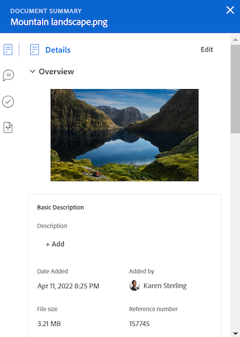
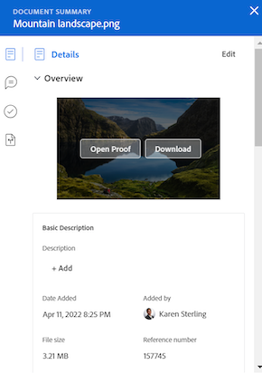
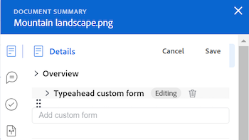
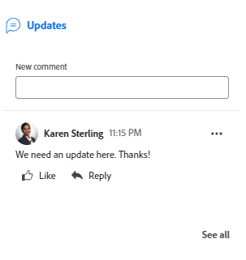
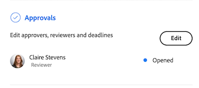
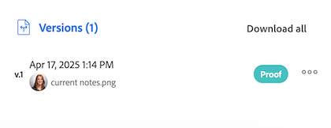

# Summary for documents overview

<!--Audited: April, 2024-->

You can use the Summary panel to access and update important information directly from the documents list.

+++ Expand to view access requirements for the functionality in this article.

## Access requirements

You must have the following access to perform the steps in this article:

<table style="table-layout:auto"> 
 <col> 
 </col> 
 <col> 
 </col> 
 <tbody> 
  <tr> 
   <td role="rowheader">Adobe Workfront plan</td> 
   <td> 
 Any
 </td> 
  </tr> 
  <tr> 
   <td role="rowheader">Adobe Workfront licenses</td> 
   <td> 
New: Contributor or higher
 
   
Current: Request or higher

   </td> 
  </tr> 
  <tr data-mc-conditions=""> 
   <td role="rowheader">Access level configurations</td> 
   <td> 
Edit access to Documents
  </td> 
  </tr> 
  <tr data-mc-conditions=""> 
   <td role="rowheader">Object permissions</td> 
   <td> 
View access to the object associated with the document
 </td> 
  </tr> 
 </tbody> 
</table>

For more detail about the information in this table, see [Access requirements in Workfront documentation](/help/quicksilver/administration-and-setup/add-users/access-levels-and-object-permissions/access-level-requirements-in-documentation.md).

 +++

## Open the Summary view

{{step1-to-documents}}

1. On the **Documents** page, select a document in the list. 

1. In the upper-right corner of the page, click the **Open Summary** icon . The **Document Summary** side panel opens. 

   

   After you open the Summary, it will remain open on this page (even if you click on other documents) until you manually close it.

## Details

Use the Details section to view high-level overview information and interact with custom forms. Click Details at the top of the section to go to the full Document Details page.

* [Overview](#overview) 
* [Custom Forms](#custom-forms)

### Overview {#overview}

Expand the Overview section to view or download an image thumbnail, open a proof, update the basic description, check the document out and more.

### Custom Forms {#custom-forms}

Use the Custom Forms section to add, edit, or view any custom forms associated with the document. Begin typing the name of the custom form to add it to the document. For more information, see [Add or edit a custom form to a document](../../documents/managing-documents/add-custom-form-documents.md).

## Updates

Use the Updates section to view an update someone made on the document or proof. The summary shows the first 2 comments made. For more information on updates, see [Comment on a proof](../../review-and-approve-work/proofing/reviewing-proofs-within-workfront/comment-on-a-proof/comment-on-proof.md).

## Approvals

Use the Approvals section to ask for a document approval. You can also remind someone about an approval, resubmit the approval and cancel the previous decision, or delete the approval. Document approvers can use the Summary to make a decision.

Proof approvals must be added in the Proof Workflow. For more information on approvals, see

* [Approving work](../../review-and-approve-work/manage-approvals/approving-work.md) 
* [Request document approvals](../../review-and-approve-work/manage-approvals/request-document-approvals.md)

## Versions

Use the Versions section to view the number of versions created for a specific document. Click the More icon  to do the following:

* Open a proof.
* Download a proof or document.
* Preview a browser-supported document.
* Go to the Document Details.
* Delete a proof or document.

