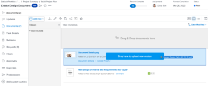

# Upload a new version of a document

You can add a new version of a document you have previously uploaded to Adobe Workfront.

If the file name of the new version is different from the file name of the previous version, Workfront displays the document with the newer file name.

If the document contains a proof and you want to create a new version of the proofed document, see the section [Upload a document and create a new version of a proof](../../review-and-approve-work/proofing/creating-proofs-within-workfront/generate-proof-for-a-document.md#uploading-a-document-and-creating-a-new-version-of-a-proof) in the article [Create a proof for a document](../../review-and-approve-work/proofing/creating-proofs-within-workfront/generate-proof-for-a-document.md).

For information about adding a new version of a document linked to Workfront from an external application, see [Add a new version of a linked document](../../documents/adding-documents-to-workfront/link-documents-from-external-apps.md#add) in [Link documents from external applications](../../documents/adding-documents-to-workfront/link-documents-from-external-apps.md).

## Access requirements

+++ Expand to view access requirements for the functionality in this article.

<table style="table-layout:auto"> 
 <col> 
 </col> 
 <col> 
 </col> 
 <tbody> 
  <tr> 
   <td role="rowheader">Adobe Workfront package</td> 
   <td> 
 Any
 </td> 
  </tr> 
  <tr> 
   <td role="rowheader">Adobe Workfront licenses</td> 
   <td> 
   
Contributor or higher

   
Request or higher
 </td> 
  </tr> 
  <tr data-mc-conditions=""> 
   <td role="rowheader">Access level configurations*</td> 
   <td> 
Edit access to Documents
  </td> 
  </tr> 
  <tr data-mc-conditions=""> 
   <td role="rowheader">Object permissions</td> 
   <td> 
Edit access to the object associated with the document
 </td> 
  </tr> 
 </tbody> 
</table>

For more detail about the information in this table, see [Access requirements in Workfront documentation](/help/quicksilver/administration-and-setup/add-users/access-levels-and-object-permissions/access-level-requirements-in-documentation.md). 
+++

## Use drag-and-drop to add a new version

>[!NOTE]
>
>Drag-and-drop does not work with Internet Explorer.

1. Go to the Documents area where the document is uploaded.
1. From your desktop or a separate browser tab, drag the new version of the document on top of the existing version in Workfront.

   

   As you drag the new version, you can hover over a Workfront documents folder to open it. You can then scroll up and down by dragging the files to the top or bottom of the screen.

1. Drop the new version on top of the existing file on the **Documents** tab.

   For information about managing document versions, see [Manage document versions](../../documents/managing-documents/manage-document-versions.md).

## Use the More menu to add a new version

1. Select the document where you want to add a new version. 
1. Click **Add New** > **Version**.

   

1. Select the type of document you want to upload, then follow the prompts.
