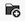

# Create document folders

Documents can be organized into folders. Workfront currently has two versions of the Documents area: the legacy documents area and the new documents area. The version that your organization uses depends on whether your organization is on legacy Workfront storage or enterprise storage. For more information about these storage types, see [Adobe enterprise storage overview](/help/quicksilver/review-and-approve-work/esm-overview.md).

## Access requirements

+++ Expand to view access requirements for the functionality in this article.

<table style="table-layout:auto"> 
 <col> 
 <col> 
 <tbody> 
  <tr> 
   <td role="rowheader">Adobe Workfront package</td> 
   <td> 
Any
 </td> 
  </tr> 
  <tr> 
   <td role="rowheader">Adobe Workfront license</td> 
   <td> 
   
Contributor or higher

   
Review or higher
 </td> 
  </tr> 
  <tr> 
   <td role="rowheader">Access level configurations*</td> 
   <td> 
Edit access to Documents
 </td> 
  </tr> 
 </tbody> 
</table>

For more detail about the information in this table, see [Access requirements in Workfront documentation](/help/quicksilver/administration-and-setup/add-users/access-levels-and-object-permissions/access-level-requirements-in-documentation.md). 

+++

## Create document folders in the legacy documents area

If your organization is on legacy Workfront storage, you will see the legacy documents area when you access documents in Workfront. For more information about legacy Workfront storage, see [Differences between Adobe enterprise storage and legacy Workfront storage](/help/quicksilver/review-and-approve-work/esm-overview.md#differences-between-adobe-enterprise-storage-and-legacy-workfront-storage).

>[!NOTE]
>
>Organizing documents simply creates links between the documents and the objects you associate them with. It does not relocate them in the system.

### Display folders

You can display folders in thumbnail, standard, or list view. To change the view, use the view options in the upper-right corner.

{{step1-to-documents}}

   Or

   With a Workfront object open, click **Documents** in the left panel. 

1. Click the view options above the right panel to change how the documents are displayed.

   

### Create folders and subfolders

Create folders to better organize your documents. You can create up to 2,000 folders on an object and up to 50 subfolders within each folder. Subfolders count towards the 2,000 folder maximum.

{{step1-to-documents}}

   Or

   With a Workfront object open, click **Documents** in the left panel. 

1. To create a top-level folder, ensure that nothing is selected, then click **Add New**&nbsp;>&nbsp;**Folder**.

   Or

   To create a sub-folder, select the folder where you want to create the sub-folder, then click **Add New** >&nbsp;**Folder**.

### Sharing folders

For information about sharing folders, see [Share a document folder](../../workfront-basics/grant-and-request-access-to-objects/share-a-document-folder.md).

## Create document folders in the new documents area

If your organization uses enterprise storage, you will see the new documents area when you access documents in Workfront. For more information about enterprise storage, see [Adobe enterprise storage overview](/help/quicksilver/review-and-approve-work/esm-overview.md).

### System-generated folders

When you upload a document to a task or issue, Workfront automatically creates a system-generated folder named after the task or issue. This folder is linked to the task or issue and inherits its permissions. System-generated folders are visible in the project-level documents area.

For more information about folder permissions, see [How document permissions work](/help/quicksilver/review-and-approve-work/esm-access-permissions.md#how-document-permissions-work).

### Create subfolders

You can create subfolders within a system-generated folder to organize documents further. All subfolders inherit permissions from the parent folder.

1. Go to the project, task, or issue that contains the document, then select **Documents** in the left panel.
1. Click into the folder you want to create a subfolder in, then click the **Add folder**  icon.
   
1. Enter a name for the subfolder, then click **Create**.

### Rename a folder

System-generated folders automatically inherit the name of the task or issue. They can be renamed by clicking the folder name and editing it.

To rename a folder:

1. Go to the project, task, or issue that contains the document, then select **Documents** in the left panel.
1. Find the folder you want to rename, then click the **More**  icon.
1. Click **Rename**, then enter a new name for the folder.

   

1. Click **Rename**.

### Move a folder

System-generated folders can be moved to another project, task, or issue. If a system-generated folder is moved to another location, its linked object is updated to the new object and permissions are inherited from the new parent object. You can also move subfolders to another project, task, or issue.

>[!NOTE]
>
>Only projects, tasks, and issues using the same storage type are available in the move dialog. For example, if you're moving a folder in an enterprise storage project, only projects, tasks, and issues using enterprise storage are available to move to.

To move a folder:

1. Go to the project, task, or issue that contains the document, then select **Documents** in the left panel.
1. Find the folder you want to move, then click the **More**  icon.
1. Click **Move**, then select the project, task, or issue you want to move the folder to.

   

<!-- STEPS PLACEHOLDER: Add steps for moving a folder in the new documents area -->

### Delete a folder

To delete a folder:

1. Go to the project, task, or issue that contains the document, then select **Documents** in the left panel.
1. Find the folder you want to delete, then click the **More**  icon.
1. Click **Delete**.

   
