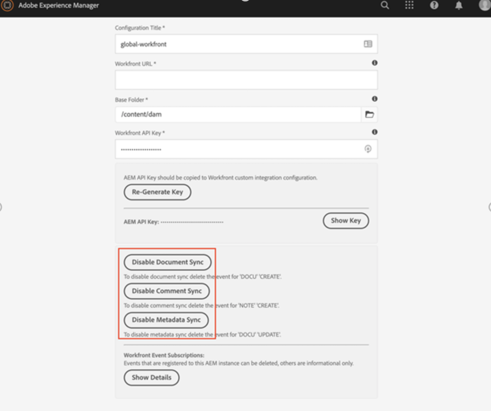
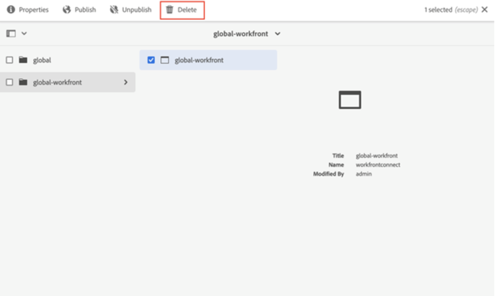
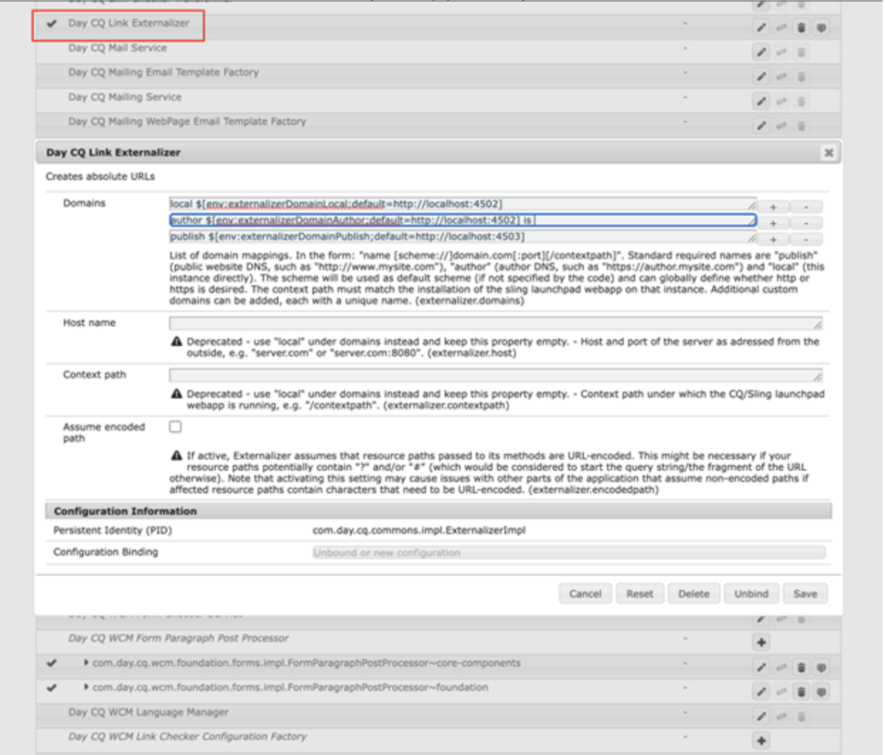

# Uninstall the Workfront with Adobe Experience Manager legacy connector

You must uninstall the Workfront with Adobe Experience Manager legacy connector to the latest native integration connecting Workfront and Adobe Experience Manager Assets as a Cloud Service.

## Unsubscribe from Workfront 

1. Open Adobe Experience Manger.
1. In Experience Manager, go to **Tools** > **Cloud Services** > **Workfront Integration Configuration**. 
1. Select your configuration (global-workfront by default), and click **Properties**. 

   

1. Disable Document, Comment, and Metadata Sync. The label should day Disabled. 
 This will remove the subscriptions in Workfront and allow the user to create a new subscription using the same url defined in Day CQ Link Externalizer. 

## Delete the Workfront Integration Configuration 

After removing the subscription, it is now safe to delete the Workfront Integration Configuration.

1. Open the configuration, and select **Delete**.

   

## Remove mapping

Next, you need to delete Workfront Property Mapping.

1. In Experience Manager, go to **Tools** > **Assets** > **Workfront Property Mapping**. 

1. Select all mappings, and click **Delete**.

## User permissions 

All users that access AEM Dam from Workfront were given read permissions to `/content/dam`. If a user doesn't need that anymore, you may remove the permissions given to said users. 
 
The connector operates using the system user workfront-service. This is uninstalled when uninstalling the connector.  

>[!NOTE]
>
>If you are using connecter version 2.0.3 and added the group `workfront-aem-connector-group`, this needs to be removed as well by going to **Tools** > **Security** > **Groups**. 

## Day CQ Link Externalizer 

If you do not need the Day CQ Link Externalizer, you can revert this back to `localhost:4502` by going to `/system/console/configMgr` and looking for 'Day CQ Link Externalizer'.

>[!NOTE]
>
>If you are using Adobe Experience Manager as a Cloud Service, you can change this by looking into your project and locating the file _com.day.cq.commons.impl.ExternalizerImpl.xml_ inside _ui.apps/src/main/content/jcr_root/apps/mysite/config_. 

## Uninstall Connector Package 

The steps requried to uninstall the connector package differ depending on which Adobe Experience Manager version you have. 

### Adobe Experience Manager On-Premise

If you are using Adobe Experience Manager on-premise, go to _crx/packmgr/index.jsp_, and look for the `workfront-aem-connector.all-<version>.zip`, click **More** and then **Uninstall**. 

Please check under `/conf` to make sure all Workfront created files have been removed.

### Adobe Experience Manager as a Cloud Service

For Adobe Experience Manager as a Cloud Service, you can remove the dependencies for the connector from the project's pom.files.

## Firewall and Dispatcher 

Don't forget to remove your whitelisted Workfront URLs if communication is not needed anymore. Also, the connector uses the headers apiKey and username which was set to the dispatcher. These can be removed as well.
