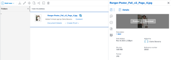

# View or download a linked asset with the enhanced connector

You can view or download an asset in Adobe Workfront that is linked from Experience Manager Assets.

## Access requirements

+++ Expand to view access requirements for the functionality in this article.

<table style="table-layout:auto"> 
 <col> 
 <col> 
 <tbody> 
  <tr> 
   <td role="rowheader">Adobe Workfront package</td> 
   <td> 
Any
 </td> 
  </tr> 
  <tr> 
   <td role="rowheader">Adobe Workfront license</td> 
   <td> 
   
Contributor or higher

   
Request or higher
 </td> 
  </tr> 
  <tr> 
   <td role="rowheader">Additional products</td> 
   <td>Experience Manager Assets </td> 
  </tr> 
  <tr> 
   <td role="rowheader">Access level configurations*</td> 
   <td> 
Edit access to Documents
 s="MCXref xref">Create or modify custom access levels</a>.
 </td> 
  </tr> 
  <tr> 
   <td role="rowheader">Object permissions</td> 
   <td> 
View access or higher on Documents
</td> 
  </tr> 
 </tbody> 
</table>

For information, see [Access requirements in Workfront documentation](/help/quicksilver/administration-and-setup/add-users/access-levels-and-object-permissions/access-level-requirements-in-documentation.md). 

+++

## Prerequisites

Before you begin, you must

* Install the Workfront for Experience Manager enhanced connector

## View or download a linked asset from Experience Manager Assets

1. Locate the document that you want to view or download. 
1. From the document list, select the document. 
1. In the Document Summary on the right, hover over the thumbnail at the top and choose **Preview** or **Download**.

   
