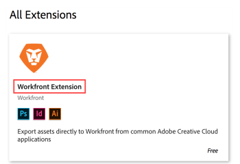

# Install the Workfront Extension for Illustrator and InDesign

The following sections describe how to download and install the Workfront Extension for Illustrator and InDesign. For information about how to use the extension, see [Use the Workfront Extension for Illustrator and InDesign](../../documents/workfront-for-adobe-creative-cloud/use-wf-adobe-cc.md).

## Supported applications

The Workfront extension is supported for the 2017 versions (and newer) of the following Adobe Creative Cloud applications:

* InDesign
* Illustrator
* Photoshop

  >[!NOTE]
  >
  >We recommend using the new [Adobe Workfront for Photoshop](../../workfront-integrations-and-apps/adobe-workfront-for-creative-cloud/workfront-for-photoshop.md) plugin.

The extension is supported for both Adobe Cloud and desktop applications.

## Access requirements

You must have the following access to perform the steps in this article:

<table style="table-layout:auto"> 
 <col> 
 <col> 
 <tbody> 
  <tr> 
   <td role="rowheader">Adobe Workfront plan*</td> 
   <td> 
Pro or higher
 </td> 
  </tr> 
  <tr data-mc-conditions=""> 
   <td role="rowheader">Adobe Workfront license*</td> 
   <td> 
Work or higher
 </td> 
  </tr> 
  <tr> 
   <td role="rowheader">Product</td> 
   <td>You must have an Adobe Creative Cloud license in addition to a Workfront license.</td> 
  </tr> 
 </tbody> 
</table>

&#42;To find out what plan, license type, or access you have, contact your Workfront administrator.

## Install the WorkfrontExtension {#install-the-workfrontextension}

1. Open your Adobe Creative Cloud application and make sure that your apps are up to date.
1. In the preferences for your Adobe Creative Cloud application, make sure that syncing is enabled (this is the default).  

1. In a web browser, log in to your Adobe account, then go to the Adobe Exchange Creative Cloud website.
1. In the **Search Marketplace** box (near the bottom of the screen), search for **Workfront**.  

1. In the box that appears below the search box, click **Workfront Extension**.

   

1. Click **Install**.
1. When the installation completes, restart your computer and Workfront for Adobe Creative Cloud is added to your list of extensions for the supported applications.

   For information about verifying that the extension is installed, see the [Ensure the Workfront Extension is installed successfully](#ensure-the-workfront-extension-is-installed-successfully) section in this article.

## Ensure the Workfront Extension is installed successfully {#ensure-the-workfront-extension-is-installed-successfully}

1. Open one of the following supported applications on your computer:

   * Adobe Illustrator
   * Adobe InDesign

1. Click **Window** > **Extensions** > Workfront.

   If you don't see the Workfront extension, make sure that syncing is enabled in Adobe Creative Cloud. See Adobe Help documentation if you need help

## Troubleshooting the Workfront Extension

### Problem: Workfront extension shows "Not Compatible" message

#### Solution:

You may have an existing, older version of the Workfront Extension. Locate and uninstall the existing Workfront Extension, then install the new Workfront Extension as described in [Install the WorkfrontExtension](#install-the-workfrontextension) in this article.
