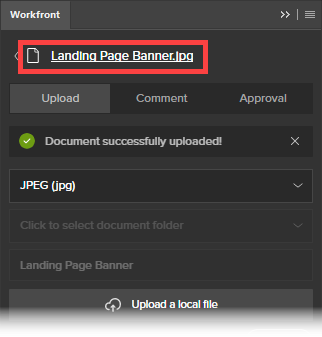

# Use the Workfront Extension for Illustrator and InDesign

<!--Audited: 01/2024-->

>[!IMPORTANT]
>
>We are replacing the Workfront extension for Illustrator and InDesign with [updated Creative Cloud plugins](/help/quicksilver/workfront-integrations-and-apps/adobe-workfront-for-creative-cloud/wf-cc-install-toc.md). Starting late 2022, this extension will no longer be supported and is available as-is.

You can use the Workfront Extension to export digital content you save and create in Adobe Illustrator and Adobe InDesign to Workfront. This speeds up the document review and approval process.

The Workfront&nbsp;Extension is supported for Adobe Creative Cloud 2017 and newer in the following applications:

* InDesign
* Illustrator
* Photoshop

  >[!NOTE]
  >
  >We recommend using the new [Adobe Workfront for Photoshop](/help/quicksilver/workfront-integrations-and-apps/adobe-workfront-for-creative-cloud/wf-cc-install-ps.md) plugin.

## Access requirements

+++ Expand to view access requirements for the functionality in this article.

You must have the following access to perform the steps in this article:

<table style="table-layout:auto"> 
 <col> 
 <col> 
 <tbody> 
  <tr> 
   <td role="rowheader">Adobe Workfront plan*</td> 
   <td> 
Current: Pro or higher

   Or
   
New: Any plan
 </td> 
  </tr> 
  <tr data-mc-conditions=""> 
   <td role="rowheader">Adobe Workfront license*</td> 
   <td> 
Current: Work or higher

   Or
   
New: Standard
 </td> 
  </tr> 
  <tr> 
   <td role="rowheader">Product</td> 
   <td>You must have an Adobe Creative Cloud license in addition to a Workfront license.</td> 
  </tr> 
  <tr> 
   <td role="rowheader">Object permissions</td> 
   <td> 
Edit access to the object you want to interact with.
  </td> 
  </tr> 
 </tbody> 
</table>

&#42;To find out what plan, license type, or access you have, contact your Workfront administrator. For more information, see [Access requirements in Workfront documentation](/help/quicksilver/administration-and-setup/add-users/access-levels-and-object-permissions/access-level-requirements-in-documentation.md).

+++

## Log in to Workfront Extension from Illustrator or InDesign {#log-in-to-workfront-extension-from-illustrator-or-indesign}

When you log in to Workfront from one of the supported Adobe applications, you are logged in to all supported Adobe applications.

1. Go to the Adobe application where you want to use the Workfront extension.

   For a list of supported formats for each supported application, see [Supported exported file formats](#supported-exported-file-formats) in this article.

1. Click **Window** > **Extensions** > Workfront.

1. (Optional) Drag the Workfront panel to the position where&nbsp;you want it displayed in the Adobe application.
1. Follow the prompts to log in to Workfront.

   >[!NOTE]
   >
   >* Workfront connects to Adobe Creative Cloud using OAuth 2.0, a secure standard used by most web-based integrations for the authentication and authorization of users.
   >* When you are prompted to enter the [domain or host] of your Workfront account, type it using this format:`yourCompany'sDomain.my.workfront.com`. Your company's domain is usually the name of your company.  

   A&nbsp;list of work items assigned to you displays if the project a current status. If a list does not display, log in to Workfront.

   Personal tasks are listed under **No Project**.

## Upload a file to a Workfront project, task, or issue {#upload-a-file-to-a-workfront-project-task-or-issue}

You can upload a file from your computer file system or export a file currently open in an Adobe Creative Cloud application to a Workfront project, task, or issue.&nbsp;

Consider the following when uploading or exporting a file from Adobe Creative Cloud:

* Your Access Level must permit uploading documents to Workfront. For more information, see [Grant access to documents](../../administration-and-setup/add-users/configure-and-grant-access/grant-access-documents.md).
* You must have permissions to upload documents to the item where you want it. For more information, see [Overview of sharing permissions on objects](../../workfront-basics/grant-and-request-access-to-objects/sharing-permissions-on-objects-overview.md).
* The file uploads to the Documents area for the Workfront object that you select. 
* You cannot export a document to the Documents area in the Main Menu  from an Adobe Creative Cloud application.

The following sections explain the following:

* [Upload a file](#upload-a-file) 
* [Export a file currently open in Illustrator or InDesign](#export-a-file-currently-open-in-illustrator-or-indesign) 
* [Upload a new version of a file from Illustrator or InDesign](#upload-a-new-version-of-a-file-from-illustrator-or-indesign)

### Upload a file {#upload-a-file}

You can upload your files to a project, task, or issue without leaving your Adobe Creative Cloud application.

1. If you do not see the Workfront extension when you open your Adobe Creative Cloud application, click&nbsp;**Window** > **Extensions** > **Workfront**.

   A list of work items assigned to you displays if the project is in a current status. If a list does not display, log in to Workfront.

   Personal tasks are listed under **No Project**.

1. Click the name of the project, task, or issue to which you want to upload the file.

   You can search for this by typing the name in the **Search** box and selecting **Project**, **Task**, or **Issue** from the drop-down menu to the right of the **Search** box. If the name of the work item doesn't appear in the list, press **Enter** to search all Workfront items that you have access to view.

1. Click **Select** in the lower-right corner of the Workfront extension.
1. In the **Click to select format** drop-down menu, click the format in which you want to save the file in Workfront.

   For a list of supported formats for each supported application, see [Supported exported file formats](#supported-exported-file-formats) in this article.

1. (Conditional) If the work item where you want to upload the file has document folders, select a document folder in the **Click to select a document folder** field, then click **Select**.

1. Click **Upload a local file**.
1. In the **Open File** box, find the file in your file system, then click **Open**.

1. (Optional) Type a new name for the file.

   

1. Click **Upload**.

   In Workfront, the document is now listed in the Documents area for the project, task, or issue you selected.

1. (Optional) Click the name of the document to open its Document Details page in Workfront.

   Workfront opens in a new browser tab.

### Export a file currently open in Illustrator or InDesign {#export-a-file-currently-open-in-illustrator-or-indesign}

1. In a supported Adobe Creative Cloud application, open a file that you would like to export to Workfront.
1. If the Workfront extension is not displayed, click **Window** > **Extensions** > **Workfront**.

   A list of work items assigned to you displays if the project is in a current status. If a list does not display, log in to Workfront.

   Personal tasks are listed under **No Project**.

1. Click the name of the project, task, or issue to which you want to export the file.

   You can search for this by typing the name in the **Search** box and selecting **Project**, **Task**, or **Issue** from the drop-down menu to the right of the **Search** box. If the name of the work item doesn't appear in the list, press **Enter** to search all Workfront items that you have access to view.

1. In the **Click to select format** drop-down menu, click the format in which you want to save the file in Workfront.

   For a list of supported formats for each supported application, see [Supported exported file formats](#supported-exported-file-formats) in this article.

1. (Conditional) If the work item where you want to upload the file has document folders, select a document folder in the**Click to select a document folder** field, then click **Select**.
1. (Optional) To rename the document, click the document name and type a new name.

   

1. Click **Export**.

   A message displays to confirm that the document successfully exported to Workfront.

   In Workfront, the document is listed in the Documents area of the object you specified in Workfront.

1. (Optional) Click the name of the document to access it in Workfront.

   

   Workfront opens in a new browser tab.

### Upload a new version of a file from Illustrator or InDesign {#upload-a-new-version-of-a-file-from-illustrator-or-indesign}

1. If you want to export a file you are working on in a supported Adobe application as a new version of a file in Workfront, open the file in the Adobe application.
1. If the Workfront extension is not displayed, click **Window** > **Extensions** > **Workfront**.

   A list of work items assigned to you displays if the project a current status. If a list does not display, log in to Workfront.

   Personal tasks are listed under **No Project**.

1. Click the name of the project, task, or issue where the existing document is listed.

   You can search for this by typing the name in the **Search** box and selecting **Project**, **Task**, or **Issue** from the drop-down menu to the right of the **Search** box. If the name of the work item doesn't appear in the list, press **Enter** to search all Workfront items that you have access to view.

   All documents uploaded to projects, tasks, or issues display in a list, regardless of whether they were uploaded from the Adobe application.

1. In the **Click to select format** drop-down menu, click the format in which you want to save the file in Workfront.

   This is required if you are exporting a file you have open in the Adobe application. For a list of supported formats for each supported application, see [Supported exported file formats](#supported-exported-file-formats) in this article.

1. If you are exporting a file you have open in the Adobe application as a new version of the Workfront document you selected, click **Export**.

   Or

   If you want to upload a file from your computer file system as a new version of the Workfront document you selected, click **Upload a local file**, find the file in the box that appears, click **Open**, then click **Upload**.

1. (Optional) Click the name of the document to see its new version in Workfront.

   >[!NOTE]
   >
   >The name of the document in Workfront is populated by default and cannot be edited. Nor does it change to the name of the file you upload or export as a new version.
   >
   >
   >

## Comment on a Workfront document from Illustrator or InDesign {#comment-on-a-workfront-document-from-illustrator-or-indesign}

You can add comments directly to a Workfront document within an Adobe application. In Workfront, your comments display in the document's Updates area and the Updates area for the Workfront item where the document is saved.

1. Open one of the supported Adobe applications.
1. If the Workfront extension is not displayed, click **Window** > **Extensions** > **Workfront**.

   A list of work items assigned to you displays if the project a current status. If a list does not display, log in to Workfront.

   Personal tasks are listed under **No Project**.

1. Click the project, task, or issue where the existing document is listed.

   You can search for this by typing the name in the **Search** box and selecting **Project**, **Task**, or **Issue** from the drop-down menu to the right of the **Search** box. If the name of the work item doesn't appear in the list, press **Enter** to search all Workfront items that you have access to view.

1. Click the name of the existing document, then click **Select** in the lower-right corner of the Workfront extension.
1. Click the **Comment** tab, then type your update in the box.  

1. (Optional) To include other Workfront users or teams on the comment, start typing the name of a user or a team in the **Notify people or teams** box, then click the name when it appears in the drop-down list.
1. (Optional) To request approval on the document, select **Make an approval request**.
1. Click **Update**.

   An update is posted in the Updates tab of the document. Workfront users who you include in the comment receive an in-app notification, and, depending on how Workfront is configured, might also receive an email notification.

   For more information about notifications within Workfront, see [View and manage in-app notifications](../../workfront-basics/using-notifications/view-and-manage-in-app-notifications.md).

   For more information about receiving email notifications, see [Adobe Workfront notifications](../../workfront-basics/using-notifications/wf-notifications.md).

## Request a document approval from Illustrator or InDesign

You can request a Workfront document approval directly from an Adobe application.

You can request a document approval from the following entities:

* A Workfront user
* An external user without a Workfront account

You can request an approval on a document from an Adobe application in the following ways:

* By attaching an approver to the document.
* By commenting on a document, notifying the person when you make a comment, and attaching them as an approver to the document.

  For information about requesting an approval when commenting on a document, see the section [Comment on a Workfront document from Illustrator or InDesign](#comment-on-a-workfront-document-from-illustrator-or-indesign) in this article.

To request an approval on a document from an Adobe application:

1. Open one of the supported Adobe applications.
1. If the Workfront extension is not displayed, click **Window** > **Extensions** > **Workfront**.

   A list of work items assigned to you displays if the project a current status. If a list does not display, log in to Workfront.

   Personal tasks are listed under **No Project**.

1. Click the project, task, or issue where the existing document is listed, then click the name of the existing document.

   You can search for this by typing the name in the **Search** box and selecting **Project**, **Task**, or **Issue** from the drop-down menu to the right of the **Search** box. If the name of the work item doesn't appear in the list, press **Enter** to search all Workfront items that you have access to view.

1. Click the name of the existing document, then click **Select**in the lower-right corner of the Workfront extension.
1. Click the **Approval** tab.
1. To add an approver, in the **Start typing a name box** do one of the following:

   * Type the name of an approver, then select it when it displays in the list.

     

   * Type the email address of an external user.

1. Click **Request Approval**.

   Workfront users who you include in the comment or add as an approver receive an in-app notification, and, depending on how Workfront is configured, might also receive an email notification.   
   External Users receive an email notification from where they can make a decision on the approval.

   For information about notifications in Workfront, see [View and manage in-app notifications](../../workfront-basics/using-notifications/view-and-manage-in-app-notifications.md). For information about receiving email notifications, see [Adobe Workfront notifications](../../workfront-basics/using-notifications/wf-notifications.md).

## Generate a proof from Illustrator or InDesign {#generate-a-proof-from-illustrator-or-indesign}

If your organization uses Automated Workflow templates, you can generate a proof for a document you create in an Adobe application without leaving the application. For information about creating proofs, see [Create proofs](../../review-and-approve-work/proofing/creating-proofs-within-workfront/create-proofs-in-wf.md). For information about Automated Workflow templates, see [Automated Workflow templates](../../review-and-approve-work/proofing/proofing-overview/automated-workflow.md#automate) in [Automated Workflow overview](../../review-and-approve-work/proofing/proofing-overview/automated-workflow.md).

1. Open one of the supported Adobe applications.
1. If the Workfront extension is not displayed, click **Window** > **Extensions** > Workfront.

   A list of work items assigned to you displays if the project a current status. If a list does not display, log in to Workfront.

   Personal tasks are listed under **No Project**.

1. If the document is already uploaded to Workfront, select the project, task, or issue in the Workfront extension where the document is listed, then click the name of the document.

   Or

   Upload an Adobe document to a Workfront object, as described in the section [Upload a file to a Workfront project, task, or issue](#upload-a-file-to-a-workfront-project-task-or-issue) in this article, then click the name of the document.

1. In the **Click to select format** drop-down menu, click the format in which you want to save the file in Workfront.

   Some formats are not available after you enable proofing functionality in the step following this one. For more information, see [Supported exported file formats](#supported-exported-file-formats) in this article.

1. Click **Upload as a new proof** to enable it.
1. Select the **Workflow Template** you want people to use as they review the document.

   Your Workfront administrator sets up Automated Workflow templates, as described in [Create and manage Automated Workflow templates](/help/quicksilver/administration-and-setup/manage-workfront/configure-proofing/create-manage-automated-workflow-templates.md). See the administrator if you have questions.

   1. Add at least one **New recipient** to every stage in the Workflow Template.

      You can start typing a name and select it when you see it in the drop-down list that appears.
   
   1. Specify the **Proof role** and frequency of **Email alerts** for each recipient you add.

   1. (Optional) In the **Email notification** section, select whether to send an email notification with an optional custom message about the proof to all the proof recipients you added.

1. Click **Create proof**.

   You can view the progress of the proof creation process. An alert appears when it has finished generating. You can open the task where you created the proof and it is listed there.

## Upload a new version of a proof without leaving Illustrator or InDesign

1. Click an existing document that has a proof, then click **Select** in the lower-right corner.
1. Click **Upload as a new proof version** to enable it.
1. (Optional) Select the **Workflow Template** you want people to use as they review the new version.

   If you don't select a different template, the template selected for the earlier version remains in effect. Also, if you have modified the template for the earlier version, the changes are in effect for the new version.

   Your Workfront administrator sets up Automated Workflow templates, as described in [Create and manage Automated Workflow templates](/help/quicksilver/administration-and-setup/manage-workfront/configure-proofing/create-manage-automated-workflow-templates.md). See the administrator if you have questions.

   1. Add at least one **New recipient** to every stage in the Workflow Template.

      You can start typing a name and select it when you see it in the drop-down list that appears.
   
   1. Specify the **Proof role** and frequency of **Email alerts** for each recipient you add. 
   1. (Optional) In the **Email notification** section, select whether to send an email notification with an optional custom message about the proof to all the proof recipients you added.

1. Click **Create new proof version**.

   You can view the progress of the proof creation process. An alert appears when it has finished generating. You can open the task where you created the proof and it is listed there.

## Log out of the Workfront Extension

1. From the Adobe application, click **Window** > **Extensions** > **Workfront**.

1. Click the **More** menu  in the upper-right corner of the panel.  

1. (Optional) Click **Feedback** to open a brief survey and send Workfront your feedback about Workfront for Adobe Creative Cloud.
1. Click **Logout**.  
   The Login screen displays. For information about logging in, see [Log in to Workfront Extension from Illustrator or InDesign](#log-in-to-workfront-extension-from-illustrator-or-indesign) in this article.

## Supported exported file formats {#supported-exported-file-formats}

* [Supported Exported File Formats for Adobe InDesign](#supported-exported-file-formats-for-adobe-indesign) 
* [Supported exported file formats for Adobe Illustrator](#supported-exported-file-formats-for-adobe-illustrator)

### Supported Exported File Formats for Adobe InDesign&nbsp; {#supported-exported-file-formats-for-adobe-indesign}

Workfront supports the following file formats for exporting a file from InDesign to Workfront:

* EPS - Encapsulated PostScript
* EPUB - Fixed layout electronic publication
* EPUB - Reflowable electronic publication &#42;
* HTML - HyperText Markup Language
* IDML - InDesign Markup Language &#42;
* JPG, JPEG - Joint Photographic Experts Group
* PDF - Adobe Portable Document File
* PNG - Portable Network Graphics
* SWF - Flash Player &#42;
* XML - Extensible Markup Language &#42;

&#42; This file format is not available when **Upload a new proof** is enabled (for information about this option, see [Generate a proof from Illustrator or InDesign](#generate-a-proof-from-illustrator-or-indesign) in this article). If this file format is already selected before you enable **Upload a new proof**, the system changes the file format to PDF. You can select a different format from the list.

### Supported exported file formats for Adobe Illustrator&nbsp; {#supported-exported-file-formats-for-adobe-illustrator}

Workfront supports the following file formats for exporting a file from Illustrator to Workfront:

* DWG - AutoCAD Drawing, AutoCAD Interchange File &#42;
* JPG, JPEG - Joint Photographic Experts Group
* PNG - Portable Network Graphics
* PSD - Photoshop Document
* SWF - Flash Player &#42;
* TIFF - Tagged Image File Format

&#42; This file format is not available when **Upload a new proof** is enabled (for information about this option, see [Generate a proof from Illustrator or InDesign](#generate-a-proof-from-illustrator-or-indesign) in this article). If this file format is already selected before you enable **Upload a new proof**, the system changes the file format to PNG. You can select a different format from the list.
