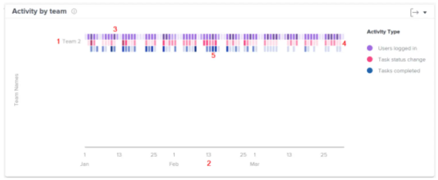
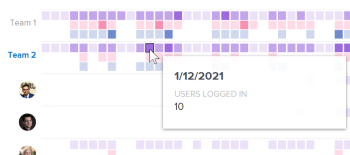

# View the Activity by team visualization in Enhanced analytics

<!-- Audited: 12/2023 -->

The Activity by team visualization shows activities that happen during a specific time frame for a home team, allowing you to understand how different home teams spent their time in Adobe Workfront. Depending on how your home team is set up in Workfront, this visualization can give you different insights and answer different questions.

>[!NOTE]
>
>The Project activity visualization is similar to this visualization, but it displays activity based on people assigned to projects rather than people assigned to a home team.  
>For information on the Project activity visualization, see [View the Project activity visualization in Enhanced analytics](../enhanced-analytics/project-activity-overview.md).

{width="700"}

## Access requirements

You must have the following:

<table style="table-layout:auto"> 
 <col> 
 <col> 
 <tbody> 
  <tr> 
   <td role="rowheader"><a href="https://www.workfront.com/plans" target="_blank">Workfront plan</a></td> 
   <td> 
Business or higher
 </td> 
  </tr> 
  <tr> 
   <td role="rowheader"><a href="../administration-and-setup/add-users/access-levels-and-object-permissions/wf-licenses.md" class="MCXref xref">Adobe Workfront licenses overview</a></td> 
   <td>
      
New:
 
         <ul><li>Light or Higher</li></ul>
      
Current:

         <ul><li>Review or Higher</li></ul>
   </td> 
  </tr> 
  <tr> 
   <td role="rowheader">Access level configurations</td> 
   <td> 
View access to Projects
 <!--
Note: If you still don't have access, ask your Workfront administrator if they set additional restrictions in your access level. For information on how a Workfront administrator can change your access level, see <a href="../administration-and-setup/add-users/configure-and-grant-access/create-modify-access-levels.md" class="MCXref xref">Create or modify custom access levels</a>.
--> </td> 
  </tr> 
  <tr> 
   <td role="rowheader">Object permissions</td> 
   <td> 
View
 <!--
For information on requesting additional access, see <a href="../workfront-basics/grant-and-request-access-to-objects/request-access.md" class="MCXref xref">Request access to objects </a>.
--> </td> 
  </tr> 
 </tbody> 
</table>

For more detail about the information in this table, see [Access requirements in Workfront documentation](/help/quicksilver/administration-and-setup/add-users/access-levels-and-object-permissions/access-level-requirements-in-documentation.md).

## Prerequisites

For prerequisites to using Enhanced Analytics, see the "Prerequisites" section in [Enhanced analytics overview](../enhanced-analytics/enhanced-analytics-overview.md).

## Understand the Activity by team visualization

The different activities display in different colors to summarize specific events over the filtered time period:

* **Users logged in**: Purple boxes show that people on the home team logged in on that day. A darker shade indicates a higher number of people logging in.

  

* **Task status change**: Pink boxes show that people on the home team changed the status of a task on that day. A darker shade indicates a higher number of task statuses changing.

  

* **Tasks completed**: Blue boxes show that people on the home team completed a task on that day. A darker shade indicates a higher number of tasks being completed.

  

Hovering over a box shows the exact number of times the action was completed in a given day. You can select a team to see a breakdown of these activities by each person on the home team.

Seeing this information helps you determine:

* What activities are occurring within a home team and at what rate.
* What home teams are being overworked or are using the system more.
* If the distribution of work is appropriate for the home team.

To learn how to get the best data for this visualization, see [Enhanced analytics overview](../enhanced-analytics/enhanced-analytics-overview.md).

## View the Activity by team visualization

1. Click the Main Menu icon , then select **Analytics**.
1. In the left panel, select **People**.

   

1. (Optional) To use a different date range, select new start and end dates from the date range filter.

   

   For information on using the date range filter, see [Apply filters in Enhanced analytics](../enhanced-analytics/use-enhanced-analytics-filters.md).

1. (Conditional) If you haven't set your Team filter, add the Team filter and select each team that you want to see data for.

   For more information on adding filters in Enhanced analytics, see [Apply filters in Enhanced analytics](../enhanced-analytics/use-enhanced-analytics-filters.md).

   After you add filters, data for up to 50 projects displays and the filters remain active even after you leave the page or log out of Workfront.

1. (Optional) To zoom in on a date range, select a point on the visualization for the start of your date range and drag to the end of your date range.

   All other visualizations update to the same date range and a timeframe filter is created.

   

1. Click a team name

   <!--
   <MadCap:conditionalText data-mc-conditions="QuicksilverOrClassic.Draft mode">
   or role
   </MadCap:conditionalText>
   -->

   to see more details for activities completed by the home team.

   The list expands to display the activities of each person assigned to the home team.

   <!--
    Role not available
   -->

1. Hover over a colored box to see the date when users completed an action, as well as the number of times the action was completed that day.

   Darker colors indicate higher activity.

   

1. (Optional) To export the visualization data, click the Export icon  in the top-right corner of the visualization, then select the export format:

   * **Chart (PNG)** 
   * **Data Table (XSLX)**

