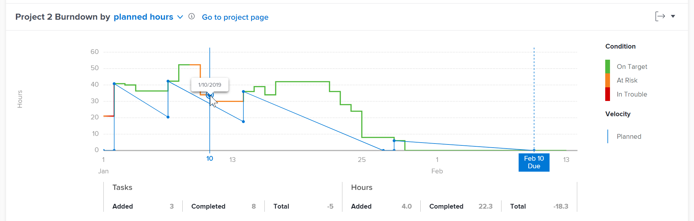
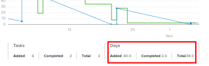

# View the Burndown visualization in Enhanced analytics

The Burndown visualization shows a specific project's burndown over time and helps you understand the relationship between project condition, velocity, and remaining hours—or days.

## Access requirements

You must have the following access to perform the steps in this article:

<table style="table-layout:auto"> 
 <col> 
 <col> 
 <tbody> 
  <tr> 
   <td role="rowheader">Adobe Workfront plan*</td> 
   <td>
      
New plan: Any

      
or

      
Current plan: Business or higher
</td>
  </tr> 
  <tr> 
   <td role="rowheader">Adobe Workfront license*</td> 
   <td>
      
New plan: Light or higher

      
or

      
Current plan: Review or higher

   </td> 
  </tr> 
  <tr> 
   <td role="rowheader">Access level configurations*</td> 
   <td> 
View access to Projects
 
Note: If you still don't have access, ask your Workfront administrator if they set additional restrictions in your access level. For information on how a Workfront administrator can modify your access level, see <a href="../administration-and-setup/add-users/configure-and-grant-access/create-modify-access-levels.md" class="MCXref xref">Create or modify custom access levels</a>.
 </td> 
  </tr> 
  <tr> 
   <td role="rowheader">Object permissions</td> 
   <td> 
View
 
For information on requesting additional access, see <a href="../workfront-basics/grant-and-request-access-to-objects/request-access.md" class="MCXref xref">Request access to objects</a>.
 </td> 
  </tr> 
 </tbody> 
</table>

&#42;To find out what plan, license type, or access you have, contact your Workfront administrator.

## Prerequisites

For prerequisites to using Enhanced Analytics, see the "Prerequisites" section in [Enhanced analytics overview](../enhanced-analytics/enhanced-analytics-overview.md#prerequisites).

## Understand the Burndown visualization

The solid blue line shows the planned velocity from the start date to the planned completion date. This line adjusts as work is added, removed, or updated, and it changes to a dashed vertical line when the project reaches the planned completion date.

The actual line shows the number of hours—or days—spent on the project over time. The color of this line indicates the condition of the project each day:

* **Green**: The project is on target.

  

* **Orange**: The project is at risk.

  

* **Red**: The project is in trouble.

  

For more information on these project conditions, see [Overview of Project Condition and Condition Type](../manage-work/projects/manage-projects/project-condition-and-condition-type.md).

When the actual line moves upward vertically, work has been added to the project. When the line moves downward vertically, work has been removed or completed for the project.

Below the x axis of the visualization, you can see more information about how tasks and hours—or days—changed on a given day (the amount added, the amount completed, and the difference between the two).

Seeing all of this information in the Burndown visualization helps you determine:

* The health of the individual project over time
* How problems coming in (or unplanned work) impacted the planned work
* Which events extended your project past the original completion date

To learn how to get the best data for this visualization, see [Enhanced analytics overview](../enhanced-analytics/enhanced-analytics-overview.md).

## View the Burndown visualization

{{step1-to-analytics}}

1. (Optional) To use a different date range, select new start and end dates from the date range filter.

   

   For information on using the date range filter, see [Apply filters in Enhanced analytics](../enhanced-analytics/use-enhanced-analytics-filters.md).

1. (Conditional) If you need to limit the project data set, select and apply the filters that you want to use.

   For more information on adding filters in Enhanced analytics, see [Apply filters in Enhanced analytics](../enhanced-analytics/use-enhanced-analytics-filters.md).

   After you add filters, data for up to 50 projects displays and the filters remain active even after you leave the page or log out of Workfront.

1. (Optional) To zoom in on a date range, select a point on the visualization for the start of your date range, and drag it to the end of your date range.

   All other visualizations update to the same date range, and a timeframe filter is automatically created.

   

1. On the Flight plan or Project treemap visualization, click a project to view more information.

   The Burndown and Tasks in flight visualizations display.

   >[!NOTE]
   >
   >To learn more about these other visualizations, see:
   >
   >   * [View the Flight plan visualization in Enhanced analytics](../enhanced-analytics/flight-plan-overview.md) 
   >   * [View the Project treemap visualization in Enhanced analytics](../enhanced-analytics/project-treemap-overview.md) 
   >   * [View the Tasks in flight visualization in Enhanced analytics](../enhanced-analytics/tasks-in-flight-overview.md) 
   >

1. (Optional) Change the view from planned hours to **duration**.

   Planned hours is selected by default.

   >[!NOTE]
   >
   >Selecting **duration** changes all hours information to days.  
   >  
   >For more information on duration in the Enhanced analytics area, see the "Duration view" section in [Enhanced analytics overview](../enhanced-analytics/enhanced-analytics-overview.md#duration-view).

1. Click any point on the line graph.

   The exact date displays and further information about tasks and hours—or days—for the selected day displays below the graph.

   

   >[!NOTE]
   >
   >If the actual velocity is a flat line that runs along the x axis (inline with 0 hours or 0 days) of the visualization, this means that no planned hours—or days—were added to the project.  
   >If the actual velocity is a flat line above the x axis (inline with a number of hours or number of days) that never goes down, this means that no tasks were completed within the filtered time period.

1. (Optional) To export the visualization data, click the **Export** icon in the top-right corner of the visualization, and select the export format:

   * Chart (PNG)
   * Data Table (XSLX)

1. (Optional) To see details about the progress of tasks in the selected project, look at the Tasks in flight visualization that appears below the Burndown visualization. For more information, see [View the Tasks in flight visualization in Enhanced analytics](/help/quicksilver/enhanced-analytics/tasks-in-flight-overview.md).
