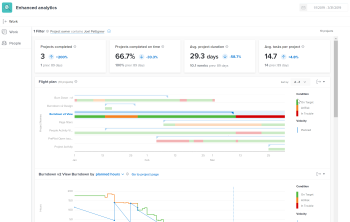

# Enhanced analytics overview

Enhanced analytics is a powerful tool in Adobe Workfront with prebuilt visualizations that allows you to look at project data and identify trends with planning and completion. This insight into your projects helps you manage your current work and enables you to plan more accurately for future work.

Enhanced analytics can help you identify:

* The way you plan projects
* When work gets added to projects
* The amount of work being completed for different projects
* The amount of hours or days required to complete a project compared to the hours or days a home team is scheduled
* How often users complete specific actions during a project
* The progress of projects, as well as the individual tasks within a project



To see use cases or learn more about managing current work and planning for future work with Enhanced analytics, see [Enhanced analytics Learning Paths](https://one.workfront.com/s/enhanced-analytics-program).

## Prerequisites

To access the Enhanced analytics area, you must:

* Have a Business or Enterprise plan.

  For more information, see [Workfront plans](https://www.workfront.com/plans).

* Have your Workfront administrator add Enhanced analytics to your layout template.

  For more information, see [Enhanced Analytics: Adding analytics to layout templates](https://one.workfront.com/s/managed-content-videos/enhanced-analytics-adding-analytics-to-layout-templates-MCH7URDSIXRREHHHF7TRTYYP2LTE).

To see information for projects and tasks, you must:

* Have View permission to the Projects and Tasks areas in your access level.

  For information on how a Workfront administrator can modify your access level, see [Create or modify custom access levels](../administration-and-setup/add-users/configure-and-grant-access/create-modify-access-levels.md).

* Have View permission for specific tasks and/or projects.

  For information on requesting additional access, see [Request access to objects](../workfront-basics/grant-and-request-access-to-objects/request-access.md).

## Best practices for Enhanced analytics

In order to get the best data for your projects, use templates that have accurate planned hours and duration days. You also need to make sure that your users enter and update the fields below as accurately as possible.

>[!NOTE]
>
>Some of the following fields are calculations that Workfront performs based on information that users input. You cannot manually update these fields.

* Planned Hours

  This is the most important field to fill out.

  >[!NOTE]
  >
  >If your teams don't use planned hours, you can still see some data based on project duration.  
  >For more information, see the section [Duration view](#duration-view) in this article.

* Project Name

  The name should be descriptive of the project.

* Project Condition
* Project Status
* Project Planned Start Date
* Planned Completion Date
* Project Actual Start Date
* Project Actual End Date
* Project Duration Hours
* Project Actual Hours
* Task Status (This includes marking tasks Completed.)
* Task Name
* Task Percent Complete
* Task Planned Start Date
* Task Planned Completion Date

>[!IMPORTANT]
>
>It can take up to 24 hours for changes made to tasks and projects to reflect in Enhanced analytics.

## Duration view {#duration-view}

By default, the Burndown and Project treemap visualizations are based on planned hours. If your teams don't use planned hours, you can look at these visualizations based on project duration.

In Enhanced analytics, the duration of a project is calculated by the following formulas:

* Planned Timeframe: 

  ```
  Planned Completion Date of the project - Start Date of the project
  ```

* Days Worked: 

  ```
  Planned Duration for tasks completed in the selected date range / Typical hours per work day
  ```

  >[!NOTE]
  >
  >8 hours is the default number for **Typical hours per work day**. A Adobe Workfront administrator can update the **Typical hours per work day** setting under **Setup** > **Project Preferences** > **Projects** > **Timelines**.  
  >To learn more, see [Configure system-wide project preferences](../administration-and-setup/set-up-workfront/configure-system-defaults/set-project-preferences.md).

For information on Planned Duration, see [Overview of project Duration](../manage-work/projects/planning-a-project/project-duration.md).

## Keyboard shortcuts

You can use the following keys on your keyboard to navigate or complete specific actions in the&nbsp;Enhanced analytics area:

| Key |Action |
|---|---|
| **Tab** |Navigate to each element on the page, as well as to a table with information on each visualization that does not display on the page |
| **Enter** |Open the calendar widget, delete an existing filter, open the add filter options, select/deselect filter values, apply a filter that you've created, open the export options on each visualization, open the drop-down menus on the Burndown, Tasks in flight, and Project treemap visualizations |
| **Arrow keys** |Navigate to dates on the calendar widget, through filter options when adding a filter, and through options in all drop-down menus on the visualizations |
| **Spacebar** |Select dates in the calendar widget, select a filter type when adding a filter, select an export option from the drop-down menu on each visualization, and select options from the drop-down menus on the Burndown, Tasks in flight, and Project treemap visualizations |

{style="table-layout:auto"}

If you are using screen-reading software or a plug-in, the screen reader reads the information on the screen aloud and describes the actions you are completing as you use the keys listed above.

## Enhanced analytics views and features

To learn more about the details of a specific feature within Enhanced analytics, the actions you can complete to get further insight, and what you can learn from this data, see the following articles:

<table style="table-layout:auto"> 
 <col> 
 <col> 
 <thead> 
  <tr> 
   <th>Article</th> 
   <th>Explanation</th> 
  </tr> 
 </thead> 
 <tbody> 
  <tr> 
   <td><a href="../enhanced-analytics/use-enhanced-analytics-filters.md" class="MCXref xref">Apply filters in Enhanced analytics</a> </td> 
   <td> <p>You can apply custom filters, project field filters, or team filters to view only projects that fit specific criteria. As you add filters, the number of projects updates accordingly.</p> </td> 
  </tr> 
  <tr> 
   <td><a href="../enhanced-analytics/understand-enhanced-analytics-kpis.md" class="MCXref xref">Understand Enhanced analytics KPIs</a> </td> 
   <td> <p>Key performance indicators (KPIs) for all projects within a specific time frame are located at the top of the screen.</p> </td> 
  </tr> 
  <tr> 
   <td> <p><a href="../enhanced-analytics/flight-plan-overview.md" class="MCXref xref">View the Flight plan visualization in Enhanced analytics</a> </p> </td> 
   <td> <p>The <b>Flight plan</b> visualization shows you the condition has changed over the life of a project. Interacting with the visualization gives you more details about specific dates. Selecting a project opens the Burndown and Tasks in flight visualizations.</p> </td> 
  </tr> 
  <tr> 
   <td><a href="../enhanced-analytics/burndown-overview.md" class="MCXref xref">View the Burndown visualization in Enhanced analytics</a> </td> 
   <td> <p>The <b>Burndown</b> visualization shows you the planned velocity of a project compared to the actual amount of hours spent on a project. Interacting with the visualization gives you more details about the condition of the project on a specific date.</p> </td> 
  </tr> 
  <tr> 
   <td><a href="../enhanced-analytics/tasks-in-flight-overview.md" class="MCXref xref">View the Tasks in flight visualization in Enhanced analytics</a> </td> 
   <td> <p>The <b>Tasks in flight</b> visualization shows you the status of each task within a project. Interacting with the visualization allows you to quickly and easily make changes to a task.</p> </td> 
  </tr> 
  <tr> 
   <td><a href="../enhanced-analytics/project-activity-overview.md" class="MCXref xref">View the Project activity visualization in Enhanced analytics</a> </td> 
   <td> <p>The <b>Project activity</b> visualization shows you a heatmap of when users assigned to a project logged in to Workfront, changed the status of task in that project, and completed tasks in that project. Interacting with the visualization allows you to see these details for each user. You can also see specific dates for these actions, as well as the number of times each action was completed.</p> </td> 
  </tr> 
  <tr> 
   <td><a href="../enhanced-analytics/project-treemap-overview.md" class="MCXref xref">View the Project treemap visualization in Enhanced analytics</a> </td> 
   <td> <p>The <b>Project treemap</b> visualization shows you how much time has been spent on some projects compared to others. Interacting with the visualization gives you details about the condition of the project, the planned project completion, and the actual project completion.</p> </td> 
  </tr> 
  <tr> 
   <td><a href="../enhanced-analytics/activity-by-team-overview.md" class="MCXref xref">View the Activity by team visualization in Enhanced analytics</a> </td> 
   <td> <p>The <b>Activity by team</b> visualization shows you a heatmap of when users on a home team logged into Workfront, changed the status of a task, and completed a task. Interacting with the visualization allows you to see these details for each individual user. You can also see specific dates for these actions, as well as the number of times each action was completed.</p> </td> 
  </tr> 
  <!-- Features permanently removed from Workfront
  <tr> 
   <td><a href="../enhanced-analytics/resource-capacity-overview.md" class="MCXref xref">View the Resource capacity visualization in Enhanced analytics</a> </td> 
   <td> <p>The <b>Resource capacity</b> visualization shows you which home teams have the capacity to take on more work and which home teams have more work assigned to them than they can complete. Interacting with the visualization allows you to see more details about work completed and available hours for more work.&nbsp;Selecting a team opens the Team capacity visualization.</p> </td> 
  </tr> 
  <tr> 
   <td><a href="../enhanced-analytics/team-capacity-overview.md" class="MCXref xref">View the Team capacity visualization in Enhanced analytics</a> </td> 
   <td> <p>The <b>Team capacity</b> visualization shows you a percentage of the amount of work a home team has completed out of the amount of work assigned to them. Interacting with the visualization allows you to see scheduled hours and planned hours for a specific date, as well as the capacity percentage and whether the home team was over, under, or at capacity on that day.</p> </td> 
  </tr>--> 
 </tbody> 
</table>
