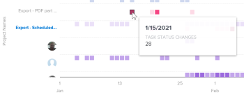

# View the Project activity visualization in Enhanced analytics

<!-- Audited: 12/2023 -->

The Project activity visualization shows an aggregate view of activities on the project level—the activities of each person assigned to the project—that happened during a specific time frame. You can narrow your focus to understand the activities within a project, or you can compare project activities against other projects in Adobe Workfront.

>[!NOTE]
>
>The Activity by team visualization behaves similarly to this visualization, but the Activity by team visualization shows home team activity for all projects.  
>For information on the Activity by team visualization, see [View the Activity by team visualization in Enhanced analytics](../enhanced-analytics/activity-by-team-overview.md).

## Access requirements

You must have the following:

<table style="table-layout:auto"> 
 <col> 
 <col> 
 <tbody> 
  <tr> 
   <td role="rowheader"><a href="https://www.workfront.com/plans" target="_blank">Workfront plan</a></td> 
   <td> 
Business or higher
 </td> 
  </tr> 
  <tr> 
   <td role="rowheader"><a href="../administration-and-setup/add-users/access-levels-and-object-permissions/wf-licenses.md" class="MCXref xref">Adobe Workfront licenses overview</a></td> 
   <td>   
New:
 
   <ul><li>Light or Higher</li></ul>
   
Current:

   <ul><li>Review or Higher</li></ul>
 </td> 
  </tr> 
  <tr> 
   <td role="rowheader">Access level configurations</td> 
   <td> 
View access to Projects
 <!--
Note: If you still don't have access, ask your Workfront administrator if they set additional restrictions in your access level. For information on how a Workfront administrator can change your access level, see <a href="../administration-and-setup/add-users/configure-and-grant-access/create-modify-access-levels.md" class="MCXref xref">Create or modify custom access levels</a>.
--> </td> 
  </tr> 
  <tr> 
   <td role="rowheader">Object permissions</td> 
   <td> 
View
 <!--
For information on requesting additional access, see <a href="../workfront-basics/grant-and-request-access-to-objects/request-access.md" class="MCXref xref">Request access to objects </a>.
--> </td> 
  </tr> 
 </tbody> 
</table>

For more detail about the information in this table, see [Access requirements in Workfront documentation](/help/quicksilver/administration-and-setup/add-users/access-levels-and-object-permissions/access-level-requirements-in-documentation.md).

## Prerequisites

For prerequisites to using Enhanced Analytics, see the "Prerequisites" section in [Enhanced analytics overview](../enhanced-analytics/enhanced-analytics-overview.md).

## Understand the Project activity visualization

Project activities display in different colors to summarize specific events in a project over a period of time:

* **Users logged in**: Purple boxes show that people assigned to the project logged in on that day. A darker shade indicates a higher number of people logging in.

  

* **Task status change**: Pink boxes show that people changed the status of a task for the project on that day. A darker shade indicates a higher number of task statuses changing.

  

* **Tasks completed**: Blue boxes show that people completed a task for the project. A darker shade indicates a higher number of tasks being completed.

  

Hovering over a box shows the exact number of times the action was completed in a given day. You can select a project to see a breakdown of these activities by each individual contributor on the project.

Seeing this information helps you determine:

* The activity on a specific project.
* The activity of one project compared to other projects.
* Which users are working on a project and at what frequency.

To learn how to get the best data for this visualization, see [Enhanced analytics overview](../enhanced-analytics/enhanced-analytics-overview.md).

## View the Project activity visualization

1. Click the Main Menu icon , then select **Analytics**.
1. (Optional) To use a different date range, select new start and end dates from the date range filter.

   

   For information on using the date range filter, see [Apply filters in Enhanced analytics](../enhanced-analytics/use-enhanced-analytics-filters.md).

   >[!NOTE]
   >
   >If you select a date range for a period greater than 3 months, the Project activity visualization does not display any data.

1. (Conditional) If you need to limit the project data set, select and apply the filters that you want to use.

   For more information on adding filters in Enhanced analytics, see [Apply filters in Enhanced analytics](../enhanced-analytics/use-enhanced-analytics-filters.md).

   After you add filters, data for up to 50 projects displays and the filters remain active even after you leave the page or log out of Workfront.

1. (Optional) To zoom in on a date range, select a point on the visualization for the start of your date range and drag to the end of your date range.

   All other visualizations update to the same date range and a timeframe filter is created.

   

1. (Optional) To change how the projects are sorted, click the **Sort by** menu, then select a new sorting option:

   * **A - Z** 
   * **Z - A** 
   * **Planned completion date** 
   * **Planned start date**

   All other visualizations on the page update to match your sorting selection.

1. (Conditional) If there are more than 50 projects in your data set, use the arrows in the bottom-left corner of the visualization to navigate from one group of 50 projects to the next.

   All other visualizations on the page update to match your page selection.

   

1. Click a project in the visualization to see more details for the project.

   The list expands to display the activities of each individual contributor on the project.

1. Mouse over a box to see the date that users completed an action, as well as the number of times the action was completed for that day.

   

1. (Optional) To export the visualization data, click the **Export icon**  in the top-right corner of the visualization, then select the export format:

   * **Chart (PNG)** 
   * **Data Table (XSLX)**

