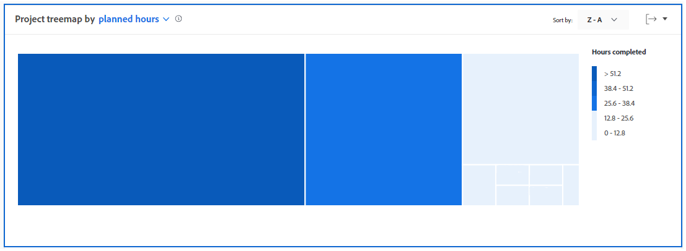
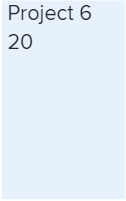
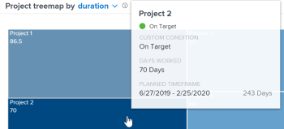

# View the Project treemap visualization in Enhanced analytics

<!-- Audited: 12/2023 -->

The Project treemap visualization is a view of hours—or days—that have been worked in a specific window of time compared against other work efforts in size. This helps you understand how much time people have dedicated to a project.

{width="700"}

## Access requirements

You must have the following:

<table style="table-layout:auto"> 
 <col> 
 <col> 
 <tbody> 
  <tr> 
   <td role="rowheader"><a href="https://www.workfront.com/plans" target="_blank">Adobe Workfront plan</a></td> 
   <td> 
Business or higher
 </td> 
  </tr> 
  <tr> 
   <td role="rowheader"><a href="../administration-and-setup/add-users/access-levels-and-object-permissions/wf-licenses.md" class="MCXref xref">Adobe Workfront licenses overview</a></td> 
   <td>   
New:
 
   <ul><li>Light or Higher</li></ul>
   
Current:

   <ul><li>Review or Higher</li></ul>
 </td> 
  </tr> 
  <tr> 
   <td role="rowheader">Access level configurations</td> 
   <td> 
View access to Projects
 <!--
Note: If you still don't have access, ask your Workfront administrator if they set additional restrictions in your access level. For information on how a Workfront administrator can change your access level, see <a href="../administration-and-setup/add-users/configure-and-grant-access/create-modify-access-levels.md" class="MCXref xref">Create or modify custom access levels</a>.
--> </td> 
  </tr> 
  <tr> 
   <td role="rowheader">Object permissions</td> 
   <td> 
View
 <!--
For information on requesting additional access, see <a href="../workfront-basics/grant-and-request-access-to-objects/request-access.md" class="MCXref xref">Request access to objects </a>.
--> </td> 
  </tr> 
 </tbody> 
</table>

For more detail about the information in this table, see [Access requirements in Workfront documentation](/help/quicksilver/administration-and-setup/add-users/access-levels-and-object-permissions/access-level-requirements-in-documentation.md).

## Prerequisites

For prerequisites to using Enhanced Analytics, see the "Prerequisites" section in [Enhanced analytics overview](../enhanced-analytics/enhanced-analytics-overview.md).

## Understand the Project treemap visualization

The boxes in the Project treemap visualization represent projects and the size of the boxes shows a comparison of how much time was spent on different projects. The larger the box is, the more time spent on the project.

The Project treemap visualization is comprised of:

* **Smaller, light blue boxes**: Projects that have fewer hours—or days—display as smaller boxes with a light blue color.

  

* **Larger, dark blue boxes**: Projects that have more hours—or days—display as larger boxes with a dark blue color.

  

* **Medium-sized, blue boxes**: Projects that fall in between the two categories display as medium-sized boxes with a shade of blue between the dark blue and light blue colors. There are 3 possible shades of blue for the medium-sized boxes.

The legend on the right side shows a breakdown of completed hours for each shade of blue. This legend is dynamic and updates according to the data.

>[!NOTE]
>
>If you are looking at the Project treemap visualization by duration instead of by planned hours, this legend shows a breakdown of days worked for each shade of blue.  
>>

Seeing this information helps you determine:

* The priority of things being worked on during the selected date range.
* What teams are spending time on.
* If teams are focusing on the right things.
* When a specific project is clicked, how much the scope of a project changed over that time period.

To learn how to get the best data for this visualization, see [Enhanced analytics overview](../enhanced-analytics/enhanced-analytics-overview.md).

## View the Project treemap visualization

1. Click the Main Menu icon , then select **Analytics**.
1. (Optional) To use a different date range, select new start and end dates from the date range filter.

   

   For information on using the date range filter, see [Apply filters in Enhanced analytics](../enhanced-analytics/use-enhanced-analytics-filters.md).

1. (Conditional) If you need to limit the project data set, select and apply the filters that you want to use.

   For more information on adding filters in Enhanced analytics, see [Apply filters in Enhanced analytics](../enhanced-analytics/use-enhanced-analytics-filters.md).

   After you add filters, data for up to 50 projects displays and the filters remain active even after you leave the page or log out of Workfront.

1. (Optional) To change how the projects are sorted, click the **Sort by** menu in the upper-right corner of the Project treemap visualization, then select a new sorting option:

   * **A - Z** 
   * **Z - A** 
   * **Planned completion date** 
   * **Planned start date**

   All other visualizations on the page update to match your sorting selection.

1. (Conditional) If there are more than 50 projects in your data set, use the arrows in the bottom-left corner of the visualization to navigate from one group of 50 projects to the next.

   All other visualizations on the page update to match your page selection.

   

1. (Optional) Change the view from **planned hours** to **duration**.

   Planned hours is selected by default.

1. Hover over a project to see the project condition, as well as the number of total planned hours, the number of total completed hours, and the average number of hours spent on the project per day.

   

   >[!NOTE]
   >
   >If you selected the **duration** view, you'll see the following duration details:
   >
   >* **Planned Timeframe**: The number of days planned to complete the project.
   >* **Days Worked**: The planned duration for each task that was completed within the date range selected at the top, divided by the number of hours in a day.
   >   
   >
   >
   >For more information on duration, see the section "Duration view" in [Enhanced analytics overview](../enhanced-analytics/enhanced-analytics-overview.md).

1. (Optional) To export the visualization data, click the **Export icon**  in the top-right corner of the visualization, then select the export format:

   * **Chart (PNG)** 
   * **Data Table (XSLX)**

1. Click a project to open the Burndown and Tasks in flight visualizations to gain a deeper insight of how tasks and hours—or days—contributed to the size of a project.

For more information on the Burndown visualization, see [View the Burndown visualization in Enhanced analytics](../enhanced-analytics/burndown-overview.md). For more information on the Tasks in flight visualization, see [View the Tasks in flight visualization in Enhanced analytics](../enhanced-analytics/tasks-in-flight-overview.md).

