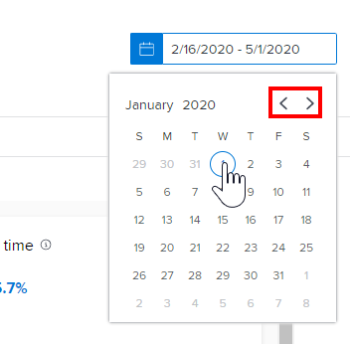
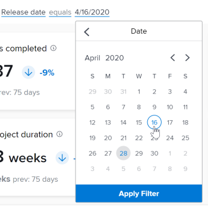
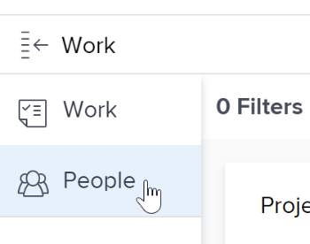

# Apply filters in Enhanced analytics

The filters in the Enhanced analytics area of Adobe Workfront help you focus on specific projects or specific types of data. The types of filters that you use can give you insight on:

* Projects you own
* Specific portfolio or program views
* Key performance indicators for a specific time frame (week, quarter, fiscal year)

You can add and remove filters as needed and Workfront retains the filters that you apply even if you log out.

## Access requirements

You must have the following access to perform the steps in this article:

<table style="table-layout:auto"> 
 <col> 
 <col> 
 <tbody> 
  <tr> 
   <td role="rowheader">Adobe Workfront plan*</td> 
   <td>
      
New plan: Any

      
or

      
Current plan: Business or higher
</td> 
  </tr>
  <tr> 
   <td role="rowheader">Adobe Workfront license*</td> 
   <td>
      
New plan: Light or higher

      
or

      
Current plan: Review or higher

   </td> 
  </tr>
  <tr> 
   <td>Access level* </td> 
   <td> 
View access to Projects
 
You must also have View access to Tasks, Portfolios, and Users to see specific project field filter options.
 
Note: If restrictions are selected in the Set additional restrictions section of the Edit Access Level dialog, you may not see all information in the filters or on the Enhanced analytics page after the filter is applied. For information on how a Workfront administrator can change your access level, see <a href="../administration-and-setup/add-users/configure-and-grant-access/create-modify-access-levels.md" class="MCXref xref">Create or modify custom access levels</a>.
 </td> 
  </tr> 
  <tr> 
   <td> 
Object permissions 
 </td> 
   <td> 
View
 
For information on requesting additional access, see <a href="../workfront-basics/grant-and-request-access-to-objects/request-access.md" class="MCXref xref">Request access to objects </a>.
 </td> 
  </tr> 
 </tbody> 
</table>

&#42;To find out what plan, license type, or access you have, contact your Workfront administrator.

## Prerequisites

For prerequisites to using Enhanced Analytics, see [Prerequisites](../enhanced-analytics/enhanced-analytics-overview.md#prerequisites) in [Enhanced analytics overview](../enhanced-analytics/enhanced-analytics-overview.md).

## Change the date range filter {#change-the-date-range-filter}

By default, the visualizations in the Enhanced analytics area show data for the last 60 days and the next 15 days. You can select a new date range and apply it to all visualizations in the Enhanced analytics area. If you navigate away from the page, the default date range is applied the next time you navigate back.

>[!TIP]
>
>You can also use keys on your keyboard to navigate to, open, and select a date range from the calendar widget.  
>For more information, see the [Keyboard shortcuts](../enhanced-analytics/enhanced-analytics-overview.md#keyboard-shortcuts) section in the article [Enhanced analytics overview](../enhanced-analytics/enhanced-analytics-overview.md).

To select a new date range:

{{step1-to-analytics}}

1. On the top right, click the date range field to open the calendar view.
1. Use the arrows above the calendar to locate the month of your start date, then select the start date.

   

1. Use the arrows above the calendar to locate the month of your end date, then select the end date.
1. (Optional) To zoom in on a smaller date range, drag the mouse from one specific date to another on one of the visualizations.

   All visualizations on the screen update to match the selected timeframe, and a Timeframe filter appears next to any existing filters. This filter is not retained if you log out or navigate away from the Enhanced analytics area.

   

## Add a filter

You can add filters based on default project fields, custom form fields, and home teams assigned to projects.

>[!TIP]
>
>You can also use keys on your keyboard to navigate to and add a new filter.  
>For more information, see the [Keyboard shortcuts](../enhanced-analytics/enhanced-analytics-overview.md#keyboard) section in the article [Enhanced analytics overview](../enhanced-analytics/enhanced-analytics-overview.md).

* [Add a project field filter](#add-a-project-field-filter) 
* [Add a project custom form filter](#add-a-project-custom-form-filter) 
* [Add a Team filter](#add-a-team-filter)

### Add a project field filter {#add-a-project-field-filter}

Project field filters allow you to filter data for projects and tasks based on the values entered in fields that are included on projects by default.

The following project field filter types are available:

| Field |Data displayed |
|---|---|
| **Project** |Displays data only for the selected project(s) |
| **Program** |Displays data only for projects in the selected program(s) |
| **Portfolio** |Displays data only for projects in the selected portfolio(s) |
| **Condition** |Displays data only for projects that most recently had the selected condition(s) (on target, at risk, or in trouble) |
| **Status** |Displays data only for projects that most recently had the selected statuses (complete, current, on hold, cancelled, etc.) |
| **Sponsor** |Displays data only for projects with the selected sponsor(s) |
| **Project Owner** |Displays data only for projects with the selected project owner(s) |

Custom form filters work differently. For more information, see [Add a project custom form filter](#add-a-project-custom-form-filter).

To add a project field filter:

{{step1-to-analytics}}

1. On the top left, click **Add Filter**, then select the desired filter type.

   >[!NOTE]
   >
   >Different filter types display different data. You can use only one filter type in a filter. After you select it, a filter type isn't available to use in another project field filter.

1. Locate the values you want to see data for by entering at least three characters of text in the **Search** field, then select each value you want to include in the filter.

   To select all current values, click **Select All**.

   

1. After you select all desired values, click **Apply Filter**.  

   The project count on the top right updates to reflect your applied filters.

1. Repeat these steps for each filter you want to add.

   As you add filters, data displays in the visualizations below for up to 50 projects.

   >[!TIP]
   >
   >To see data for more than the 50 projects that display by default, you can:   
   >
   >   * Use the arrows on the bottom left to display the next 50 projects in that visualization.  
   >       
   >   
   >   * Use the **Sort by** drop-down menu on a visualization to view the projects in a different order.  
   >     

   To adjust the date range, see [Change the date range filter](#change-the-date-range-filter).

### Add a project custom form filter

The custom form filter type allows you to filter data for projects and tasks based on the values entered in custom form fields on projects. Unlike with other Enhanced analytics filter types, you can add more than one custom form filter. Each custom form filter contains values entered only within the selected field on a specific custom form.

To add a custom form filter:

{{step1-to-analytics}}

1. In the top-left corner of the screen, click **Add Filter**, then select **Custom form**.

   

1. Locate the custom form you want by entering at least three characters of text in the **Search** field, then select the custom form.
1. Select the field you want, then complete one of the following actions based on the type of field you are adding to the filter:

   >[!NOTE]
   >
   >Not all custom corm field types can be added to a filter. Currently, Enhanced analytics supports only the field types listed below.

   * **Check box**, **drop-down**, or **radio button**: Select each value in the field that you want to include in your filter, or click the **Select All** check box.  
       
   
   * **Date**: Use the arrows to navigate to a specific month, then select the date in the field that you want to include in your filter.  
       
   
   * **Text**: Enter the text within the field that you want to include in your filter.  
     

   * **Number**: Enter the number within the field that you want to include in your filter.  
     

1. After you enter or select the values you want to filter for, click **Apply Filter**.

   The project count on the top right updates to reflect your applied filters.

1. Repeat these steps for each filter you want to add.

   As you add filters, data displays in the visualizations below for up to 50 projects.

   >[!TIP]
   >
   >To see data for more than the 50 projects that display by default, you can:   
   >  
   >   * Use the arrows on the bottom left to display the next 50 projects in that visualization.  
   >       
   >   
   >   * Use the **Sort by** drop-down menu on a visualization to view the projects in a different order.  
   >     

   To adjust the date range, see [Change the date range filter](#change-the-date-range-filter).

### Add a Team filter {#add-a-team-filter}

{{step1-to-analytics}}

1. In the left panel, click **People**.

   

1. On the top left of the screen, click **Add Filter**, then select the **Team** filter.
1. Locate the teams you want to see data for by entering at least three characters of text in the **Search** field, then select each team you want to include in the filter. To select all teams, click **Select All**.

   

   >[!NOTE]
   >
   >All teams are included as filter options, regardless of your access level.

1. After you select all desired teams, click **Apply Filter**.

   As you add filters, data displays in the visualizations below.

   To adjust the date range, see [Change the date range filter](#change-the-date-range-filter).

## Remove a filter

You can remove a filter at any time. If you remove a filter, it doesn't display the next time you visit the Enhanced analytics area.

>[!TIP]
>
>You can also use keys on your keyboard to navigate to and remove an existing filter.  
>For more information, see the [Keyboard shortcuts](../enhanced-analytics/enhanced-analytics-overview.md#keyboard) section in the article [Enhanced analytics overview](../enhanced-analytics/enhanced-analytics-overview.md).

To remove a filter:

{{step1-to-analytics}}

1. If you want to remove a project field or custom form filter, remain in the **Work** area.

   Or

   If you want to remove a Team filter, select **People** in the left panel.

1. Locate the desired filter and click the **X** to remove it.

   

   The filter is no longer active and doesn't display unless you add it again.
