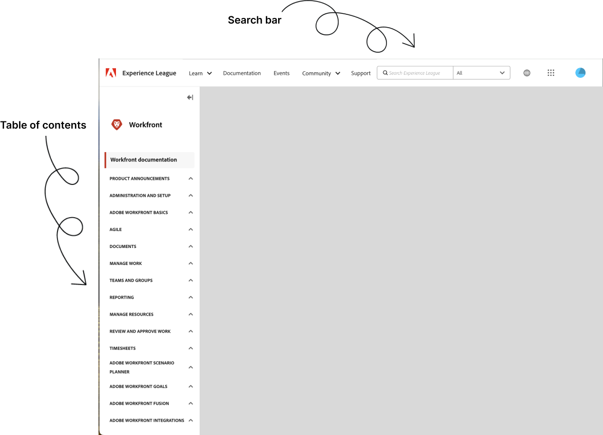

# [!DNL Workfront] documentation

Welcome to the Adobe Workfront product and technical documentation home page. Adobe Workfront is a work management application that helps you manage the entire lifecycle of work in one place.

Use the following Adobe Workfront help articles, and additional resources to learn how to implement and effectively use Adobe Workfront in your organization.

The following sections point you to useful links in this guide, arranged by intended audience based on typical job functions:

## What's new

>[!BEGINTABS]

>[!TAB Latest release]

* [Third Quarter 2024 release overview](/help/quicksilver/product-announcements/product-releases/24-q3-release-activity/24-q3-release-overview.md)
* [Adobe Workfront Fusion release activity](/help/quicksilver/product-announcements/product-releases/fusion-release-activity/fusion-release-activity.md)

>[!TAB 2024 releases]

* [First Quarter 2024 release overview](/help/quicksilver/product-announcements/product-releases/24-q1-release-activity/24-q1-release-overview.md)
* [Second Quarter 2024 release overview](/help/quicksilver/product-announcements/product-releases/24-q2-release-activity/24-q2-release-overview.md)
* [Third Quarter 2024 release overview](/help/quicksilver/product-announcements/product-releases/24-q3-release-activity/24-q3-release-overview.md)
* [Adobe Workfront Fusion release activity](/help/quicksilver/product-announcements/product-releases/fusion-release-activity/fusion-release-activity.md)

>[!TAB Betas]

* [Canvas Dashboards overview](/help/quicksilver/reports-and-dashboards/dashboards/creating-and-managing-dashboards/canvas-dashboards-overview.md)
* [New commenting beta experience](../betas/new-commenting-experience-beta/new-commenting-beta-experience-information.md)
* [Form designer overview](../../administration-and-setup/customize-workfront/create-manage-custom-forms/form-designer/form-designer-overview.md)
* [Workfront and Frame.io integration](/help/quicksilver/review-and-approve-work/Documents/wf-frame-alpha.md)

>[!TAB Known Issues]

* [Known Issues](https://experienceleague.adobe.com/en/docs/workfront-known-issues/issues/overview)

>[!ENDTABS]

## Explore documentation

<table>
 
  <tr tr style="border: 0;">
    <td style="text-align: center;">
<b>Administrators</b>
</td>
    <td colspan="2" style="text-align: center;">
<b>End users <!--Individual contributors--></b>
</td>
    <td style="text-align: center;">
<b>Developers</b>
</td>
  </tr>
  <tr tr style="border: 0;">
    <td>
    <ul>
    <li><a href="/help/quicksilver/administration-and-setup/get-started-wf-administration/get-started-with-wf-administration.md">Get started with Workfront Administration</a></li>
    <li><a href="/help/quicksilver/workfront-fusion/get-started/get-started.md">Get started with Workfront Fusion</li>
    </ul>
 </td>
    <td>
        <ul>
        <li><a href="/help/quicksilver/workfront-basics/workfront-basics.md">Adobe Workfront Basics</a></li>
        <li><a href="/help/quicksilver/manage-work/manage-work.md">Manage Work</a></li>
        <li><a href="/help/quicksilver/reports-and-dashboards/reports-and-dashboards-overview.md">Reports and Dashboards</a></li>
        <li><a href="/help/quicksilver/reports-and-dashboards/reports/text-mode/text-mode-resources.md">Text Mode</a></li>
        </ul>
    </td>
    <td><ul>
        <li><a href="/help/quicksilver/agile/agile-overview.md">Agile Overview</a></li>
        <li><a href="/help/quicksilver/documents/documents-overview.md">Documents</a></li>
        <li><a href="/help/quicksilver/resource-mgmt/workload-balancer/workload-balancer.md">Workload Balancer</a></li>
        <li><a href="URL">Review and Approval</a></li>
        </ul></td>
    <td><ul>
        <li><a href="/help/quicksilver/wf-api/general/api-basics.md">API Basics</a></li>
        <li><a href="https://developer.adobe.com/workfront/api-explorer/">API Explorer</a></li>
        <li><a href="/help/quicksilver/workfront-integrations-and-apps/workfront-integrations.md">Workfront Integrations</a></li>
        </ul></td>
  </tr>
</table>

## Tips for finding content in Experience League

Searching documentation can be more efficient with a few strategic approaches. Here are some tips to help you find what you need effectively:

### Use the Table of Contents and Search bar 

* **Table of Contents**: Start with the table of contents to get an overview of available topics and narrow down to specific topics by expanding sections.
* **Search bar**: Use the search bar to find documentation. Enter specific terms related to your issue or topic. Instead of general terms like "project management," use "project timeline setup" or "task dependencies."

### Explore Learning and Training Sections

* **Training Materials**: Navigate to the [Workfront tutorials](https://experienceleague.adobe.com/en/docs/workfront-learn/tutorials-workfront/home) page for a library of training videos and articles designed to help you better understand Workfront features and settings. 
* **Courses**: Check for structured learning paths that guide you through using various Workfront features in a logical sequence.

### Find answers in Community Forums

* **Ask Questions**: If the documentation doesn't answer your question, try posting in the [Workfront Community forums](https://experienceleaguecommunities.adobe.com/t5/workfront/ct-p/workfront?profile.language=en) where other users and experts can offer assistance.