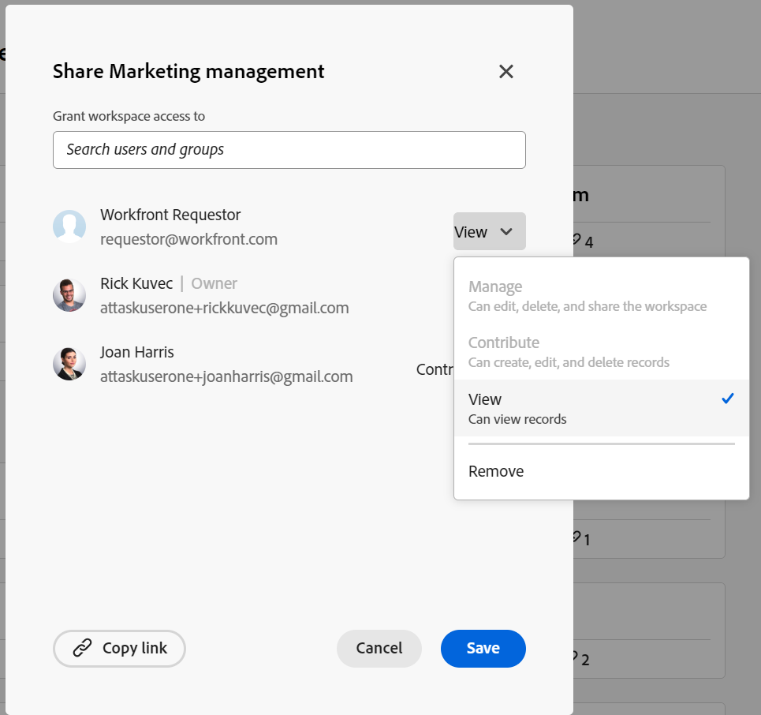

<!--update the metadata with real things when making this public; also update the description with something like this: Not all users in the organization have the same access and permissions to use Adobe Maestro. This article describes the levels of access that users could have to Adobe Maestro. -->
<!--update the title and the metadata title if Maestro is NOT its own product - because the title is too generic for it being a Workfront capability-->

# License type overview in Adobe Maestro

{{maestro-important-intro}}

Your Adobe Workfront license type works in conjunction with your Maestro permissions to give you access to view, contribute, or manage Maestro objects.

This article describes the types of licenses needed and the access granted to Maestro objects based on each license type. 

A user with a lower-level license type has restricted permissions to Maestro objects. 

>[!INFO]
>
>**EXAMPLE:** Requestors (or Collaborators, according to the new license model) cannot contribute to or manage Maestro workspaces and their objects. 
>
>There is an indication in the sharing box that users cannot be granted permissions to contribute to or manage a workspace when they hold a lower-level license. 
>
>

For information about permissions to Maestro objects, see [Overview of sharing permissions in Adobe Maestro](/help/quicksilver/maestro/access/sharing-permissions-overview.md). 

## The relationship between Workfront license types and Maestro permissions

The following table describes the relationship between the license type of a user and the level of permissions you can grant to them based on that license: 

| License type                                   | Permissions allowed to Maestro objects                                                                                                                                             |
|------------------------------------------------|-------------------------------------------------------------------------------------------------------------------------------------------------------------------------------|
|New: Standard   or  Current: Plan                    | Users can create and manage workspaces, record types, and records.                                                                                                                       |
| New: Light   or  Current: Work and Review                      | Users can contribute and view a workspace shared with them, as well as the record types and records from that workspace.  Users can create, edit, delete records in the workspaces where they have Contribute permissions.            |
| New: Contributor   or  Current: Requestor | Users can view the workspaces shared with them, as well as the record types and records of those workspaces. Users cannot create, edit, or delete record types or records. |

