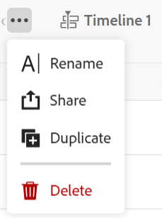
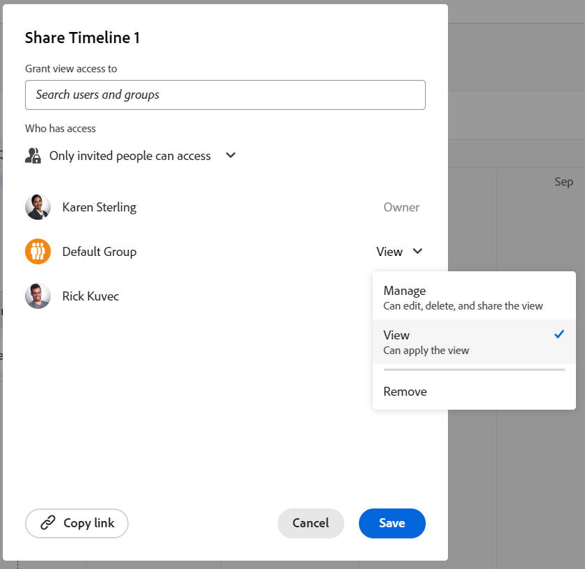

<!--*****************ADD TO TOC AND MINITOC WHEN RELEASING*********************-->

<!--update the metadata and description when we turn this article live; also, update title after Bob adds Maestro as a product-->

# Share a view

You can share a view with others to ensure collaboration when working in Adobe Workfront Maestro. 

Granting permissions to a workspace does not give other users permissions to the views on the record type pages. You must grant permissions to individual views in a record type page to share them with other users. 

## Access requirements

You must have the following access to perform the steps in this article: 

<table style="table-layout:auto">
 <col>
 </col>
 <col>
 </col>
 <tbody>
    <tr>
<tr>
<td>
   
 Product
 </td>
   <td>
   
 Adobe Workfront
 </td>
  </tr>  
 <td role="rowheader">
Adobe Workfront agreement
</td>
   <td>

Your organization must be enrolled in the Adobe Maestro closed beta program. Contact your account representative to inquire about this new offering. 

   </td>
  </tr>
  <tr>
   <td role="rowheader">
Adobe Workfront plan
</td>
   <td>

Any

   </td>
  </tr>
  <tr>
   <td role="rowheader">
Adobe Workfront license
</td>
   <td>
   
Any
 
  </td>
  </tr>
  
  <tr>
   <td role="rowheader">
Access level configurations
</td>
   <td> There are no access controls for Adobe Maestro
  
</td>
  </tr>

  <tr>
   <td role="rowheader">
Object permissions
</td>
   <td> 
Manage permissions to a view
  
</td>
  </tr>

<tr>
   <td role="rowheader">
Layout template
</td>
   <td> 
Your Workfront or group administrator must add the Maestro area to your layout template. 
  
</td>
  </tr>
 </tbody>
</table>

## Share permissions to a view

You can share views you created or views you have Manage permissions to. 

>[!NOTE]
>
>System Administrators cannot view or share views they did not create themselves. They can only view or share views that are shared with them. 

To share a view with others: 

{{step1-to-maestro}}

1. Open the workspace whose view you want to share, then click a Record Type card. 

   This opens the record type page.

1. From the view drop-down menu, hover over the view you want to share and click the **More** menu  to the right of the view name, then click **Share**. 

   

1. In the **Grant view access to** field, start typing the name of a user or a group, then click it when it displays in the list. 

    

1. Select one of the following permission levels from the drop-down menu: 
    * View
    * Manage

        For information about permission levels and what actions users can perform for each level, see [Overview of sharing permissions in Adobe Maestro](../access/sharing-permissions-overview.md).
1. Click **Save**.

## Remove permissions to a view

{{step1-to-maestro}}

{{step1-to-maestro}}

1. Open the workspace whose view you want to share, then click a Record Type card. 

   This opens the record type page.

1. From the view drop-down menu, hover over the view you want to share and click the **More** menu  to the right of the view name, then click **Share**. 

1. Find the user or group that you want to remove, then click **Remove** in the permissions drop-down menu to the right of the user's or group's name. 

1. Click **Save**.

    The user or the users that belong to the group removed no longer have access to the view. 