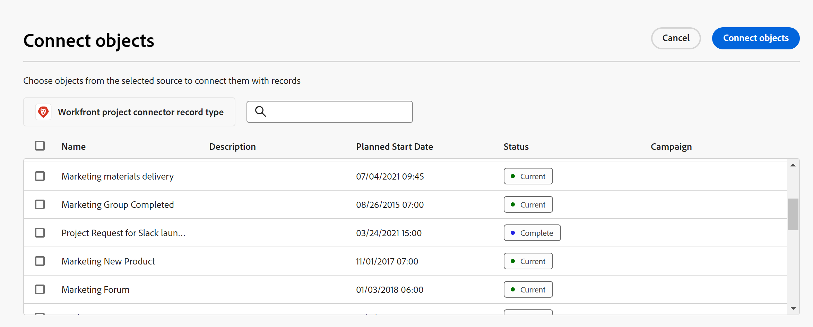

<!--udpate the metadata with real information when making this avilable in TOC and in the left nav-->

<!--if you change steps here, also update steps in the "Manage relationship fields" article-->

# Connect records to objects from other applications

In addition to connecting Maestro records to one another, you can also connect Maestro records to objects from other applications by creating a Relationship-type field.

You must connect the record type to an object from another application, and then you can use the Table view of the record type to connect records to other objects. 

You can connect the following objects from the following applications: 

* Projects from Workfront. 

  This article describes how you can connect Workfront objects to Maestro record types in Maestro.  <!--when you add more objects, fix the Access Requirements below which right now refer only to projects-->

## Access requirements

<table style="table-layout:auto">
 <col>
 </col>
 <col>
 </col>
 <tbody>
  <tr>
   <td role="rowheader">
Adobe Workfront plan*
</td>
   <td>
Any

<!--the above is only for closed beta; when going to GA - activate the following plans:    

Current plan: Prime and Ultimate

Legacy plan: Enterprise
-->
   </td>
  </tr>
  <tr>
   <td role="rowheader">
Adobe Workfront license*
</td>
   <td> 
Any, to create Maestro records
 

Work or higher to view projects in Workfront

  
For more information, see <a href="../../administration-and-setup/add-users/access-levels-and-object-permissions/wf-licenses.md" class="MCXref xref">Adobe Workfront licenses overview</a>.
 </td>
  </tr>
  <tr>
   <td role="rowheader">
Product
</td>
   <td> 
 Adobe Workfront
 </td>
  </tr>
  <tr>
   <td role="rowheader">
Access level*
</td>
   <td> 
Any, to create Maestro records

View or higher access to Projects
 
</td>
  </tr>

<tr>
   <td role="rowheader">
Object permissions
</td>
   <td> 
View or higher permissions to the projects you want to link with Maestro records  
</td>
  </tr>
<tr>
   <td role="rowheader">
Layout template
</td>
   <td> 
Your system administrator must add the Maestro area in your layout template. For information, see the "Enable Maestro for the users in your Workfront instance" section in the article <a href="../maestro/maestro-overview.md">Adobe Maestro overview</a>. 
  
</td>
  </tr>
 </tbody>
</table>

>[!NOTE]
>
>*If you still don't have access, ask your Workfront administrator if they set additional restrictions in your access level. For information on how a Workfront administrator can change your access level, see [Create or modify custom access levels](../administration-and-setup/add-users/configure-and-grant-access/create-modify-access-levels.md).

## Requirements for connecting Maestro records with Workfront objects

To link Maestro records with Workfront objects you must have the following:

* Workfront objects you want to link from Maestro. For example, projects in Workfront.
* Maestro workspaces and record types. For more information, see the following articles:

  * [Create workspaces](../architecture-and-fields/create-workspaces.md)
  * [Create record types](../architecture-and-fields/create-record-types.md)

## Considerations about importing record types from Workfront

<!-- this heading might need to be updated when more applications accessible??-->

* You can connect Workfront objects to Maestro record types by creating a Relationship-type field for a Maestro record type and using Workfront objects as the Linked record type. This action connects the Maestro record type with a Workfront object type. 
* After you connect a Maestro record type with a Workfront object type, you can connect records to individual objects. Connecting records to objects automatically creates a Workfront record type in Maestro. This is a read-only record type which cannot be deleted. <!-- is this still accurate??-->  The Workfront objects connected to Maestro records are also read-only in Maestro.
* After the connection between the objects and records is established, the values of any of the linked fields from the Workfront objects populate in Maestro record fields automatically. 
* You cannot update the values of Workfront objects or their field from Maestro. The synchronization of information is unilateral: only changes made in Workfront are automatically visible in Maestro.
* Everyone with access to Maestro can see the connections you make between Maestro records and Workfront objects. Also, you can see everyone else's connections. <!--add that this is based on your permissions in both Maestro and Workfront (or, later, any other application)-->
<!-- this is not possible yet; just projects for now: * You can connect one Maestro record to one or multiple Workfront objects. -->
* You cannot connect a Workfront object to a Maestro record from Workfront. You can only connect records to objects from Maestro. 
* There is no indication in Workfront that an object is linked to Maestro records. Any changes made to the Maestro records do not reflect on the objects linked from Workfront. <!--this will change at some point; they'll probably add some indication in the Details section in WF, per Artur-->
* You cannot connect taxonomies to Workfront objects. You can only connect operational record types. <!-- this is temporary; there will be certain objects (teams, etc) that will be linked to taxonomies, per Lilit-->

## Connect Workfront object types and fields to Maestro record types

You must connect Maestro record types with Workfront object types before you can connect individual records to objects. 

Connecting record types to object types from Workfront is similar to creating a Relationship-type field in Maestro. For more information, see [Manage Relationship-type fields in Adobe Maestro](../architecture-and-fields/manage-relationship-fields.md). 

1. Go to a record type whose records you want to connect to Workfront objects.
1. Select a **Table** view from the **View** drop-down menu in the upper-right corner of the record type page. 
1. Click the **+** icon in the upper-right corner of the table, to add a new field. 
1. Select **Relationship** from the **Field type** drop-down menu. You cannot change the field type after you save the field. 
1. Start typing a **Name** for the new field. 

   >[!TIP]
   >
   >We recommend that you include the name of the object you are linking to in the name of the relationship-type field to capture what object type the new field is coming from. The name of the linked record is not visible in the new linked field.
   >
   >For example, if you are linking the record to Workfront projects, you can name the new field "Linked Workfront project". 

1. (Optional) Add a description for this field. The description displays in the table view, when you hover over the column header of this field. 
1. From the **Linked record type** drop-down menu select **Workfront Project** . This is a mandatory field and you cannot edit this selection after you save the field.  <!--check the names of the links here and the screen shot-->

    <!--insert screen shot-->

1. Select **Allow multiple records** if you want to be able to link more than one Workfront object from one record. You cannot change this option after you save the field. This allows users to select multiple records from the linked record field. 
1. Click **Create**.

    This creates the following in Maestro: 

    * A relationship-type field with the name you selected in step 5. <!--ensure this is accurate-->

1. (Optional) Click the drop-down menu in the header of the linked record field name, then click **Edit field** to edit any information about the linked field. You can only edit the **Name** and the **Description** of the linked record field. 

## Connect Workfront objects and fields to Maestro records

After you created a linked field between a Maestro record type and a Workfront object type, you can connect individual records to objects in Workfront. You can also connect fields from the Workfront object to the Maestro record type you linked to the object. 

1. Find the record type you created the linked record field for in the previous section. For information, see the section [Connect Workfront object types and fields to Maestro record types](#connect-workfront-object-types-and-fields-to-maestro-record-types) in this article. 
1. Select a Table view from the **View** drop-down menu in the upper-right corner of the record type page. 

1. (Optional)  Click the drop-down menu in the header of the linked record field name, then click **Edit lookup fields** to add or remove any of the linked record's fields. 

    The **Add fields** box displays.
1. Click the  icon to remove fields from the **Selected fields** area

    Or
  
    Click the  icon to add fields from the **Unselected fields** area. 

    >[!NOTE]
    >
    >   * Not all Workfront fields are available in the list.
    >
    >    * If you don't select any fields, the **Name** field is selected by default.
    >
    >    * The name of the custom form displays under the custom fields. 

1. (Conditional and optional) For date, number, currency, or percentage fields, select an aggregator from the drop-down to the right of the field name. For more information, see [Manage Relationship-type fields](../architecture-and-fields/manage-relationship-fields.md). 

    <!--insert screen shot-->

1. Click **Add fields** to save your changes.<!-- is this the right button? I asked Lusine to replace with "Add"-->

1. From a record listed in the table view, go to the linked record column and hover over the cell corresponding to the record that you want to link with Workfront objects, then click the **+** icon. 

    The **Connect objects** box displays. 

    

1. Start typing the name of a Workfront objects in the search box, then select it when it displays on the screen

    Or

    Select the name of one or multiple objects in the box, then click **Connect objects** in the upper-right corner of the Connect objects box. 

    <!--insert screen shot-->

    The following are added to Maestro:

    * The selected Workfront objects are added to the linked record field. 
    * A new record type called "Workfront project" is created in the same workspace as the Maestro record you are linking from. 
    
        This is a read-only record type and it will display projects that are selected in the new relationship-type field. The linked fields of the linked object also display on the read-only linked records.  
    * A new linked field is created for every linked field that you selected in step 6 <!--is this still accurate-->. The linked field from the linked Workfront object type is named according to this pattern: 

      `<Name of the original field on the Workfront object type> (from <Name of your linked field>)`

      For example, if you linked the Budget field from Workfront projects and you named your relationship-type field "Linked Workfront project", the linked Budget field is named "Budget (From Linked Workfront project)". 
    
    * Any existing information from the Workfront objects displays in the linked fields. 

        >[!TIP]
        >
        >*  We use "linked fields" and "lookup fields" interchangeably. 
        >
        >* If you enabled the Allow multiple records setting, the values of the multiple objects are either displayed separated by commas or are aggregated according to the aggregator you chose.
    
1. (Optional) Close the Maestro record type page and go to the Workspace you selected. Click the card for the Workfront object record type. For example, click the **Workfront project** card. The record type card should open in the Table view. 

    This is a read-only Workfront linked record type. 
    
    >[!NOTE]
    >
    >    * The records listed in the Workfront record type are read-only Workfront objects. The fields linked from the Maestro record type also display as  read-only columns. 
    >
    >    * To display the Workfront object record type in the Timeline view, you must have at least two date fields displayed in the Table view of the read-only Workfront record type page. 

1. (Optional) Click the **More** menu  next to the Workfront object record type name in the header of the page, then click **Rename** to edit the name of the record. 

    >[!NOTE]
    >
    >    You cannot delete a linked Workfront record type. 

1. (Optional) Click the add fields icon  in the upper-right corner of the table view on the Workfront record type page, to add or remove Workfront fields from the Workfront record type.

    >[!NOTE]
    >
    >  The fields you add or remove are not added nor removed from the Maestro record type that links to the Workfront object type. The fields are only visible on the read-only Workfront record type page, so you can review them in Maestro.
    
    
    
   
 

    

 
