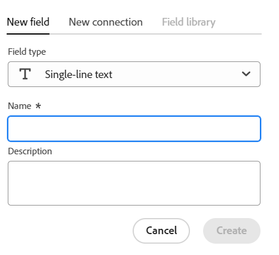
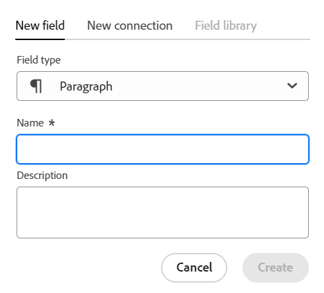
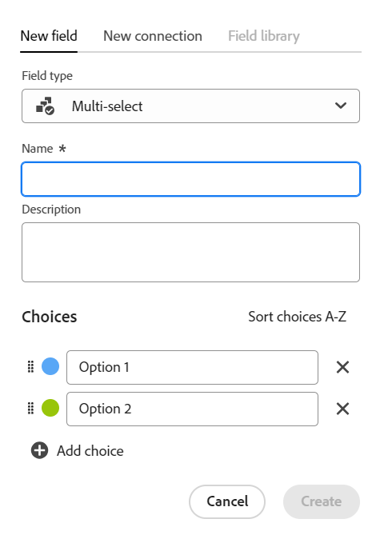
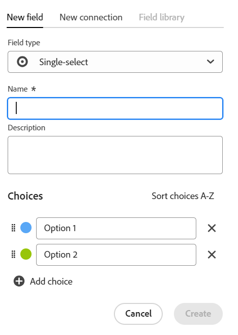
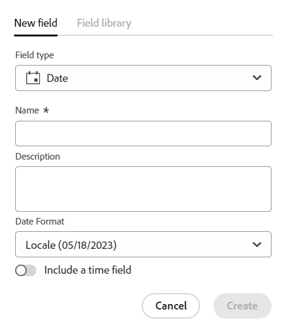
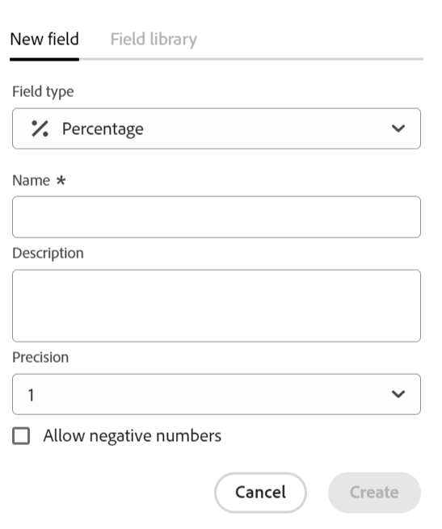
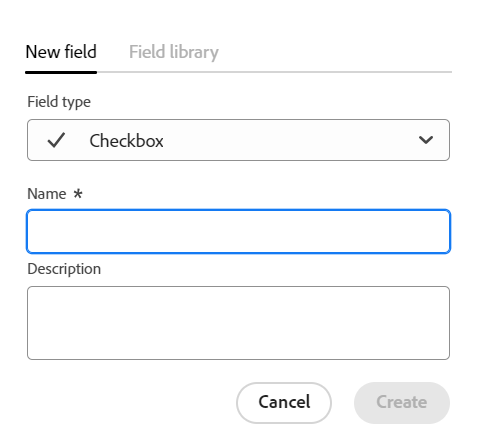

<!--udpate the metadata with real information when making this avilable in TOC and in the left nav-->

<!--Should the structure of this article be like this one: https://experienceleague.adobe.com/docs/workfront/using/administration-and-setup/customize/custom-forms/custom-form-builder/use-the-custom-form-builder/add-a-custom-field-to-a-custom-form.html?lang=en ??-->

<!--will they add a way to create fields elsewhere than in a table?! - how will that change the structure of this article? -->

# Create fields

In Adobe Maestro, you can create custom fields for operational record types or taxonomies. You can then associate the fields with Maestro records to enhance record information. 

You must create record types before you can create fields to associate with them. For information, see [Create record types](../architecture-and-fields/create-record-types.md). 

## Access requirements

<table style="table-layout:auto">
 <col>
 </col>
 <col>
 </col>
 <tbody>
  <tr>
   <td role="rowheader">
Adobe Workfront plan*
</td>
   <td>

Any

<!--the above is only for closed beta; when going to GA - activate the following plans:    

Current plan: Prime and Ultimate

Legacy plan: Enterprise
-->
   </td>
  </tr>
  <tr>
   <td role="rowheader">
Adobe Workfront license*
</td>
   <td>
   
Any
 
  
For more information, see <a href="../../administration-and-setup/add-users/access-levels-and-object-permissions/wf-licenses.md" class="MCXref xref">Adobe Workfront licenses overview</a>.
 </td>
  </tr>
  <tr>
   <td role="rowheader">
Product
</td>
   <td>
   
 Adobe Workfront
 </td>
  </tr>
  <tr>
   <td role="rowheader">Access level*</td>
   <td> 
Any
  
</td>
  </tr>
<tr>
   <td role="rowheader">Layout template</td>
   <td> 
Your system administrator must add the Maestro area in your layout template. For information, see the "Enable Maestro for the users in your Workfront instance" section in the article <a href="../maestro/maestro-overview.md">Adobe Maestro overview</a>. 
  
</td>
  </tr>
 </tbody>
</table>

*If you still don't have access, ask your Workfront administrator if they set additional restrictions in your access level. For information on how a Workfront administrator can change your access level, see [Create or modify custom access levels](../administration-and-setup/add-users/configure-and-grant-access/create-modify-access-levels.md).

## Considerations about Maestro fields

* The fields associated with a record type are available to be associated with all the records of that type. <!--will this change and will the fields be available for other record types, too?! Also, the next bullet might need to change too if this one changes -->

* Fields associated with a record type cannot be added to another record type. <!-- this will change when they open the Field library tab when creating a field-->

* You can create fields manually or automatically in the following ways:

    * Automatically: 

        * Maestro creates fields by default every time you create a record type. 

            The following are standard fields created by default for each new operational record type:

            * Name
            * Description
            * Start Date
            * End Date
            * Status. The default values for record statuses are:
                * Development
                * Planned
                * Active
                * Completed
                * On Hold

                You can add more values or rename the existing ones. 

            The following are the standard fields created by default for each new taxonomy record type:

            * Name <!--will more be added? If not, consider rephrasing this bullet-->

        * Maestro creates fields for operational record types and taxonomies when you create a workspace from a template. For information, see [Create workspaces](../architecture-and-fields/create-workspaces.md). 

        
    * Manually:

        * Create fields in the Table view of a record type page. The columns of the table are the fields associated with the record type. They are the same fields that display on a record's Details page. 
        
            You cannot create fields from the Details page of a record.
            
            This article describes how to manually create fields. 

        * Create fields by making a new connection between two Maestro record types or a record type and an object types from other applications. 
        
           <!--* Importing record types with fields using a CSV or an Excel file. - this is not available yet-->

           For more information about connecting Maestro record types, see [Connect record types](../architecture-and-fields/connect-record-types.md).  

        * Import fields when you import record types using an Excel or CSV file. For more information, see [Create record types](../architecture-and-fields/create-record-types.md). 

* You can view and update the settings for the fields that you or any other user created. <!--this will change with access/ permissions-->

* You can have up to 500 fields for one record type.

* Field names can have up to 250 characters.

* When deleting an operational record type, taxonomy, or workspace, all fields associated with them are also deleted and cannot be recovered. <!-- this might change with a possible recycle bin solution?!-->

## Create fields from scratch {#create-fields-from-scratch} <!--in a table (not sure if this can be done elsewhere?!-->

1. Click the **Main Menu** icon  in the upper-right corner of Workfront, <!---or the **Main menu** icon   in the upper-left corner, if available--> then click **Maestro** .

    The last-accessed workspace should open by default. 

1. (Optional) Expand the downward-pointing arrow to the right of an existing workspace name and select the workspace whose record types you want to create fields for, then click the record type. 

    All existing records associated with the record type display in the rows of the table view. 

    >[!TIP]
    >
    >    If no records display, you might not have any records yet, or you might have a filter applied that limits what you see on the screen.

    All existing fields associated with the record type display in the columns of the table view. <!--caveat this for when we can hide the fields; mention that they can be hidden if they are not visible by default-->

    
1. Click the **+** icon in the upper-right corner of the table view to add new fields.
1. In the **New field** tab, select from the following field types: 

    * [Single-line text](#single-line-text)
    * [Paragraph](#paragraph)
    * [Multi-select](#multi-select)
    * [Single-select](#single-select)
    * [Date](#date)
    * [Number](#number) 
    * [Percentage](#percentage)
    * [Currency](#currency)
    * [Checkbox](#checkbox) 
    
    >[!IMPORTANT]
    >
    >    You cannot change the type of the field after you save it. 

1. Continue with adding each field, as described in the sections below.

### Single-line text {#single-line-text}

Single-line text fields capture limited alphanumeric information. For example,  you can capture the Owner, Stakeholder, Team, or Organizational unit information in a single-line text field. The content of a single-line text field can have up to 250 characters. <!-- asked Lilit if we can change this to "Single-line" since this can have numbers and text.-->

1. Start creating a field as described in the section [Create fields from scratch](#create-fields-from-scratch) in this article, then select the **Single-line text** field type.

     

1. Add the following information:
     * **Name**: The name of the field type, as it will appear in a table or the Details page of the record. <!--ensure they updated this; and update the screen shot: it used to be "Label"-->
     * **Description**: Additional information about the field. The description of a field displays when you hover over the field's column in a table.
1. Click **Create**. 

    The new single-line field is added as a column to the record type and its values can be associated with records. The field also displays on the Details page of a record.

### Paragraph {#paragraph}

Paragraph fields capture additional alphanumeric information about a record, similar to the Description field. The content of a paragraph field can have up to 1,000 characters. 

1. Start creating a field as described in the section [Create fields from scratch](#create-fields-from-scratch) in this article, then select the **Paragraph** field type.

    
 

1. Add the following information:
     * **Name**: The name of the field type, as it will appear in a table or the Details page of the record. <!--ensure they updated this; and update the screen shot: it used to be "Label"-->
     * **Description**: Additional information about the field. The description of a field displays when you hover over the field's column in a table.
1. Click **Create**. 

    The new paragraph field is added as a column to the record type and its values can be associated with records. The field also displays on the Details page of a record. 

### Multi-select {#multi-select}

You can use a multi-select field to capture additional information in any format by selecting more than one option from a drop-down menu. 

1. Start creating a field as described in the section [Create fields from scratch](#create-fields-from-scratch) in this article, then select the **Multi-select** field type.

    
 

1. Add the following information:
     * **Name**: The name of the field type, as it will appear in a table or the Details page of the record. <!--ensure they updated this; and update the screen shot: it used to be "Label"-->
     * **Description**: Additional information about the field. The description of a field displays when you hover over the field's column in a table.
     * **Choices**: The options  available to select from the drop-down menu after the field is saved. You can have both numbers and letters for the name of each choice. 
1. (Optional) Manually drag and drop each choice in the desired order, or select the **Sort choices A-Z** option if you want the choices to be automatically listed in alphabetical order. <!--Add this if they added this functionality: You cannot edit this option after you save the field.-->
1. Click **Add choice** to add as many choices or options as needed.      
1. Click the **x** icon to the right of a choice to remove it.
1. Click the color swatch to the left of a choice to expand the color selector and customize the color of each option. 
1. Click **Create**. 

    The new multi-select field is added as a column to the record type and its values can be associated with records. The field also displays on the Details page of a record.

### Single-select {#single-select}

Single-select fields capture additional information in any format by selecting one option from a drop-down menu. 

1. Start creating a field as described in the section [Create fields from scratch](#create-fields-from-scratch) in this article, then select the **Single-select** field type.

    
 

1. Add the following information:
     * **Name**: The name of the field type, as it will appear in a table or the Details page of the record. <!--ensure they updated this; and update the screen shot: it used to be "Label"-->
     * **Description**: Additional information about the field. The description of a field displays when you hover over the field's column in a table.
     * **Choices**: The options  available to select from the drop-down menu after the field is saved. You can have both numbers and letters for the name of each choice. 
     
1. (Optional) Manually drag and drop each choice in the desired order, or select the **Sort choices A-Z** option if you want the choices to be automatically listed in alphabetical order. <!--Add this if they added this functionality: You cannot edit this option after you save the field.-->
1. Click **Add choice** to add as many choices or options as needed.      
1. Click the **x** icon to the right of a choice to remove it.
1. Click the color swatch to the left of a choice to expand the color selector and customize the color of each option. 
1. Click **Create**. 

    The new single-select field is added as a column to the record type and its values can be associated with records. The field also displays on the Details page of a record.

### Date {#date}

You can use a date field to capture additional information in date and time format. 

1. Start creating a field as described in the section [Create fields from scratch](#create-fields-from-scratch) in this article, then select the **Date** field type.

    
 

1. Add the following information:
     * **Name**: The name of the field type, as it will appear in a table or the Details page of the record. <!--ensure they updated this; and update the screen shot: it used to be "Label"-->
     * **Description**: Additional information about the field. The description of a field displays when you hover over the field's column in a table.
     * **Date format**: The type of date format you want to display in this field.
        
        Select from the following formats:
        * **Locale**: Matches the locale of your browser.
        * **Standard**: 05/16/2023
        * **Long**: May 16, 2023
        * **European**: 16/05/2023
        * **ISO**: 2023-05-16
    * Include a time field: Select this option if you want to include a time stamp. Select from the following options:
        * **24hr**: For example: 18:00
        * **12hr**: For example: 6:00 PM

        This is unselected by default.

1. Click **Create**. 

    The new date field is added as a column to the record type and its values can be associated with records. The field also displays on the Details page of a record.

### Number {#number}

Number field types capture information in a number format. 

1. Start creating a field as described in the section [Create fields from scratch](#create-fields-from-scratch) in this article, then select the **Number** field type.

    
1. Add the following information:

    * **Name**: The name of the field type, as it will appear in a table or the Details page of the record. 
    * **Description**: Additional information about the field. The description of a field displays when you hover over the field's column in a table. 
    * **Precision**: The number of decimals that you want to record for the field. You can display up to 6 decimals.
    * **Allow negative numbers**: Select this option if you want to allow negative numbers in this field. This option is unselected by default. 
    
    >[!NOTE]
    >
    >    If you select Allow negative numbers, and negative values are stored on the records the field is attached to, then you can no longer deselect the setting.

1. Click **Create**.

    The new number field is added as a column to the record type and its values can be associated with records. The field also displays on the Details page of a record.  

### Percentage {#percentage}

Percentage field types capture information in a number format followed by a percentage sign. 

1. Start creating a field as described in the section [Create fields from scratch](#create-fields-from-scratch) in this article, then select the **Percentage** field type.

    

1. Add the following information:
     * **Name**: The name of the field type, as it will appear in a table or the Details page of the record. 
     * **Description**: Additional information about the field. The description of a field displays when you hover over the field's column in a table. 
    * **Precision**: The number of decimals that you want to record for the field. You can display up to 6 decimals.
    * **Allow negative numbers**: Select this option if you want to allow negative percentage values in this field. This option is unselected by default. 

    >[!NOTE]
    >
    >    If you select Allow negative numbers, and negative values are stored on the records the field is attached to, then you can no longer deselect the setting.

1. Click **Create**. 

    The new percentage field is added as a column to the record type and its values can be associated with records. The field also displays on the Details page of a record. 

### Currency {#currency}

Currency field types capture information in a number format preceded by a currency symbol. 

1. Start creating a field as described in the section [Create fields from scratch](#create-fields-from-scratch) in this article, then select the **Currency** field type.

    

1. Add the following information:
     * **Name**: The name of the field type, as it will appear in a table or the Details page of the record. <!--ensure they updated this; and update the screen shot: it used to be "Label"-->
     * **Description**: Additional information about the field. The description of a field displays when you hover over the field's column in a table.
     * **Currency**: The type of currency you want to display in this field. This is a list of currencies according to the International Organizaton of Standardization (ISO). 
      * **Precision**: The number of decimals that you want to record for the field. You can display up to 6 decimals.
    * **Allow negative numbers**: Select this option if you want to allow negative currency values in this field. This option is unselected by default. 

    >[!NOTE]
    >
    >    If you select Allow negative numbers, and negative values are stored on the records the field is attached to, then you can no longer deselect the setting. 

1. Click **Create**. 

    The new currency field is added as a column to the record type and its values can be associated with records. The field also displays on the Details page of a record. 

### Checkbox

You can use the Checkbox field type to add a single checkbox option to a record. You can use this field to indicate a specific attribute or status for that particular record. For example, you can use it as a flag for tracking completion, approval, or any other binary attribute for each record. 
 
1. Start creating a field as described in the section [Create fields from scratch](#create-fields-from-scratch) in this article, then select the **Checkbox** field type.
 
    

1. Add the following information:
     * **Name**: The name of the field type, as it will appear in a table or the Details page of the record. <!--ensure they updated this; and update the screen shot: it used to be "Label"-->
     * **Description**: Additional information about the field. The description of a field displays when you hover over the field's column in a table.
1. Click **Create**.

    The new checkbox field is added as a column to the record type and its values can be associated with records. The field also displays on the Details page of a record. 

