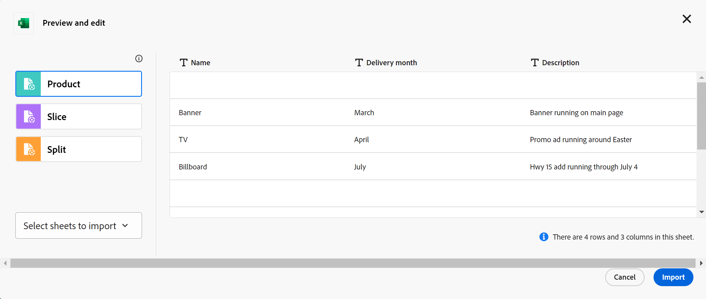
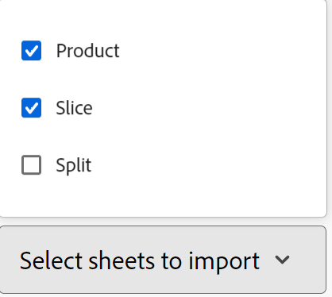

<!--udpate the metadata with real information when making this available in TOC and in the left nav-->

# Create record types

Record types are the object types of Adobe Maestro. In Maestro, you can create custom record types which illustrate the work-related items needed in your organization's lifecycle. 

Record types can be one of the following:

* **Operational record types**
* **Taxonomies**

For more information about Maestro record types, see [Overview of record types and taxonomies](../architecture-and-fields/overview-of-record-types-and-taxonomies.md).

Creating operational record types is similar to creating taxonomy record types. This article describes how you create operational record types. 

For information about creating taxonomies, see [Create taxonomy record types](../architecture-and-fields/create-a-taxonomy.md). 

## Access requirements

You must have the following access to perform the steps described in this article:

<table style="table-layout:auto">
 <col>
 </col>
 <col>
 </col>
 <tbody>
  <tr>
   <td role="rowheader">
Adobe Workfront plan*
</td>
   <td>

Any

<!--the above is only for closed beta; when going to GA - activate the following plans:    

Current plan: Prime and Ultimate

Legacy plan: Enterprise
-->
   </td>
  </tr>
  <tr>
   <td role="rowheader">
Adobe Workfront license*
</td>
   <td>
   
Any
 
  
For more information, see <a href="../../administration-and-setup/add-users/access-levels-and-object-permissions/wf-licenses.md" class="MCXref xref">Adobe Workfront licenses overview</a>.
 </td>
  </tr>
  <tr>
   <td role="rowheader">
Product
</td>
   <td>
   
 Adobe Workfront
 </td>
  </tr>
  <tr>
   <td role="rowheader">Access level*</td>
   <td> 
Any
  
</td>
  </tr>
<tr>
   <td role="rowheader">Layout template</td>
   <td> 
Your system administrator must add the Maestro area in your layout template. For information, see the "Enable Maestro for the users in your Workfront instance" section in the article <a href="../maestro/maestro-overview.md">Adobe Maestro overview</a>. 
  
</td>
  </tr>
 </tbody>
</table>

>[!NOTE]
>
>*If you don't have access, ask your Workfront administrator if they set additional restrictions in your access level. For information on how a Workfront administrator can change your access level, see [Create or modify custom access levels](../administration-and-setup/add-users/configure-and-grant-access/create-modify-access-levels.md).

## Considerations about creating record types 

* You can create record types in a workspace by doing one of the following:

    * Automatically: 
        * When you create a workspace using a template. 
        
            For information, see [Create workspaces](../architecture-and-fields/create-workspaces.md).
        * When you import them using an Excel or CSV file. This is not available for taxonomy record types. 
        * When you create a connection to object types from another application, when adding fields to a record type. This creates a read-only record type in Maestro which is connected to object types from the original application. This is not available for taxonomy record types. 

        For information about connecting object types with Maestro records, see [Connect records](../architecture-and-fields/connect-records.md). 
    * Manually:

        * From scratch.    

## Create record types using a workspace template

You can create record types automatically when you create a workspace using a template. Each Maestro template contains sample operational and taxonomy record types. 

For information about creating workspaces, see [Create workspaces](../architecture-and-fields/create-workspaces.md).

For information about what record types are included with each template, see [List of available workspace templates](../architecture-and-fields/workspace-templates.md). 

## Create a record type from scratch

This article describes how to create operational record types from scratch. Creating operational record types from scratch is similar to creating taxonomies. 

For more information about taxonomies, see [Create a taxonomy](../architecture-and-fields/create-a-taxonomy.md).

1. Click the **Main Menu** icon  in the upper-right corner of Workfront, <!---or the **Main menu** icon   in the upper-left corner, if available--> then click **Maestro** .

    The last-accessed workspace should open by default. 

1. (Optional) Expand the downward-pointing arrow to the right of an existing workspace name and select the workspace that you want to create record types for.
1. Click **Add record type**. 
1. (Conditional) If you are creating an operational record type, click **From scratch**. This option is not available when creating taxonomies. 

    The Add record type box opens. 

    

1. Select the following information:

    * **Record name**: Replace "Untitled Operational Record Type" with the name of your future record type. <!--correct this - I asked Garik to change this field to "Record type name"--> 
    * **Appearance**: Define the color and shape of the icon associated with the record type. Do the following: 
        * Select a color to identify your new record type. This is the color of the record type icon. Gray is selected by default.
        * Select an icon from the list, or start typing the name of an icon to describe what it represents, then select it when it displays. This is the icon of the record type. A file icon is selected by default. 

1. Click outside the **Add record type** box to save the record. 

    The record type card is added to the workspace you selected. 
    The number of fields that the record type contains displays on the card. 
1. (Optional) Click the record type card to open the record type page. 

    

    The record type page displays in the Table view by default. The columns of the table are fields associated with the new record type. Each row is a unique record that you must add. 

    By default, the following fields display in the table view columns of an operational record type:

    * Name

        The Name field is the only field automatically created for taxonomies. 
    * Description
    * Start Date
    * End Date
    * Status

1. (Optional) Update the record type name in he header of the page

    Or

    Click the **More** icon  to the right of the record type name and click **Rename** to rename it. 

1. (Optional) Click **+ New < record type name >** to add records of the selected record type. For more information, see [Create records](../records/create-records.md). 
1. (Optional) Click the **+** icon in the upper-right corner of the table to add more fields to the record type. For more information, see [Create fields](../architecture-and-fields/delete-fields.md). 
1. (Optional) Click the left-pointing arrow to the left of the record type name to go back to the selected workspace. 

    The record type card displays the number of fields and connections the record type contains. 

    

    For additional information about adding records, deleting or editing record types, or updating the view in the record type page, see the following articles:

      * [Create records](../records/create-records.md)
      * [Delete record types](../architecture-and-fields/delete-record-types.md)
      * [Edit record types](../architecture-and-fields/edit-record-types.md)
      * [Manage record views in Adobe Maestro](../views/manage-record-views.md) <!--add information here about the sorting and grouping when available-->

## Create record types by importing an Excel or CSV file

Consider the following when importing record types using an Excel or CSV file: 

* Each sheet of the Excel file becomes a record type in Maestro. 
* The columns of each sheet become the fields associated with each record type. 
* Fields are unique for their respective record types. 
* Each row in each sheet becomes a unique record associated with its respective record type. 
* Each sheet of the Excel file should not exceed the following: 
    * 10,000 rows
    * 500 columns
* The Excel file should not be larger than 5MB.
* Empty sheets are not supported. 

To import record types using an Excel file: 

1. Click the **Main Menu** icon  in the upper-right corner of Workfront, <!---or the **Main menu** icon   in the upper-left corner, if available--> then click **Maestro** .

    The last-accessed workspace should open by default. 

1. (Optional) Expand the downward-pointing arrow to the right of an existing workspace name and select the workspace that you want to create record types for.
1. Click **Add record type**. 
1. (Conditional) If you are creating an operational record type, click **Excel/CSV**. 

    >[!NOTE]
    >
    >    This option is not available when creating taxonomy record types.

1. Drag and drop an Excel or CSV file previously saved on your computer, or click **Select a CSV or Excel file** to browse for one. 
1. Click **Review your data**.
    
    The Preview and edit box displays with the following information: 

    * The names of the sheets or of the future record types display in the left panel. Maestro selects an icon and a color for each new record type by default.
    * The first sheet or record type is selected and the names of the fields associated with it display as the column headers. The type of each field is selected by default. 
    * Each row represents a new record. Only the first 10 records display in the Preview and edit box. 

    

1. (Optional) Click the name of each sheet in the left panel to review the information it contains. 

    >[!NOTE]
    >
    >    Sheets that are empty are not supported and are dimmed. 

1. (Optional) Click the **Select sheets to import** drop-down menu and deselect the sheets that you don't want to import. 

    

    Sheets you deselected display with a gray background. 

1. Click **Import** when you are ready to import your file. 

    The following information imports in to Maestro:

    * New record types
    * New fields associated with each record type
    * New records associated with each record type

    You can start managing fields and records on the record types pages. 
    
    Everyone with access to Maestro can now view and edit the imported record types and their information. <!--this will change with permissions-->

## Connect record types with object types from another application

You can import record types when you create a connection between a Maestro record type and an object type from another application. This creates a read-only record type in Maestro that corresponds to the object type in the third-party application. 

For example, you can create record types by connecting Maestro record types with Workfront projects. As a result, the Workfront project object type is imported into Maestro as a read-only record type. By default, the record type is named "Workfront Project." <!--has this name changed? Lusine wanted to change it at some point--> 
    
You can import the following objects from the following applications: 

* From Workfront:

    * Projects
    * Portfolios
    * Programs

For more information, see [Connect record types](../architecture-and-fields/connect-record-types.md). 

    

