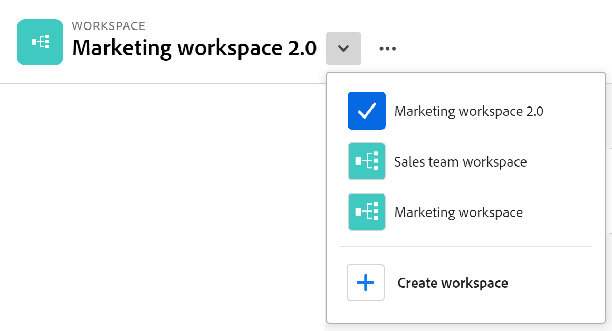
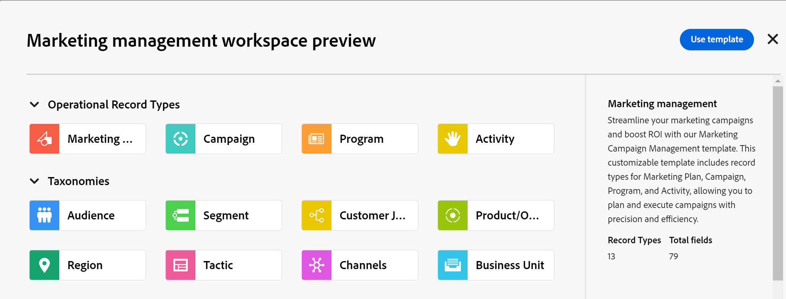

<!--udpate the metadata with real information when making this avilable in TOC and in the left nav-->

# Create workspaces

>[!IMPORTANT]
>
>Currently, Adobe Maestro is part of a beta program which is open to a limited number of customers. 
>
>Contact your account representative for more information about joining the beta program for Maestro.
>
>For information, see [Adobe Maestro overview](../maestro-overview.md).

In Adobe Maestro, workspaces are centralized locations for teams to plan work. 

A workspace is a collection of operational record types and taxonomies used by a team and represents the team's work lifecycle. You can fully customize workspaces in Maestro. 

## Access requirements

You must have the following access to perform the steps in this article: 

<table style="table-layout:auto">
 <col>
 <tbody>
<td>
   
 Adobe product
 </td>
   <td>
   
 Adobe Workfront
 </td>
  </tr>  
 <td role="rowheader">
Adobe Workfront agreement
</td>
   <td>

Your organization must be enrolled in the Adobe Maestro closed beta program. Contact your account representative to inquire about this new offering. 

   </td>
  </tr>
  <tr>
   <td role="rowheader">
Adobe Workfront plan
</td>
   <td>

Any

   </td>
  </tr>
  <tr>
   <td role="rowheader">
Adobe Workfront license
</td>
   <td>
   
Any
 
  </td>
  </tr>
  
  <tr>
   <td role="rowheader">Access level</td>
   <td> 
Any
  
</td>
  </tr>
<tr>
   <td role="rowheader">Layout template</td>
   <td> 
Your system administrator must add the Maestro area in your layout template. For information, see <a href="../access/grant-access.md">Grant access to Adobe Maestro</a>. 
  
</td>
  </tr>
 </tbody>
</table>

<!--Maybe enable this at GA - but Maestro is not supposed to have Access controls in the Workfront Access Level: 
>[!NOTE]
>
>If you don't have access, ask your Workfront administrator if they set additional restrictions in your access level. For information on how a Workfront administrator can change your access level, see [Create or modify custom access levels](../administration-and-setup/add-users/configure-and-grant-access/create-modify-access-levels.md). -->

<!-- Notes to add for the table: for the "Workfront plans" row: the above is only for closed beta; when going to GA - activate the following plans:    

Current plan: Prime and Ultimate

Legacy plan: Enterprise
-->

<!-- Notes for the table: for the "Workfront access" row: 
For more information, see <a href="../../administration-and-setup/add-users/access-levels-and-object-permissions/wf-licenses.md" class="MCXref xref">Adobe Workfront licenses overview</a>.
--> 

## Considerations about workspaces

* You can create workspaces for specific organizational units within your organization, to match the unique way each unit works. 
* The record types and taxonomies that a workspace contains should reflect the work lifecycle of an organizational unit. 
* When you create a workspace, everyone in your organization can view, edit, or delete it.  <!--this will change with access levels and permissions-->
* You can have a maximum of 1,000 workspaces in your organization. 
* Workspaces contain record types that are unique to each workspace. <!--this might change-->

## Create a workspace

1. (Conditional) If you don't have any workspaces in your system, click the **Main Menu** icon  in the upper-right corner of Workfront, <!--or the **Main menu** icon   in the upper-left corner, if available--> then click **Maestro** .

    Or, from an existing workspace, click the downward-pointing to the right of the workspace name, then click **Create workspace**. 

    

    This opens the Workspaces area of Maestro. 
1. (Optional and conditional) Click **Preview** inside any of the following predefined workspace templates:

    * Marketing management
    * Sales management
    * Product management
    
    There is an indication of what operational record types, taxonomies and how many fields are associated with each template.

    

    For information about Maestro workspace templates, see [List of workspace templates](../architecture-and-fields/workspace-templates.md).

1. Click **Use template** to start creating the workspace from the selected template

    Or

    Click **Create workspace** to create a workspace from scratch.

    One for the following types of workspaces is created:
    
    * An empty workspace where you can start adding record types manually. 
    * A workspace populated with sample record types which you can further customize. 
     
1. Click inside the name of the workspace in the header of the new workspace to rename it, then press Enter

    Or
    
    Click the **More** menu to the right of the workspace name in the header, then click **Rename**.

1. (Optional) Click **Add record type** to add record types to the workspace.
    
    For information, see [Create record types](../architecture-and-fields/create-record-types.md).

1. (Optional) Click **Add taxonomy** to add taxonomies to the workspace. 

    For information, see [Create taxonomies](../architecture-and-fields/create-a-taxonomy.md).
