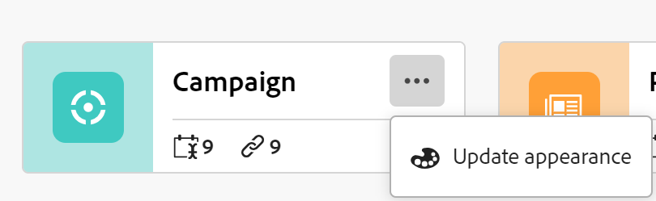
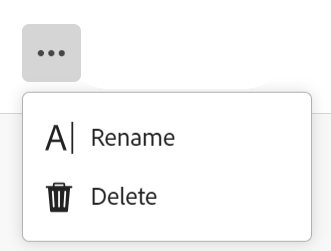

<!--udpate the metadata with real information when making this avilable in TOC and in the left nav-->

# Edit record types

Record types are the object types of Adobe Maestro. You can edit record types that you or anyone else created. For information about creating Maestro record types, see [Create record types](../architecture-and-fields/create-record-types.md). 

## Access requirements

You must have the following access to perform the steps in this article:

<table style="table-layout:auto">
 <col>
 </col>
 <col>
 </col>
 <tbody>
  <tr>
   <td role="rowheader">
Adobe Workfront plan*
</td>
   <td>

Any

<!--the above is only for closed beta; when going to GA - activate the following plans:    

Current plan: Prime and Ultimate

Legacy plan: Enterprise
-->
   </td>
  </tr>
  <tr>
   <td role="rowheader">
Adobe Workfront license*
</td>
   <td>
   
Any
 
  
For more information, see <a href="../../administration-and-setup/add-users/access-levels-and-object-permissions/wf-licenses.md" class="MCXref xref">Adobe Workfront licenses overview</a>.
 </td>
  </tr>
  <tr>
   <td role="rowheader">
Product
</td>
   <td>
   
 Adobe Workfront
 </td>
  </tr>
  <tr>
   <td role="rowheader">Access level*</td>
   <td> 
Any
  
</td>
  </tr>
<tr>
   <td role="rowheader">Layout template</td>
   <td> 
Your system administrator must add the Maestro area in your layout template. For information, see the "Enable Maestro for the users in your Workfront instance" section in the article <a href="../maestro/maestro-overview.md">Adobe Maestro overview</a>. 
  
</td>
  </tr>
 </tbody>
</table>

>[!NOTE]
>
>*If you still don't have access, ask your Workfront administrator if they set additional restrictions in your access level. For information on how a Workfront administrator can change your access level, see [Create or modify custom access levels](../administration-and-setup/add-users/configure-and-grant-access/create-modify-access-levels.md).

## Edit record types

1. Click the **Main Menu** icon  in the upper-right corner of Workfront, <!---or the **Main menu** icon   in the upper-left corner, if available--> then click **Maestro** .

    The last-accessed workspace should open by default. 

1. (Optional) Expand the downward-pointing arrow to the right of an existing workspace name and select the workspace that you want to create record types for.
1. Hover on a record type and click the **More** menu  in the upper-right corner of the record type card, then click Update appearance. 

    

1. In the Update record type box, update the following information: 

    * **Record name**: Edit the record type name, if needed. <!--correct this - I asked Garik to change this field to "Record type name"--> 
    * **Appearance**: Edit the color and shape of the icon associated with the record type. Do the following: 
        * Select a color to identify the record type. This is the color of the record type icon. Gray is selected by default.
        * Select an icon from the list, or start typing the name of an icon to describe what it represents, then select it when it displays. This is the icon of the record type. A file icon is selected by default.

        

1. Click outside the Update record type box to save your changes. 
1. (Optional) Click the record type from the workspace area to open the record type's page. 
1. Click the **More** menu to the right of the record type name, then click **Rename** to rename the record type. You can also rename a record type in the header of the record type's page. <!--check to see if they renamed this to "Rename" - it kept going back and forth between Rename and Edit-->

     <!--check this screen shot - not sure this is valid ???-->

