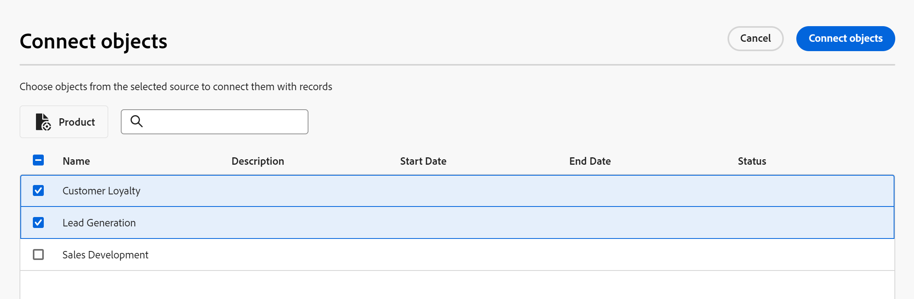
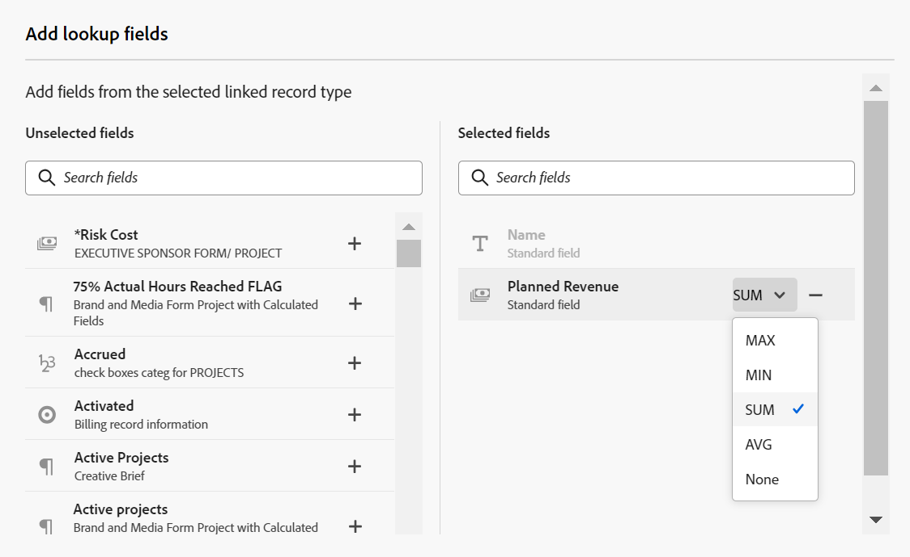

# Example of connecting record types and records

>[!IMPORTANT]
>
>Currently, Adobe Maestro is part of a closed beta program which is open to a limited number of customers. 

This article describes an example of the following:

* How to create a connection between two Maestro record types and two Maestro records.

* How to create a connection between an Adobe Maestro record type and a Workfront project object type, as well as a connection between a Maestro record and a project.

For more information, also see the following articles:

* [Connect record types](../architecture-and-fields/connect-record-types.md)
* [Connect records](../records/connect-records.md)

## Connect two Maestro record types and records (example)

For example, you have a record type named Campaign as your original record type. 

You also have another record type called Product, which has a currency field called Budget. 

You want to create a field on the record type of Campaign where you can show the values of the Budget field on the record type Product. 

To do this:

1. Open the table view for the Campaign record type. 
1. Click the **+** icon in the upper-right corner of the table view to add a new field, then click **New connection**. 
1. Add the following information, for example:

    * **Record Type**: Product <!--did they change the casing here?-->
    * **Name**: Product information. This is the name of the linked record field. 
    * **Description**: These are the Products that I want my Campaigns associated with. 
    * **Allow multiple records**: If you leave this option selected, this allows users to select multiple records when the linked record type field (Product information) displays on the original records (Campaigns). In our case, they will be able to select multiple Products to be connected to one Campaign. 
    * **Select lookup fields**: If you leave this option selected, the **Add lookup fields** box opens next, to allow you to link Product fields with the Campaign record type. You can skip this step and add Product fields later. 

    

1. (Conditional) If you selected the **Select lookup fields option** in the previous step, from the list of fields associated with the **Product** record type, click the **+** icon for the **Budget** field, then click **Add fields**. This creates a field called **Budget (from Product information)**, which is the name of the linked field. Any information for the Product Budget will display in this field for the Campaign records. 

    

    >[!TIP]
    >
    >    If you want to view the Budget of all selected products as one total number, select **SUM** in the drop-down menu to the right of the field name. When users select multiple products in the **Product information** linked record field, the **Budget (from Product information)** field adds all their Budget values together and displays the total. <!-- check the shot below - added a bug with a couple of UI changes here-->
    > If you select **None**, instead of **SUM**, the individual budgets will display separated by commas.

    This generates the following fields: 
    
    * In the Campaign record table view and in the Details page of a campaign: 

        * **Product information** (the linked record field): This will display the name or names of the Products. 
        * **Budget (from Product information)** (the linked field): This will display the Budgets of the Products selected in the Product information field. 

    * In the Product record table view and in the Details page of a product: 

        * **Campaign**: This indicates that the Product record type is linked from the Campaign record type.

        

    >[!TIP]
    >
    >    Linked record fields are preceded by the relationship icon . 

1. To populate the **Product information** field, from the **Campaign** record type table view, create a campaign by adding a new row in the Campaign record type page's table. 
1. Click the **+** icon inside the  **Product information** column of the new campaign. The **Connect objects** box displays. The name of the record type that you are linking to (Product) displays in the upper-left corner of the box.

    

1. Select the Product records you want to connect with the Campaign records, then click **Connect objects**.

    The following columns are populated in the Campaign record type table: 
    * The **Product information** field populates for the Campaign record with the selected Products. 
    * **The Budget (from Product information)** field populates with the Budget value for each selected Product, or with a total of all budgets of the selected products. 

    

    >[!TIP]
    >
    >When you do not select an aggregator for the multiple values, all values display separated by commas. 

1. To populate the **Campaign** field from the **Product** table view, repeat steps 5-7 starting from the Product record type table view and selecting campaign information. This will also update the Product information field in the Campaign record type page's table. <!--ensure the step numbers remain correct--> 

## Connect a Maestro record type with a Workfront project object type and a record with individual projects

For example, you have a record type named Campaign as your original record type. 

You also have projects in Workfront with a field called "Planned revenue." 

You want to create a connection field on the record type of Campaign where you can show the values of the Planned Revenue field on the project in Workfront for certain campaigns. 

To do this:

1. Go to a Workspace where you want to connect the Campaign record type with Workfront projects. 
1. Open the table view for the Campaign record type in the selected workspace.
1. Click the **+** icon in the upper-right corner of the table view to add a new field, then click **New connection**. 
1. Add the following information, for example:

    * **Record Type**: Workfront Project (from the Workfront sub-section) <!--did they change the casing here for the field label and did they take "Workfront" out of the name of the object?-->
    * **Name**: Project information. This is the name of the linked object field. 
    * **Description**: These are the Projects that I want my Campaigns associated with. 
    * * **Allow multiple records**: If you leave this option selected, this allows users to select multiple objects when the linked object type field (Project information) displays on the original records (Campaigns).
     * **Select lookup fields**: If you leave this option selected, the **Add lookup fields** box opens next, to allow you to link Project fields with the Campaign record type. You can skip this step and add Project fields later. 

     

1. (Conditional) If you selected the **Select lookup fields option** in the previous step, from the list of fields associated with the **Project** object type, click the **+** icon for the **Planned Revenue** field, then click **Add fields**. This creates a field called **Planned Revenue (from Project information)**, which is the name of the linked field. Any information from the Project Revenue field will display in this field for the Campaign records.  

    >[!TIP]
    >
    >    If you want to view the Planned Revenue of all selected projects as one total number, select **SUM** in the drop-down menu to the right of the field name. When users select multiple projects in the **Project information** linked object field, the **Planned Revenue (from Product information)** field adds all their values together and displays the total. <!-- check the shot below - added a bug with a couple of UI changes here-->
    > If you select **None**, instead of **SUM**, the individual Planned Revenues display separated by commas.

    

    This generates the following fields: 
    
    * In the Campaign record table view and in the Details page of a campaign: 

        * **Project information** (the linked object field): This will display the name or names of the Projects. 
        * **Planned Revenue (from Project information)** (the linked field): This will display the Planned Revenues of the Projects selected in the Project information field. 

    >[!TIP]
    >
    >    Linked object fields are preceded by the relationship icon . 

1. To populate the **Project information** field, from the **Campaign** record type table view, create a campaign by adding a new row in the table. 
1. Click the **+** icon inside the  **Project information** column of the new campaign. The **Connect objects** box displays. The name of the object type that you are linking to (Workfront Project) displays in the upper-left corner of the box.

    

1. Select the project or projects you want to connect with the Campaign records, then click **Connect objects**.

    The following are added to the selected workspace: 
    
    * In the Campaign record type table: 
        * The **Project information** field populates for the Campaign record with the selected projects. 
        * The **Planned Revenue (from Product information)** field populates with the Budget value for each selected Product. This is a read-only field. 

    

    >[!TIP]
    >
    >When you do not select an aggregator for the multiple values, and you select multiple objects in the object linked field, all values display separated by commas. 

    * A read-only Workfront Project record type to the workspace you selected. 

1. Click the back-pointing arrow to the left of the record name in the header of the page to go to the workspace you are updating. 
1. Open the **Workfront Project** record type card to open the record type page. 

    Notice the following for the Workfront Project record type page: 

    * This is a read-only Maestro record type which you cannot delete or update. 
    * The projects you selected to connect to campaigns display as separate records in the Workfront Project record type page. The project records are also read-only and their information updates automatically as projects update in Workfront. You must add more projects from the connected Maestro record to view them in the Workfront Project record type. 
    * The Campaign linked record field is populated with the names of the campaigns that are connected to projects from the Campaign record type page. 

1. (Optional) Click the **More** icon  to the right of the Workfront Project record type name and click **Rename** to rename the record type. 

    >[!TIP]
    >
    >You can rename a record type name by clicking the name in the record type header.

1. Click the Add fields icon  in the upper-right corner of the Workfront Project record type table to add more project fields to the Workfront Project Maestro record type. 
1. Click the **+** icon for any project fields you want to add to the Workfront Project Maestro record in the **Unselected fields** section. 
1. Click the **-** icon for any project fields you want to remove from the Workfront Project Maestro record in the **Selected fields** section.
1. Click **Save**.

    >[!TIP]
    >
    >    The fields you add to the Workfront Project Maestro record are only added on the Workfront Project page and are not added to the Campaign record type page, as linked fields. You must add the project fields from the Project information connected object field of the Campaign record type to view them for campaigns. 

1. (Optional and conditional) If you selected to display at least two date fields for projects, click the **View** drop-down menu in the Workfront Project record type table, then **Create view** > **Timeline** > **Create** to create a timeline view and display the projects on a timeline. 

