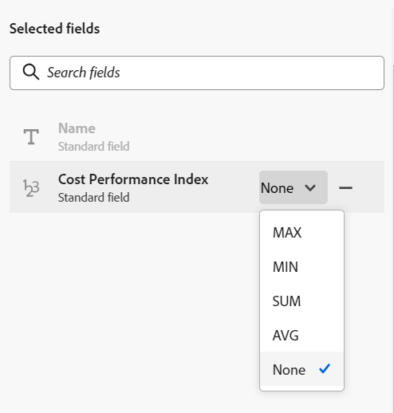

<!--update the metadata with real information when making this avilable in TOC and in the left nav-->
<!--************ THIS MIGHT NO LONGER BE A 'RELATIONSHIP' TYPE FIELD, BECAUSE THEY WILL SHOW IT IN THE CONNECTION TAB*****************************-->

# Connect record types

You can use connect the following: 

* Two Maestro record types and their fields. 
* A Maestro record type with an object type from another application and its fields. 

By doing this, you can display fields from the linked record or object on another Maestro record.  

This article describes how you can connect two Maestro record types or a Maestro record type with an object from another application. For information about connecting a Maestro record to an object from another application, see [Connect records](../architecture-and-fields/connect-records-to-other-applications-objects.md). 

<!--ensure this last linked article is right; the title and the link should have changed-->

## Access requirements

You must have the following access to perform the steps described in this article: 

<table style="table-layout:auto">
 <col>
 </col>
 <col>
 </col>
 <tbody>
  <tr>
   <td role="rowheader">
Adobe Workfront plan*
</td>
   <td>

Any

<!--the above is only for closed beta; when going to GA - activate the following plans:    

Current plan: Prime and Ultimate

Legacy plan: Enterprise
-->
   </td>
  </tr>
  <tr>
   <td role="rowheader">
Adobe Workfront license*
</td>
   <td>
   
Any
 
  
For more information, see <a href="../../administration-and-setup/add-users/access-levels-and-object-permissions/wf-licenses.md" class="MCXref xref">Adobe Workfront licenses overview</a>.
 </td>
  </tr>
  <tr>
   <td role="rowheader">
Product
</td>
   <td>
   
 Adobe Workfront
 </td>
  </tr>
  <tr>
   <td role="rowheader">
Access level*
</td>
   <td> 
Any
  
</td>
  </tr>
<tr>
   <td role="rowheader">
Layout template
</td>
   <td> 
Your system administrator must add the Maestro area in your layout template. For information, see the "Enable Maestro for the users in your Workfront instance" section in the article <a href="../maestro/maestro-overview.md">Adobe Maestro overview</a>. 
  
</td>
  </tr>
 </tbody>
</table>

*If you don't have access, ask your Workfront administrator if they set additional restrictions in your access level. For information on how a Workfront administrator can change your access level, see [Create or modify custom access levels](../administration-and-setup/add-users/configure-and-grant-access/create-modify-access-levels.md).

## Considerations about connecting record types

* You can connect the following entities in Maestro:

    * Two operational record types
    * Two taxonomies
    * An operational record type and a taxonomy
    * An operational record type and an object type from another application. 

        >[!TIP]
        >
        >    You cannot connect a taxonomy record type to an operational record type or to an object type from another application.

* After you connect fields from a record type or from an object type from another application, a similar field is created on the linked record type that refers back to the original record type. We will refer to the fields that refer to another record type "linked record fields". 
* After you connect the record types, you can connect multiple fields from one record type to another record type. We will refer to these fields as "linked fields" or "lookup fields."
* Linked record fields display the linked records and are preceded by a relationship icon .
* After you create individual records for a record type, you can select the records you connect to from the linked record type in the linked record type field. 
* You cannot edit the information of the linked fields from the record type you are linking from, as they automatically populate from the original record type they belong to as soon as you select the linked records.

## Connect record types

<!--if you change steps here, also update steps in the "Connect records to other applications objects" article-->

1. Click the **Main Menu** icon  in the upper-right corner of Workfront, <!---or the **Main menu** icon   in the upper-left corner, if available--> then click **Maestro** .

    The last-accessed workspace should open by default. 

1. (Optional) Expand the downward-pointing arrow to the right of an existing workspace name and select the workspace that you want to create record types for.
1. Click the card of a record type to open the record type page. 
1. Click the **+** icon in the upper-right corner of the table view, then click the **New connection** tab.

    
1. In the **Record type** field, select one of the following:

    * The name of another operational record type
    * The name of a taxonomy
    * Workfront Project. For more information, see the section [Connect record types with Workfront projects](#connect-record-types-with-workfront-projects) in this article. 

    

1. (Conditional) When connecting two Maestro record types, update the following information: 

    * **Name**: The name of connected field, as it will appear in the table view or the Details page of a record of the original record type. This creates the linked record column in the table view of the original record type or the linked record field for the original records. <!--ensure they updated this; and update the screen shot: it used to be "Label"-->

    >[!TIP]
    >
    >We recommend that you include the name of the record you are linking to in the name of the relationship-type field to capture what record type the new field is coming from. The name of the linked record is not visible in the new linked record field or its linked fields. 

     * **Description**: Additional information about the relationship-type field. The description of a field displays when you hover over the field's column in a table. 
     * **Allow multiple records**: Select this option to indicate that you allow that users can add multiple records when the linked record type field displays on the original records. This is selected by default.
     * **Select lookup fields**: Select this option to add fields from the selected record type. This is selected by default. 

1. Click **Create**.

    The **Add lookup fields** box opens. 

    

1. Click the  icon to add fields from the **Unselected fields** area. 

    Or
  
    Click the  icon to remove fields from the **Selected fields** area
    
    >[!NOTE]
    >
    >If you don't select any of the fields, the **Name** of the linked record is the only visible field in the original record's table view. The **Name** field cannot be removed.
    
1. (Optional and conditional) If you select to link a number, currency, percentage, or date-type field, also select an aggregator value. The values for the linked fields display either separated by commas or as a aggregated value according to the aggregator you choose, when users select more than one linked record in the linked record field. 

        

    Select from the following:

    * **None**: Displays the values that come from multiple records separated by commas. This is the default selection. 
    * **MAX**: Displays the highest value from all the values that come from multiple records selected in the linked record field. 
    * **MIN**: Displays the lowest value from all the values that come from multiple records selected in the linked record field. 
    * **SUM**:  Displays the total of all the values that come from multiple records selected in the linked record field.
    * **AVG**: Displays the average of all the values that come from multiple records selected in the linked record field.

    >[!NOTE]
    >
    >For example, you can link the Product record (linked record) from the Campaign record (original record) and name it "Product field". You can also choose to link the Budget field of the Product record from the Campaign record and call it "Product Budget". If you allowed to select multiple records in the "Product field", you can select Product 1 with a Budget of $120,000 and Product 2 with a Budget of $100,000. You can view the following Budget information in the linked field from the original record, depending on which aggregator you choose: 
    >
    >* **None**: $120,000, $100,000
    >* **MAX**: $120,000
    >* **MIN**: $100,000
    >* **SUM**: $220,000
    >* **AVG**: $110,000  
    >
    >For more information, see the [Example of creating and updating a Relationship-type field](#example-of-creating-and-updating-a-relationship-type-field) section in this article. 

1. (Optional) Use the **search** icon  to search for a field.

1. Click **Save** to save your changes.

    The following are added: 

    * The linked record field that displays the records from the linked record type. This is the relationship-type field you created. The name of the relationship field is the name you selected in step 2. <!-- ensure this is still accurate-->
    
    * The linked record field (or fields) that displays information from the field of the linked record type, which is named according to this pattern: 

        `<Name of the original field on the linked record> (from <Name of your linked field>)`
    
        For more information, see the [Example of creating and updating a Relationship-type field](#example-of-creating-and-updating-a-relationship-type-field) section in this article. 
    * A linked record field on the record type you are linking to. The name of the linked record field on the linked record type is the name of the record type you link from. 
    
    For example, if you link the "Product" record type from the "Campaign" record type and you name the connected field of the Campaign "Linked Product", a "Campaign" linked field is created for the Product record type. 

    >[!NOTE]
    >
    >The linked record field is not added to record types when you connect a record type with the following: <!--is this temporary for taxonomies??-->
    >        
    >* A taxonomy.
    >* An object type from another application. 

1. (Optional) From either the original record type or the linked record type table view, click the drop-down to the right of the linked record field, then click **Edit field**. 

    <!--insert screen shot-->

    You can only update the **Name** and the **Description** information of the field. 

1. (Optional)  From either the original record type or the linked record type table view, click the drop-down menu in the header of the linked record field name, then click **Edit lookup fields** to add or remove any of the linked record's fields. 

    To add or remove fields, follow the directions in steps 4-8 above. 
    
1. (Optional) Click the downward-pointing arrow in the header of the record or relationship fields, then click **Delete**. 

    The record field and any additional lookup fields are deleted and the fields and their information cannot be recovered. 

    >[!TIP]
    >
    >    The linked record field on the record linked from the original record is not deleted. <!-- is this still accurate?! -->

***************************************LEFT HERE********************

### Example of creating and updating a Relationship-type field

<!---------------------------THIS SECTION MUST BE REDONE WITH THE NEW UI ----------->
This section describes an example of how to create a field by linking record types together, as well as how to populate a linked field.  

For example, you have a record type named Campaign as your original record type. 

You also have another record type called Product, which has a currency field called Budget. 

You want to create a field on the record type of Campaign where you can show the values of the Budget field on the record type Product. 

To do this:

1. Open the table view for the Campaign record type. 
1. Click the **+** icon in the upper-right corner of the table view to add a new field, then expand the **Field type** drop-down menu and select **Relationship**. 
1. Add the following information, for example:

    * **Name**: Product information. This is the name of the linked record field. 
    * **Description**: This is the Product that I want my Campaigns associated with. 
    *** Linked record type**: Product
    * * **Allow multiple records**: If you leave this option selected, this allows users to select multiple records when the linked record type field (Product information) displays on the original records (Campaigns).
1. From the list of fields associated with the **Product** record type, select the **Budget** field. This creates a field called **Budget (from Product information)**, which is the name of the linked field. 

    >[!TIP]
    >
    >    If you want to view the Budget of all selected products as one total number, select **SUM** in the drop-down menu to the right of the field name. When users select multiple products in the **Product information** linked record field, the **Budget (from Product information)** field adds all their Budget values together and displays the total. <!-- check the shot below - added a bug with a couple of UI changes here-->
    > If you select **None**, instead of **SUM**, the individual budgets will display separated by commas.

    

    This generates the following fields: 
    
    * In the Campaign record table view and in the Details page of a campaign: 

        * **Product information** (the linked record field): This will display the name or names of the Products. 
        * **Budget (from Product information)** (the linked field): This will display the Budgets of the Products selected in the Product information field. 

    * In the Product record table view and in the Details page of a product: 

        * **Campaign**: This indicates that the Product record type is linked from the Campaign record type.

        

    >[!TIP]
    >
    >    Relationship-type fields are preceded by the relationship icon . 

1. To populate the **Product information** field, from the **Campaign** record type table view, create a campaign by adding a new row in the table. 
1. Click the **+** icon inside the  **Product information** column of the new campaign. The **Connect objects** box displays. The name of the record type that you are linking to (Product) displays in the upper-left corner of the box.

    

1. Select the Product records you want to connect with the Campaign records, then click **Connect objects**.

    The following columns are populated in the Campaign record type table: 
    * The Product information field populates for the Campaign record with the selected Products. 
    * The Budget (from Product information) field populates with the Budget value for each selected Product. 

    

    >[!TIP]
    >
    >When you do not select an aggregator for the multiple values, all values display separated by commas. 

1. To populate the **Campaign** field from the **Product** table view, repeat steps 5-7 starting from the Product record type table view and selecting campaign information. <!--ensure the step numbers remain correct--> 

    
## Connect record types with Workfront projects