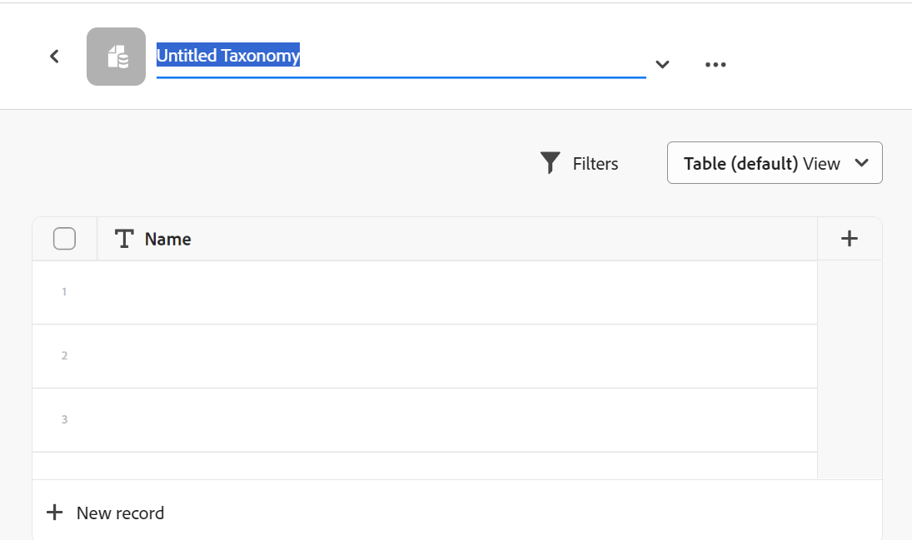

<!--udpate the metadata with real information when making this avilable in TOC and in the left nav-->

# Overview of record types and taxonomies

Unlike Workfront where the object types are predefined, in Adobe Maestro, you can create your own object types. For example, in Workfront the object types of Program, Portfolio, Project, Task, or Issue are already created. 

Maestro object types are called "record types". Record types are the building blocks of a Maestro workspace. For information about workspaces, see [Create workspaces](../architecture-and-fields/create-workspaces.md). 
    
## Record type overview
    
In Maestro, you can create custom object types that meet your organization's needs.

You can also import record types from other applications by connecting Maestro records with objects from another application.

<!--Will be available later: You can also define how the record types relate to one another or form dependencies.--> 
    
There are two kinds of Maestro record types: 

* [Operational Record Type](#operational-record-type)
* [Taxonomy](#taxonomy)

You can have a combined total of 1,000 operational record types and taxonomies in one workspace.

### Operational Record Type{#operational-record-type}

An operational record type is a Maestro record type that represents work objects.  

For more information about operational record types including how to create them, see [Create record types](../architecture-and-fields/create-record-types.md). 

### Taxonomy{#taxonomy}

A taxonomy is a record type that captures attributes about an operational record type. 

For more information about taxonomy record types including how to create them, see [Create a taxonomy](../architecture-and-fields/create-a-taxonomy.md). 

Although creating taxonomies is identical to creating operational record types, Maestro distinguishes conceptually between an operational record type and a taxonomy record type. The purpose of taxonomies is to enhance operational record types. Taxonomies should not directly represent work objects.  <!--this is no longer true, but might be later?!: A taxonomy is a record without dates, like a static list of attributes.--> 

<!--mimic what you did above for operational record types to say that we can also import taxonomies from other applications too - this will be possible later; for example Team would be a taxonomy record type, etc -->

For example, Audience, Region, or Address can be taxonomy-type record types.  

For more information, see [Create a taxonomy](../architecture-and-fields/create-a-taxonomy.md). 

## Similarities and differences between operational record types and taxonomies

The following table illustrates some of the similarities and differences between operational record types and taxonomies: 

| Record type and characteristic                              | Operational Record Type | Taxonomy Record Type |
|-------------------------------------------------------------|:-----------------------:|:--------------------:|
| They are part of a workspace                                |            ✓            |           ✓          |
| You can create from a workspace template                    |            ✓            |           ✓          |
| They represent work-related objects                         |            ✓            |                      |
| They represent attributes about work-related objects        |                         |           ✓          |
| You can create from scratch                                 |            ✓            |           ✓          |
| You can create by importing an Excel or CSV file            |            ✓            |                      |
| You can connect to an object from a third-party application |            ✓            |                      |
| You can connect to other Maestro record types               |            ✓            |           ✓          |
| You can view their associated records in a table view       |            ✓            |           ✓          |
| You can view their associated records in a timeline view    |            ✓            |           ✓          |
