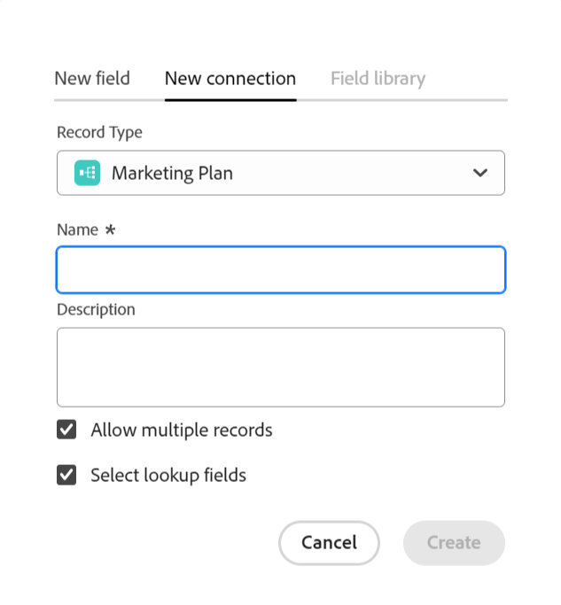
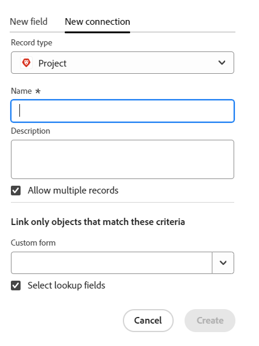
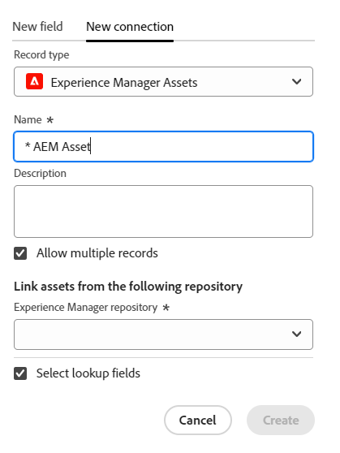
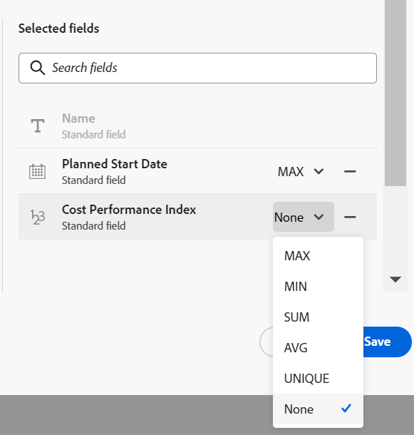

<!-----
title: Connect record types
description: A way to indicate how individual record types relate to one another is to connect them. Also, you can connect Maestro record types with object types from other applications to enhance your users' experience and keep their focus in one application.
hidefromtoc: yes
hide: yes
feature: Work management
role: User
author: Alina
--->

<!--update the metadata with real information when making this avilable in TOC and in the left nav-->
<!--************ THIS MIGHT NO LONGER BE A 'RELATIONSHIP' TYPE FIELD, BECAUSE THEY WILL SHOW IT IN THE CONNECTION TAB*****************************-->

# Connect record types

{{maestro-important-intro}}

You can use Adobe Maestro to design fully-customizable workspaces that contain record types needed in your organization. A way to indicate how individual record types relate to one another is to connect them. Also, you can connect Maestro record types with object types from other applications to enhance your users' experience and keep their focus in one application. 

You can connect the following: 

* Maestro operational record types to one another
* Maestro taxonomies to one another
* Maestro operational record types and taxonomies to one another
* Maestro operational record types and taxonomies with object types from other applications.

By doing this, you can display fields from the linked record or object type on another Maestro record.  

This article describes how you can connect two Maestro record types or a Maestro record type with an object from another application. 

After the connection between record or object types is established, you can connect individual records to one another. 

For information about connecting a Maestro record to an object from another application, see [Connect records](../records/connect-records.md). 

For an example of connecting record types, see [Example of connecting record types and records](../architecture/example-connect-record-types-and-records.md). 

<!--ensure this last linked article is right; the title and the link should have changed-->

## Access requirements

You must have the following access to perform the steps in this article: 

<table style="table-layout:auto">
 <col>
 </col>
 <col>
 </col>
 <tbody>
    <tr>
<tr>
<td>
   
 Product
 </td>
   <td>
   
 Adobe Workfront
 
To connect Maestro record types with Experience Manager Assets, you must have an Adobe Experience Manager Assets license and your organization's instance of Workfront must be onboarded to the Adobe Business Platform or the Adobe Admin Console.
 </td>
  </tr>  
 <td role="rowheader">
Adobe Workfront agreement
</td>
   <td>

Your organization must be enrolled in the Adobe Maestro closed beta program. Contact your account representative to inquire about this new offering. 

   </td>
  </tr>
  <tr>
   <td role="rowheader">
Adobe Workfront plan
</td>
   <td>

Any

   </td>
  </tr>
  <tr>
   <td role="rowheader">
Adobe Workfront license
</td>
   <td>
   
Any
 
  </td>
  </tr>
  
  <tr>
   <td role="rowheader">
Access level configurations
</td>
   <td> 
There are no access level controls for Maestro
  
</td>
  </tr>
<tr>
   <td role="rowheader">
Layout template
</td>
   <td> 
Your Workfront or group administrator must add the Maestro area in your layout template. For information, see <a href="../access/access-overview.md">Access overview</a>. 
  
</td>
  </tr>
<tr>
   <td role="rowheader">
Permissions
</td>
   <td> 
Manage permissions to a workspace</a> 
  
   
System Administrators have permissions to all workspaces, including the ones they did not create
</td>
  </tr>
 </tbody>
</table>

<!--Maybe enable this at GA - but Maestro is not supposed to have Access controls in the Workfront Access Level: 
>[!NOTE]
>
>If you don't have access, ask your Workfront administrator if they set additional restrictions in your access level. For information on how a Workfront administrator can change your access level, see [Create or modify custom access levels](../administration-and-setup/add-users/configure-and-grant-access/create-modify-access-levels.md). -->

<!-- Notes to add for the table: for the "Workfront plans" row: the above is only for closed beta; when going to GA - activate the following plans:    

Current plan: Prime and Ultimate

Legacy plan: Enterprise
-->

<!-- Notes for the table: for the "Workfront access" row: 
For more information, see <a href="../../administration-and-setup/add-users/access-levels-and-object-permissions/wf-licenses.md" class="MCXref xref">Adobe Workfront licenses overview</a>.
--> 

## Considerations about connecting record types

Consider the following:

* You can connect the following entities in Maestro:

    * Two operational record types
    * Two taxonomies
    * An operational record type and a taxonomy
    * An operational record type or a taxonomy and an object type from another application. 

* You can connect the following objects from the following applications with Maestro record types:

    * Adobe Workfront:

        * Projects
        * Portfolios
        * Programs
        * Companies
        * Groups

    * Adobe Experience Manager Assets:

        * Images
        * Folders

        >[!IMPORTANT]
        >
        >You must have an Adobe Experience Manager Assets license, and your organization's instance of Workfront must be onboarded to the Adobe Business Platform or the Adobe Admin Console to connect Maestro records to Adobe Experience Manager Assets.
        >
        >If you have questions about onboarding to the Adobe Admin Console, see the [Adobe Unified Experience FAQ](/help/quicksilver/workfront-basics/navigate-workfront/workfront-navigation/unified-experience-faq.md).

* After you connect a record type with another record type or with an object type from another application, the following scenarios exist: 
    
    * **When you connect two record types**: A Linked record field is created on the record type you're connecting from. A similar Linked record field is created on the record type you are connecting to. 

        For example, if you connect the "Campaign" record type with the "Product" record type, a linked record field that you name "Linked Product" is created on the Campaign record type and a linked record type automatically named "Campaign" is created on the Product record type. 

    * **When you connect a record type with an object type from another application**: A linked record field is created on the record type you're connecting from. No linked record field is automatically created on the third-party application object. 
        
        A new Maestro record type is created for the third-party application object is created only when actual objects are connected to the Maestro records. 
    
        For more information, see [Connect records](../records/connect-records.md). 
    
    * **When you add lookup fields from the record or object you connect to**: Linked fields are added to the record you are connecting from that display the lookup fields you selected to bring over from the linked record to the records you're linking from. The the record fields are always read-only and populate automatically with the values of the third-party object. 

        For example, if you connect the "Campaign" Maestro record type with a Workfront project and you select to bring the Planned Completion Date field of the project to the Maestro record, a linked field called Planned Completion Date (from Project) is automatically created for the record you are linking from. 

* Linked record fields are preceded by a relationship icon . 
    
    Linked fields are preceded by an icon that identifies the field type. For example, icons that indicate that a field is a number, a paragraph, or a date. 

* After you create individual records for a record type, you can select the records you connect to from the linked record type field. For information, see [Connect records](../records/connect-records.md). 

## Connect record types

<!--when changes here, also update the article for "Connect records"-->

{{step1-to-maestro}}

   The last-accessed workspace should open by default. 

1. (Optional) Expand the downward-pointing arrow to the right of an existing workspace name and select the workspace that you want to connect record types from.
1. Click the card of a record type to open the record type page. 
1. Click the **+** icon in the upper-right corner of the table view, then click the **New connection** tab.

    

1. In the **Record Type** field, search for a record type, or select one of the following: <!--is the field name spelled right? lowercase "t"?-->

    * Another operational record type or a taxonomy from the workspace you selected

        >[!TIP]
        >
        >Only record types and taxonomies from the workspace you selected are available to connect to. 
        > 
        >If you don't have other record types in the selected workspace, the workspace name does not display. 

    * A **Project, Portfolio, Program, Company**, or **Group** from the **Workfront Object Types** section.
    * **Experience Manager Assets** from the **Adobe Applications** section. 

    

1. Update the following information: 

    * **Name**: The name of connected field, as it will appear in the table view or the Details page of the original record type. This creates the linked record column in the table view of the original record type or the linked record field for the original records. <!--ensure they updated this; and update the screen shot: it used to be "Label"-->

    >[!TIP]
    >
    >We recommend that you include the name of the record you are linking to in the name of the connected record field to capture what record type the new field is coming from. The name of the linked record is not visible in the new linked record field or its linked fields. 

     * **Description**: Additional information about the connected record field. The description of a field displays when you hover over the field's column in a table. 
     * **Allow multiple records**: Select this option to indicate that you allow that users can add multiple records when the linked record type field displays on the original records. This is selected by default.
     * **Select lookup fields**: Select this option to add fields from the selected record type. This is selected by default. 

1. (Conditional and optional) If you selected to connect a Workfront object, select a **Custom form** from the **Link only projects that match these criteria** section. <!--this needs to be updated for each object when they fix this UI.--> Only objects that have the selected custom forms attached can be linked to the selected Maestro record type. You can select more than one form. 

    

1. (Conditional) If you selected to connect to Experience Manager Assets, select a repository from the **Experience Manager repository** drop-down menu in the **Link assets from the following repository** section. This is a required field. Only repositories you have access to in Experience Manager Assets display in this field. 

    

1. Click **Create**.

1. (Conditional) If you selected the **Select lookup field** setting, the **Add lookup fields** box opens. 

    Click the **+** icon  to add fields from the **Unselected fields** area. 

    Or
  
    Click the **-** icon to remove fields from the **Selected fields** area

    
    
    
1. (Optional) Click **Skip** and don't add any fields from the linked record or object. The **Name** of the linked record is the only visible field in the original record's table view. 

1. (Optional and conditional) If you select to link a number, currency, percentage, or date-type field, also select an aggregator value. The values for the linked fields display either separated by commas or as a aggregated value according to the aggregator you choose, when users select more than one linked record in the linked record field. 

      

    >[!NOTE]
    >
    > Aggregators are not available when connecting record types to Experience Manager Assets.  

    Select from the following:

    * **None**: Displays the values that come from multiple records separated by commas. This is the default selection. 
    * **MAX**: Displays the highest value from all the values that come from multiple records selected in the linked record field. 
    * **MIN**: Displays the lowest value from all the values that come from multiple records selected in the linked record field. 
    * **SUM**:  Displays the total of all the values that come from multiple records selected in the linked record field.
    * **AVG**: Displays the average of all the values that come from multiple records selected in the linked record field.

    >[!NOTE]
    >
    >For example, you can link the Product record (linked record) from the Campaign record (original record) and name it "Product field". You can also choose to link the Budget field of the Product record from the Campaign record and call it "Product Budget". If you allowed to select multiple records in the "Product field", you can select Product 1 with a Budget of $120,000 and Product 2 with a Budget of $100,000. You can view the following Budget information in the linked field from the original record, depending on which aggregator you choose: 
    >
    >* **None**: $120,000, $100,000
    >* **MAX**: $120,000
    >* **MIN**: $100,000
    >* **SUM**: $220,000
    >* **AVG**: $110,000  
    >

1. (Optional) Use the **search** icon  to search for a field.

1. Click **Add fields** to save your changes.

    The following items are added: 

    * The linked record field that displays the records from the linked record type, after you manually add them. The name of the linked record field is the name you selected in step 5. <!--accurate--> 
    
    * The linked field (or fields) that display information from the fields of the linked record type after you manually add the records in the linked record field. The linked fields are created only when the **Select lookup fields** setting is selected when creating the connection. The linked fields are named according to this pattern: 

        `<Name of the original field on the linked record> (from <Name of your linked field>)`

    * When you link Maestro record types to one another, a linked record field is also added on the record type you are linking to . The name of the linked record field on the linked record type is the name of the record type that you link from. 
    
        For example, if you link the "Product" record type from the "Campaign" record type and you name the connected field of the Campaign "Linked Product", a "Campaign" linked record field is created for the Product record type. 

1. (Optional) From either the original record type or the linked record type table view, click the downward-pointing arrow in the header of the linked record fields, then click one of the following:

    * **Edit field**: You can only update the **Name** and the **Description** information of the field. 
    * **Edit lookup fields**: Add or remove any of the linked record's fields. 

    

    To add or remove lookup fields, follow the directions in steps 9-13 above. <!--ensure these step numbers stay accurate--> 

    >[!NOTE]
    >
    > You cannot add the lookup fields of the record you link from to the linked record type that indicates an object in a third-party application. 
    >
    > For example, you cannot add the lookup field of a "Campaign" Maestro object from the "Campaign" linked record field displayed in the Maestro Project record type when linking to Workfront projects. 

    
1. (Optional) Click the downward-pointing arrow in the header of the linked record field from the record type you are linking from, then click **Delete**. 

    The record field and any additional linked lookup fields are deleted and the fields and their information cannot be recovered. 

    >[!TIP]
    >
    >    The linked record field on the record type you are linking to is not deleted. <!-- is this still accurate?! -->
