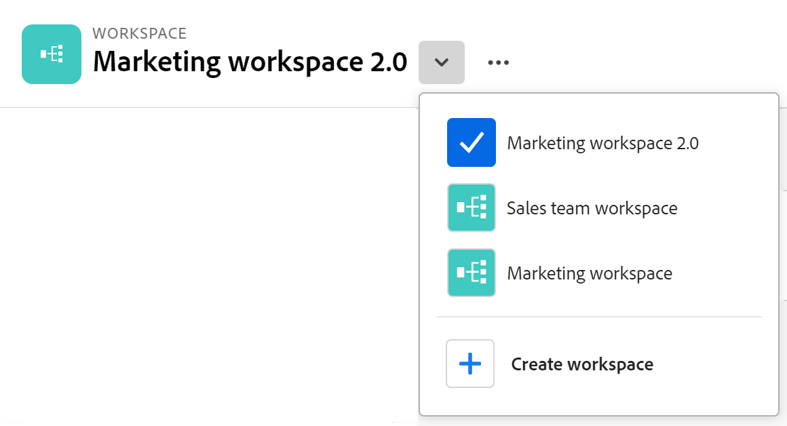

<!--udpate the metadata with real information when making this avilable in TOC and in the left nav-->

# Create workspaces

{{maestro-important-intro}}

In Adobe Workfront Planning, workspaces are centralized locations for teams to plan work. 

A workspace is a collection of record types used by a team and represents the team's work lifecycle. You can fully customize workspaces in Adobe Workfront Planning.

## Access requirements

You must have the following access to perform the steps in this article: 

<table style="table-layout:auto">
 <col>
 </col>
 <col>
 </col>
 <tbody>
    <tr>
<tr>
<td>
   
 Product
 </td>
   <td>
   
 Adobe Workfront
 </td>
  </tr>  
 <td role="rowheader">
Adobe Workfront agreement
</td>
   <td>

Your organization must be enrolled in the Adobe Workfornt planning closed beta program. Contact your account representative to inquire about this new offering. 

   </td>
  </tr>
  <tr>
   <td role="rowheader">
Adobe Workfront plan
</td>
   <td>

Any

   </td>
  </tr>
  <tr>
   <td role="rowheader">
Adobe Workfront license*
</td>
   <td>
   
New: Standard

   Or
   
Current: Plan
 
  </td>
  </tr>
  
  <tr>
   <td role="rowheader">
Access level configuration
</td>
   <td> 
There are no access level controls for Adobe Workfront Planning

</td>
  </tr>

<tr>
   <td role="rowheader">
Permissions
</td>
   <td> 
You receive Manage permissions to the workspaces you create. 
  
</td>
  </tr>

<tr>
   <td role="rowheader">
Layout template
</td>
   <td> 
You must add the Planning area to your layout template. For information, see <a href="../access/access-overview.md">Access overview</a>. 
  
</td>
  </tr>

 </tbody>
</table>

For more information about access requirements, see [Access requirements in Workfront documentation](/help/quicksilver/administration-and-setup/add-users/access-levels-and-object-permissions/access-level-requirements-in-documentation.md). 

<!--Maybe enable this at GA - but Planning is not supposed to have Access controls in the Workfront Access Level: 
>[!NOTE]
>
>If you don't have access, ask your Workfront administrator if they set additional restrictions in your access level. For information on how a Workfront administrator can change your access level, see [Create or modify custom access levels](../administration-and-setup/add-users/configure-and-grant-access/create-modify-access-levels.md). -->

<!-- Notes to add for the table: for the "Workfront plans" row: the above is only for closed beta; when going to GA - activate the following plans:    

Current plan: Prime and Ultimate

Legacy plan: Enterprise
-->

<!-- Notes for the table: for the "Workfront access" row: 
For more information, see <a href="../../administration-and-setup/add-users/access-levels-and-object-permissions/wf-licenses.md" class="MCXref xref">Adobe Workfront licenses overview</a>.
--> 

## Considerations about workspaces

* You can create workspaces for specific organizational units within your organization, to match the unique way each unit works. 
* The record types that a workspace contains should reflect the work lifecycle of an organizational unit. 
* When you create a workspace, only you have the permission to access and manage your workspace. You must share it with other users in order for them to collaborate with you in the same space. For information, see [Share a workspace](/help/quicksilver/maestro/access/share-workspaces.md). System administrators can manage all workspaces, even the ones that they did not create. 
* You can have a maximum of 1,000 workspaces in your organization's Workfront instance. 
* Workspaces contain record types that are unique to each workspace. <!--this might change-->

## Create a workspace

{{step1-to-maestro}}

1. (Conditional) If you don't have any workspaces in your environment, click **Create workspace**

   Or, from an existing workspace, click the downward-pointing to the right of the workspace name, then click **Create workspace**. 

   

   This opens the Workspaces area of Workfront Planning. 
1. (Optional and conditional) Click **Preview** inside any of the following predefined workspace templates:

    * Marketing management
    * Sales management
    * Product management
    
    There is an indication of what operational record types, taxonomies and how many fields are associated with each template.

    

    For information about Workfront Planning workspace templates, see [List of workspace templates](../architecture/workspace-templates.md).

1. Click **Use template** to start creating the workspace from the selected template

    Or

    Click **Create workspace** to create a workspace from scratch.

    One for the following types of workspaces is created:
    
    * An empty workspace where you can start adding record types manually, when you create a workspace from scratch. 
    * A workspace populated with sample record types which you can further customize, when you use one of the templates. 
     
1. Click inside the name of the workspace in the header of the new workspace to rename it, then press Enter

    Or
    
    Click the **More** menu to the right of the workspace name in the header, then click **Rename**.

1. (Optional and conditional) If the workspace already has sections, click **Add section** to add a new section to a workspace. A section can contain several record types. 

1. (Optional and conditional) If you created the workspace from a template, click inside the name of the **Operational Record Types** or **Taxonomies** sections 

   Or 

   Hover the name of a section, then click the **More** menu , then click **Rename** to rename the section. 

      >[!TIP]
      >
      >You can rename any section from any workspace, even if you created the section. 

1. (Optional) To change the location of a section, do one of the following:

   * Hover over the name of a section and click the **grab** icon , then drag and drop it in the right spot. 
   * Hover over the name of a section and click the **More** menu , then click **Move up** or **Move down**. The section moves up or down inside the workspace. 

1. (Optional) To add a new section, do one of the following:

   * Click **Add section** at the bottom of the workspace.
   * Hover over the name of a section and click the **More** menu , then click **Add section above** or **Add section below**. 

1. (Optional) Click **Add record type** to add record types to the workspace.
    
   For information, see [Create record types](../architecture/create-record-types.md).

