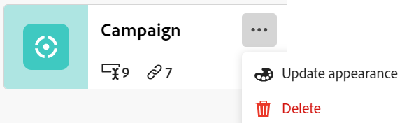
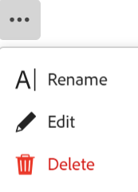

<!--update the metadata with real information when making this available in TOC and in the left nav
---
title: Edit record types
description: You can edit record types after they have been saved. Record types are the object types of Adobe Workfront Planning.
author: Alina
role: User
feature: Work Management 
topic: Architecture
hidefromtoc: yes
hide: yes
---

-->

# Edit record types

{{maestro-important-intro}}

Record types are the object types of Adobe Workfront Planning. You can edit the appearance of record types that you or anyone else created. For information about creating Workfront Planning record types, see [Create record types](../architecture/create-record-types.md). 

## Access requirements

You must have the following access to perform the steps in this article: 

<table style="table-layout:auto">
 <col>
 </col>
 <col>
 </col>
 <tbody>
    <tr>
<tr>
<td>
   
 Product
 </td>
   <td>
   
 Adobe Workfront
 
To connect Adobe Workfront Planning record types with Experience Manager Assets, you must have an Adobe Experience Manager Assets license and your organization's instance of Workfront must be onboarded to the Adobe Business Platform or the Adobe Admin Console.
 </td>
  </tr>  
 <td role="rowheader">
Adobe Workfront agreement
</td>
   <td>

Your organization must be enrolled in the Adobe Workfront Planning closed beta program. Contact your account representative to inquire about this new offering. 

   </td>
  </tr>
  <tr>
   <td role="rowheader">
Adobe Workfront plan
</td>
   <td>

Any

   </td>
  </tr>
  <tr>
   <td role="rowheader">
Adobe Workfront license
</td>
   <td>
   
Any
 
  </td>
  </tr>
  
  <tr>
   <td role="rowheader">
Access level configurations
</td>
   <td> 
There are no access level controls for Workfront Planning
  
</td>
  </tr>

  <tr>
   <td role="rowheader">
Permissions
</td>
   <td> 
Manage permissions to a workspace</a> 
  
   
System Administrators have permissions to all workspaces, including the ones they did not create
</td>
  </tr>
<tr>
   <td role="rowheader">
Layout template
</td>
   <td> 
Your Workfront or group administrator must add the Planning area in your layout template. For information, see <a href="../access/access-overview.md">Access overview</a>. 
  
</td>
  </tr>

 </tbody>
</table>

<!--Maybe enable this at GA - but Planning is not supposed to have Access controls in the Workfront Access Level: 
>[!NOTE]
>
>If you don't have access, ask your Workfront administrator if they set additional restrictions in your access level. For information on how a Workfront administrator can change your access level, see [Create or modify custom access levels](../administration-and-setup/add-users/configure-and-grant-access/create-modify-access-levels.md). -->

## Edit record types

{{step1-to-maestro}}

   The last-accessed workspace should open by default. 

1. (Optional) Expand the downward-pointing arrow to the right of an existing workspace name and select the workspace that you want to edit record types for.
1. Hover over the card of a record type and click the **More** menu  in the upper-right corner of the record type card, then click **Update appearance**. 

    

1. In the **Update record type** box, update the following information: 

    * **Record name**: Edit the record type name, if needed. <!--correct this - I asked Garik to change this field to "Record type name"--> 
    * **Appearance**: Edit the color and shape of the icon associated with the record type. Do the following: 
        * Select a color to identify the record type. This is the color of the record type icon. Gray is selected by default.
        * Select an icon from the list, or start typing the name of an icon to describe what it represents, then select it when it displays. This is the icon of the record type. A file icon is selected by default.

        

1. Click outside the **Update record type** box to save your changes. 
1. (Optional) Click the record type card from the workspace area to open the record type's page. 
1. Click the **More** menu to the right of the record type name, then click **Rename** to rename the record type

    Or
    
    Rename the record type in the header.  <!--check to see if they renamed this to "Rename" - it kept going back and forth between Rename and Edit-->

     <!--check this screen shot - not sure this is valid ???-->

    You can also rename a record type in the header of the record type's page.
1. (Optional) Expand the downward-pointing arrow to the right of a record type name and select another record type to edit. 
