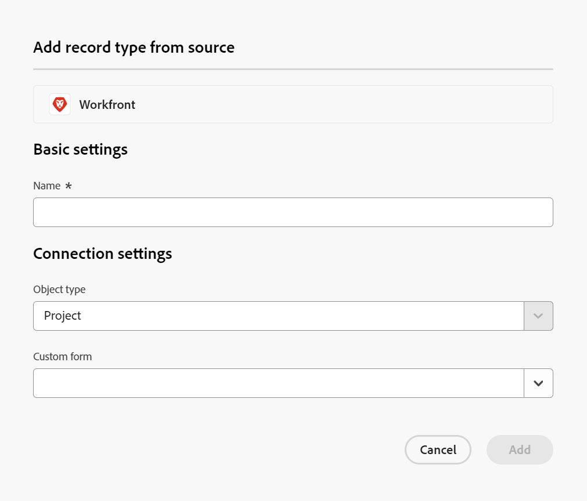
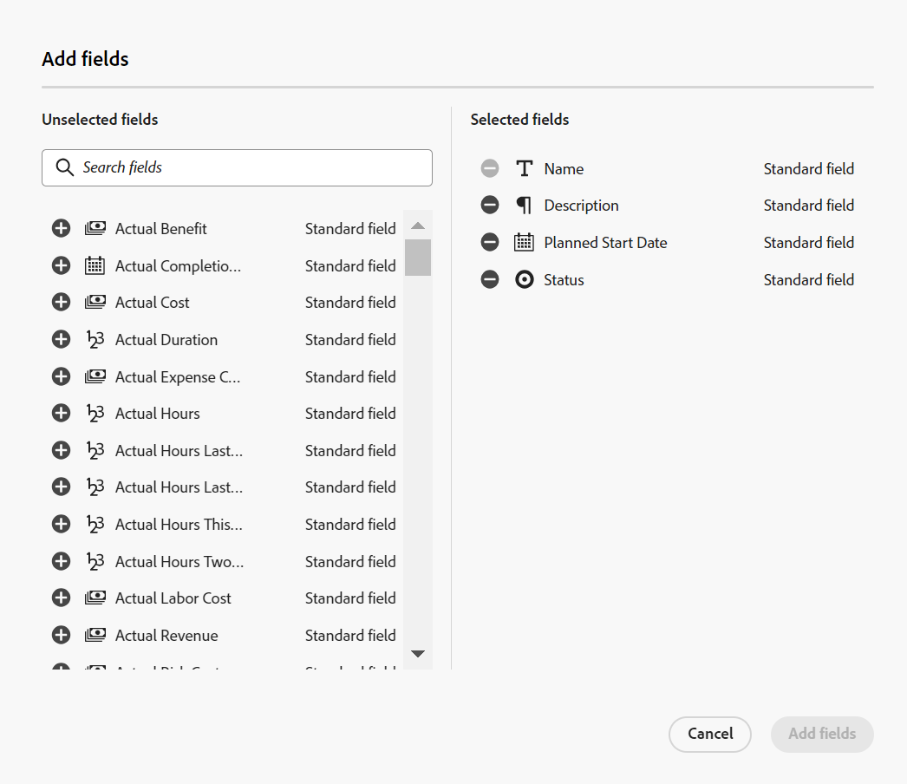
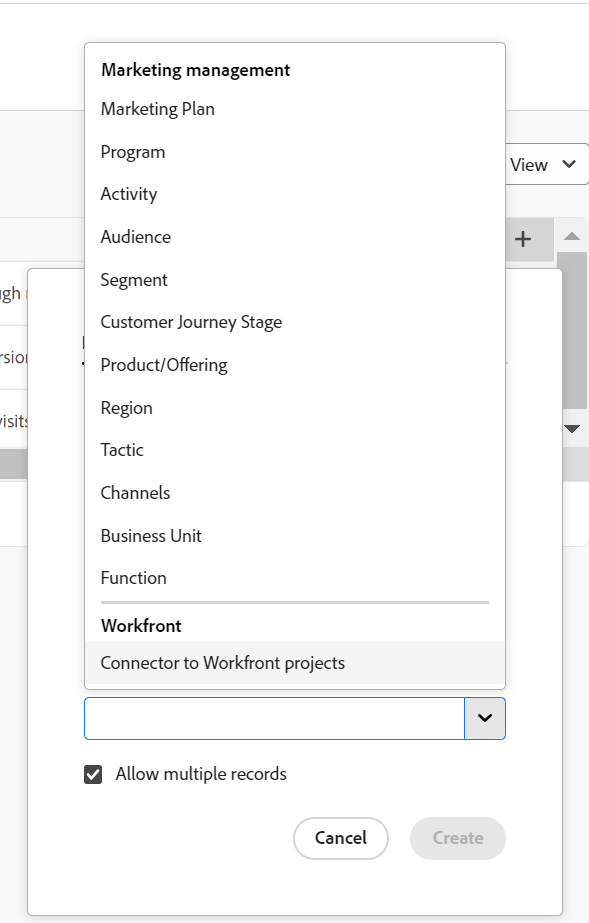
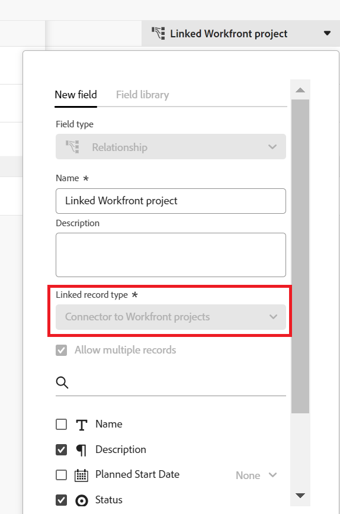
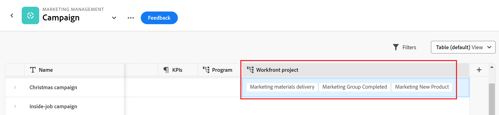

<!--udpate the metadata with real information when making this avilable in TOC and in the left nav-->

# Connect Maestro records to Workfront objects{#connect-maestro-records-to-workfront-objects-title}

You can link Maestro records to Workfront objects to show how the work you manage in Workfront influences the planned initiatives you have set up for Maestro records. 

Fields associated with Workfront objects can link to Maestro records to keep the activity in sync between the two systems. 

Currently, you can link the following object types from Workfront to Maestro records:

* Projects <!--when you add more objects, fix the Access Requirements below which right now refer only to projects-->
 
## Access requirements

<table style="table-layout:auto">
 <col>
 </col>
 <col>
 </col>
 <tbody>
  <tr>
   <td role="rowheader">
Adobe Workfront plan*
</td>
   <td>
Any

<!--the above is only for closed beta; when going to GA - activate the following plans:    

Current plan: Prime and Ultimate

Legacy plan: Enterprise
-->
   </td>
  </tr>
  <tr>
   <td role="rowheader">
Adobe Workfront license*
</td>
   <td> 
Any, to create Maestro records
 

Work or higher to view projects in Workfront

  
For more information, see <a href="../../administration-and-setup/add-users/access-levels-and-object-permissions/wf-licenses.md" class="MCXref xref">Adobe Workfront licenses overview</a>.
 </td>
  </tr>
  <tr>
   <td role="rowheader">
Product
</td>
   <td> 
 Adobe Workfront
 </td>
  </tr>
  <tr>
   <td role="rowheader">
Access level*
</td>
   <td> 
Any, to create Maestro records

View or higher access to Projects
 
</td>
  </tr>

<tr>
   <td role="rowheader">
Object permissions
</td>
   <td> 
View or higher permissions to the projects you want to link with Maestro records  
</td>
  </tr>
<tr>
   <td role="rowheader">
Layout template
</td>
   <td> 
Your system administrator must add the Maestro area in your layout template. For information, see the "Enable Maestro for the users in your Workfront instance" section in the article <a href="../maestro/maestro-overview.md">Adobe Maestro overview</a>. 
  
</td>
  </tr>
 </tbody>
</table>

>[!NOTE]
>
>*If you still don't have access, ask your Workfront administrator if they set additional restrictions in your access level. For information on how a Workfront administrator can change your access level, see [Create or modify custom access levels](../administration-and-setup/add-users/configure-and-grant-access/create-modify-access-levels.md).

## Requirements for connecting Maestro records with Workfront objects

To link Maestro records with Workfront objects you must have the following:

* Workfront objects you want to link from Maestro. For example, projects in Workfront.
* Maestro workspaces, record types, and records. For more information, see the following articles:

  * [Create workspaces](create-workspaces.md)
  * [Create operational record types](create-operational-record-types.md)
  * [Create records](create-records.md)

* A connector record type to establish the connection between Maestro and Workfront. The connector record type is a read-only depository for all the projects linked to Maestro records and their fields. 

  For information, see the section [Create a connector record type](#create-a-connector-record-type) in this article. 

## Considerations about connecting Maestro records with Workfront objects

* Everyone with access to Maestro can see the connections you make between Maestro records and Workfront objects. Also, you can see everyone else's connections. 
* You can connect one Maestro record to one or multiple Workfront objects. 
* You can connect multiple Maestro records to the same Workfront object. 
* You can link both standard and custom Workfront fields to Maestro records. 
* You cannot connect a Workfront object to a Maestro record from Workfront. You can only connect records to objects from Maestro. 
* Once the connection between the objects and records is established, the values of any of the linked fields from the Workfront objects populate in Maestro automatically. 
* You cannot update Workfront objects or their field values from Maestro. The synchronization of information is unilateral: only changes made in Workfront are automatically visible in Maestro. 
* There is no indication in Workfront that an object is linked to Maestro records. Any changes made to the Maestro records do not reflect on the objects linked from Workfront. <!--this will change at some point; they'll probably add some indication in the Details section in WF, per Artur-->
* You cannot connect taxonomies to Workfront objects. You can only connect operational record types. <!-- this is temporary; there will be certain objects (teams, etc) that will be linked to taxonomies, per Lilit-->

## Create a connector record type {#create-a-connector-record-type}

You must create a connector record type to indicate which Workfront object and which Workfront object fields you want future Maestro record to link to. Creating the connector record type is a prerequisite to being able to connect Maestro records with Workfront objects. 

1. Go to a workspace that contains the records you want to connect to Workfront objects. 
1. Click **Add record type** in the **Operational Record Types** area. <!--has this changed to "Create"?--> 
1. Click **Workfront**, then **Add**. 

    The **Add record type from source** box displays.
    

1. In the **Basic settings** area, type the name of the connector record type. This will be a read-only record type whose only purpose is to establish the connection between the record types in the selected workspace and Workfront object types. 

    We recommend naming the connector record field in a way that is clear that it is a connector record type, and not a record type that can be associated with work information. For example, you can name the new record type **Connector to Workfront projects** when you want to create a connection between Maestro records and Workfront projects. 

    >[!IMPORTANT]
    >
    >  Each connector record type can be associated with only one Workfront object type. 

1. In the **Connection settings** area, select the Workfront **Object type**. For example, select **Project** when you want Maestro records to connect to Workfront projects.
1. (Optional) From the **Custom form** drop-down menu, select one or several custom forms that are associated with the object type you selected in the previous step. Only select custom forms if you want their custom fields to be linked to Maestro records. If you don't select any custom forms, only the standard fields for the selected object type can be linked. 
1. Click **Add**. 
   The connector record type is added to your workspace and is now visible to everyone who can access Maestro. 
1. (Optional) Click the name of the new connector record type from the selected workspace. This opens the connector record type's table. This is a read-only table. The records (Workfront objects) and their fields populate in the connector record type table only after you have added linked fields from other Maestro record types to Workfront objects. 

    For more information, see the section [Connect Maestro records to Workfront objects](#connect-maestro-records-to-workfront-objects-section) in this article. 

1. (Optional) Click the **Add fields** icon  in the upper-right corner of the table to add more fields to the connector record type. This adds more Workfront fields to Maestro so you can link to them from other record types. 

    The **Add fields** box displays.

    

1. (Optional) Start typing the name of a field in the **Search fields** box. 
1. (Optional) Click the **+** icon to the left of a field name in the **Unselected fields** area to add it to the **Selected fields** area. These are fields that will be accessible to link from other Maestro record types. 
1. (Optional) Click the **-** icon to the left of a field name in the **Selected fields** area to remove the field. The field moves back to the **Unselected fields** area.

    >[!NOTE]
    >
    >  * The field is no longer accessible from Maestro records linked to the Workfront connector record type. 
    >  * Any information currently visible in the field will be removed from the linked records. 
    >  * You cannot remove the **Name** field.

1. Click **Add fields**.

    The Workfront fields you selected are now available to be linked from Maestro other record types. 

## Connect Maestro records to Workfront objects{#connect-maestro-records-to-workfront-objects-section}

After establishing the connection between Maestro records and Workfront objects by adding the connector record type in the previous section, you can link records from Maestro to individual objects in Workfront by creating Relationship-type fields. 

For more information, also see the article [Manage Relationship-type fields in Adobe Maestro](../maestro/manage-relationship-fields.md). 

1. Go to a record type whose records you want to connect to Workfront objects.
1. Select a **Table** view from the **View** drop-down menu in the upper-right corner of the record type page. 
1. Click the **+** icon in the upper-right corner of the table, to add a new field. 
1. Select **Relationship** from the **Field type** drop-down menu. You cannot change the field type after you save the field. 
1. Start typing a **Name** for the new field. 

   >[!TIP]
   >
   >We recommend that you include the name of the record you are linking to in the name of the relationship-type field to capture what record type the new field is coming from. The name of the linked record is not visible in the new linked field.
   >
   >For example, if you are linking the record to Workfront projects, you can name the new field "Linked Workfront project". 

1. (Optional) Add a description for this field. The description displays in the table view, when you hover over the column header of this field. 
1. Select the Workfront connector record type that you created in the previous section in the **Linked record type** field. This is a mandatory field and you cannot edit this selection after you save the field. 

    

1. Select **Allow multiple records** if you want to be able to link more than one Workfront object from one record. You cannot change this option after you save the field. 
1. (Optional) Select any of the fields available from the Workfront object. Standard as well as custom Workfront fields display in the list. If you don't select any fields, the **Name** field is selected by default, even when left unselected. You can select the name of a Workfront object in the new relationship-type field you are creating. 
1. (Conditional and optional) For date, number, currency, or percentage fields, select an aggregator from the drop-down to the right of the field name. For more information, see [Manage Relationship-type fields in Adobe Maestro](../maestro/manage-relationship-fields.md). 

    

1. Click **Create**.

    The relationship-ype field is created with the new name you selected in step 5. <!--ensure this stays accurate-->
    A new linked field is created for every linked field that you selected for the Workfront object type. The linked field from the linked Workfront object type is named according to this pattern: 

      `<Name of the original field on the Workfront object type> (from <Name of your linked field>)`

      For example, if you linked the Budget field from Workfront projects and you named your relationship-type field "Linked Workfront project", the linked Budget field is named "Budget (From Linked Workfront project)". 

1. (Optional) If you want to view which record type the linked fields come from, click the drop-down menu to the right of the relationship-type field, click **Edit field**, then view the name of the linked record type in the **Linked record type** field.  

    
1. (Optional) To connect records with objects, click the cell in the table of a Maestro record that contains the relationship-type field you created, then click the **+** icon to add Workfront objects.

    The **Connect objects** box displays. 
1. (Optional) Start typing the name of a Workfront objects in the search box, then select it when it displays on the screen

    Or

    Select the name of one or multiple projects in the box, then click **Connect objects** in the upper-right corner of the Connect objects box. 

    

    The connected objects display in the relationship-type field you created. 

    

1. (Conditional) If you selected to link more than one field from Workfront, additional columns display in the Maestro record table and the Workfront field values also display in their respective columns. If you did not select an aggregator for fields that have them available and you select more than one Workfront object, the field values display separated by commas. Otherwise, they display according to the selected aggregator. 

 
