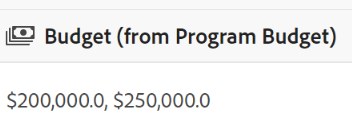

<!--udpate the metadata with real information when making this avilable in TOC and in the left nav-->

<!--Should the structure of this article be like this one: https://experienceleague.adobe.com/docs/workfront/using/administration-and-setup/customize/custom-forms/custom-form-builder/use-the-custom-form-builder/add-a-custom-field-to-a-custom-form.html?lang=en ??-->

<!--will they add a way to create fields elsewhere than in a table?! - how will that change the structure of this article? -->

# Create Maestro fields

In Adobe Maestro, you can create custom fields for operational record types or taxonomies. You can then associate the fields with Maestro records to enhance the information you store about records. 

You must create record types before you can create fields to associate with them. For information, see [Create operational record types](../maestro/create-operational-record-types.md). 

## Access requirements

<table style="table-layout:auto">
 <col>
 </col>
 <col>
 </col>
 <tbody>
  <tr>
   <td role="rowheader">
Adobe Workfront plan*
</td>
   <td>

Any

<!--the above is only for closed beta; when going to GA - activate the following plans:    

Current plan: Prime and Ultimate

Legacy plan: Enterprise
-->
   </td>
  </tr>
  <tr>
   <td role="rowheader">
Adobe Workfront license*
</td>
   <td>
   
Any
 
  
For more information, see <a href="../../administration-and-setup/add-users/access-levels-and-object-permissions/wf-licenses.md" class="MCXref xref">Adobe Workfront licenses overview</a>.
 </td>
  </tr>
  <tr>
   <td role="rowheader">
Product
</td>
   <td>
   
 Adobe Workfront
 </td>
  </tr>
  <tr>
   <td role="rowheader">Access level*</td>
   <td> 
Any
  
</td>
  </tr>
<tr>
   <td role="rowheader">Layout template</td>
   <td> 
Your system administrator must add the Maestro area in your layout template. For information, see the "Enable Maestro for the users in your Workfront instance" section in the article <a href="../maestro/maestro-overview.md">Adobe Maestro overview</a>. 
  
</td>
  </tr>
 </tbody>
</table>

*If you still don't have access, ask your Workfront administrator if they set additional restrictions in your access level. For information on how a Workfront administrator can change your access level, see [Create or modify custom access levels](../administration-and-setup/add-users/configure-and-grant-access/create-modify-access-levels.md).

## Considerations about Maestro fields

* The fields associated with a record type are available to be associated with all the records of that type. <!--will this change and will the fields be available for other record types, too?! Also, the next bullet might need to change too if this one changes -->

* Fields associated with a record type cannot be added to another record type. <!-- this will change when they open the Field library tab when creating a field-->

* You can create fields in Maestro manually or automatically in the following ways:

    * Automatically create Maestro fields: 

        * Maestro creates fields by default every time you create a record type. 

            The following are standard fields created by default for each new operational record type:

            * Name
            * Description
            * Start Date
            * End Date
            * Status. The default values for record statuses are:
                * Development
                * Planned
                * Active
                * Completed
                * On Hold

                You can add more values or rename the existing ones. 

            The following are the fields created by default for each new taxonomy record type:

            * Name <!--will more be added? If not, consider rephrasing this bullet-->

        * Link existing record types together and access the fields from the linked record type, when using Relationship fields. 
            
            For more information, see the [Create fields by linking record types](#create-fields-by-linking-record-types) section in this article. 
        
        * Link new Maestro record types to object types from other applications and access the fields of the linked object types. 
        
            <!--* Importing record types with fields using a CSV or an Excel file. - this is not available yet-->

            For more information about creating Maestro record types by linking them to object types from other applications, see [Create operational record types](../maestro/create-operational-record-types.md).

    * Manually, create Maestro fields from scratch:

        * You can manually create fields on the record type page, in the Table view. The columns of the table are the fields associated with the record type. They are the same fields that display on a record's Details page. You cannot create fields from the Details page of a record. 

* You can view and update the settings for fields that you or any other user created. <!--this will change with access/ permissions-->

* You can have up to 500 fields for one record type.

* Field names can have up to 250 characters.

* When deleting an operational record type, taxonomy, or workspace, all fields associated with them are also deleted and cannot be recovered. <!-- this might change with a possible recycle bin solution?!-->

## Create fields from scratch {#create-fields-from-scratch} <!--in a table (not sure if this can be done elsewhere?!-->

1. Click the **Main Menu** icon  in the upper-right corner of Workfront, <!---or the **Main menu** icon   in the upper-left corner, if available--> then click **Maestro** .

    The last-accessed workspace should open by default. 

1. (Optional) Expand the downward-pointing arrow to the right of an existing workspace name and select the workspace whose record types you want to create fields for, then click the record type. 

    Any existing records associated with the record type display in the table view, by default. 

    >[!TIP]
    >
    >    If no records display, you might not have any records yet, or you might have a filter applied that limits what you see on the screen.

    
1. Click the **+** icon to the upper-right corner of the table view to add new fields.
1. In the **New field** tab, select from the following field types: 

    * [Number](#number) 
    * [Percentage](#percentage)
    * [Currency](#currency)
    * [Single-line text](#single-line-text)
    * [Paragraph](#paragraph)
    * [Single-select](#single-select)
    * [Multi-select](#multi-select) 
    * [Date](#date)
    * [Relationship](#relationship)

    >[!IMPORTANT]
    >
    >    You cannot change the type of the field after you save it. 

1. Continue with adding each field, as described in the sections below. 

<!--LEFT HERE - MAY 25, 2023-->

### Number {#number}

Number field types capture information in a number format. 

1. Start creating a field as described in the section [Create fields from scratch](#create-fields-from-scratch) in this article, then select the **Number** field type.

    
1. Add the following information:

    * **Name**: The name of the field type, as it will appear in a table or the Details page of the record. 
    * **Description**: Additional information about the field. The description of a field displays when you hover over the field's column in a table. 
    * **Precision**: The number of decimals that you want to record for the field. You can display up to 6 decimals.
    * **Allow negative numbers**: Select this option if you want to allow negative numbers in this field. This option is deselected by default. <!--Add this if they added this functionality: You cannot edit this option after you save the field.-->
1. Click **Create**.

    The new number field is added as a column to the record type and its values can be associated with records. The field also displays on the Details page of a record.  

### Percentage {#percentage}

Percentage field types capture information in a number format followed by a percentage sign. 

1. Start creating a field as described in the section [Create fields from scratch](#create-fields-from-scratch) in this article, then select the **Percentage** field type.

    

1. Add the following information:
     * **Name**: The name of the field type, as it will appear in a table or the Details page of the record. 
     * **Description**: Additional information about the field. The description of a field displays when you hover over the field's column in a table. 
    * **Precision**: The number of decimals that you want to record for the field. You can display up to 6 decimals.
    * **Allow negative numbers**: Select this option if you want to allow negative percentage values in this field. This option is deselected by default. <!--Add this if they added this functionality: You cannot edit this option after you save the field.-->
1. Click **Create**. 

    The new percentage field is added as a column to the record type and its values can be associated with records. The field also displays on the Details page of a record. 

### Currency {#currency}

Currency field types capture information in a number format preceded by a currency symbol. 

1. Start creating a field as described in the section [Create fields from scratch](#create-fields-from-scratch) in this article, then select the **Currency** field type.

    

1. Add the following information:
     * **Name**: The name of the field type, as it will appear in a table or the Details page of the record. <!--ensure they updated this; and update the screen shot: it used to be "Label"-->
     * **Description**: Additional information about the field. The description of a field displays when you hover over the field's column in a table.
     * **Currency**: The type of currency you want to display in this field. <!--asked the teams where this list is coming from. If you know, add a note here-->
      * **Precision**: The number of decimals that you want to record for the field. You can display up to 6 decimals.
    * **Allow negative numbers**: Select this option if you want to allow negative currency values in this field. This option is deselected by default. <!--Add this if they added this functionality: You cannot edit this option after you save the field.-->
1. Click **Create**. 

    The new currency field is added as a column to the record type and its values can be associated with records. The field also displays on the Details page of a record. 

### Single-line text {#single-line-text}

Single-line text fields capture limited alphanumeric information like Owner, Stakeholder, Team, or Organizational unit. The content of a single-line text field can have up to 250 characters. <!-- asked Lilit if we can change this to "Single-line" since this can have numbers and text.-->

1. Start creating a field as described in the section [Create fields from scratch](#create-fields-from-scratch) in this article, then select the **Single-line text** field type.

     

1. Add the following information:
     * **Name**: The name of the field type, as it will appear in a table or the Details page of the record. <!--ensure they updated this; and update the screen shot: it used to be "Label"-->
     * **Description**: Additional information about the field. The description of a field displays when you hover over the field's column in a table.
1. Click **Create**. 

    The new single-line field is added as a column to the record type and its values can be associated with records. The field also displays on the Details page of a record. 

### Paragraph {#paragraph}

Paragraph fields capture additional alphanumeric information, similar to the Description field. The content of a paragraph field can have up to 1,000 characters. 

1. Start creating a field as described in the section [Create fields from scratch](#create-fields-from-scratch) in this article, then select the **Paragraph** field type.

    
 

1. Add the following information:
     * **Name**: The name of the field type, as it will appear in a table or the Details page of the record. <!--ensure they updated this; and update the screen shot: it used to be "Label"-->
     * **Description**: Additional information about the field. The description of a field displays when you hover over the field's column in a table.
1. Click **Create**. 

    The new paragraph field is added as a column to the record type and its values can be associated with records. The field also displays on the Details page of a record. 

### Single-select {#single-select}

Single-select fields capture additional information in any format by selecting one option from a drop-down menu. 

1. Start creating a field as described in the section [Create fields from scratch](#create-fields-from-scratch) in this article, then select the **Single-select** field type.

    
 

1. Add the following information:
     * **Name**: The name of the field type, as it will appear in a table or the Details page of the record. <!--ensure they updated this; and update the screen shot: it used to be "Label"-->
     * **Description**: Additional information about the field. The description of a field displays when you hover over the field's column in a table.
     * **Choices**: The options  available to select from the drop-down menu after the field is saved. You can have both numbers and letters for the name of each choice. Manually drag and drop each choice in the desired order, or select the **Sort choices A-Z** option if you want the choices to be automatically listed in alphabetical order. <!--Add this if they added this functionality: You cannot edit this option after you save the field.-->
1. Click **Add choice** to add as many choices or options as needed.      
1. Click the **x** icon to the right of a choice to remove it.
1. Click the color swatch to the left of a choice to expand the color selector and customize the color of each option. 
1. Click **Create**. 

### Multi-select {#multi-select}

You can use a multi-select field to capture additional information in any format by selecting more than option from a drop-down menu. 

1. Start creating a field as described in the section [Create fields from scratch](#create-fields-from-scratch) in this article, then select the **Multi-select** field type.

    
 

1. Add the following information:
     * **Name**: The name of the field type, as it will appear in a table or the Details page of the record. <!--ensure they updated this; and update the screen shot: it used to be "Label"-->
     * **Description**: Additional information about the field. The description of a field displays when you hover over the field's column in a table.
     * **Choices**: The options  available to select from the drop-down menu after the field is saved. You can have both numbers and letters for the name of each choice. Manually drag and drop each choice in the desired order, or select the **Sort choices A-Z** option if you want the choices to be automatically listed in alphabetical order. <!--Add this if they added this functionality: You cannot edit this option after you save the field.-->
1. Click **Add choice** to add as many choices or options as needed.      
1. Click the **x** icon to the right of a choice to remove it.
1. Click the color swatch to the left of a choice to expand the color selector and customize the color of each option. 
1. Click **Create**. 

### Date {#date}

You can use a date field to capture additional information in date and time format. 

1. Start creating a field as described in the section [Create fields from scratch](#create-fields-from-scratch) in this article, then select the **Date** field type.

    
 

1. Add the following information:
     * **Name**: The name of the field type, as it will appear in a table or the Details page of the record. <!--ensure they updated this; and update the screen shot: it used to be "Label"-->
     * **Description**: Additional information about the field. The description of a field displays when you hover over the field's column in a table.
     * **Date format**: The type of date format you want to display in this field.
        
        Select from the following formats:
        * **Locale**: Matches the locale of your browser.
        * **Standard**: 05/16/2023
        * **Friendly**: May 16, 2023
        * **European**: 16/05/2023
        * **ISO**: 2023-05-16
    * Include a time field: Select this option if you want to inclue a time stamp. Select from the following options:
        * **24hr**: 18:00
        * **12hr**: 6:00 PM

        This is deselected by default.

### Relationship {#relationship}

You can use a relationship field to link record types and their fields to one another. By doing this, you can display fields from the linked record on another record.

>[!IMPORTANT]
>
>    You cannot manually update the values of linked fields from linked record types. They are automatically updated from their original records.

For more information about creating a relationship field, see the section [Create fields by linking record types](#create-fields-by-linking-record-types) in this article.  

## Create fields by linking record types {#create-fields-by-linking-record-types}

You can create fields on a record type by linking it to another record type's fields by creating a Relationship-type field. 

1. Start creating a field for a record type, as described in the section [Create fields from scratch](#create-fields-from-scratch) in this article, then select the **Relationship** field type. This is the original record type. 

    

1. Add the following information:
     * **Name**: The name of relationship-type field, as it will appear in the table view or the Details page of a record of the original record type. This creates the linked record column in the table view of the original record type or the linked record field for the original records. <!--ensure they updated this; and update the screen shot: it used to be "Label"-->

    >[!TIP]
    >
    >We recommend that you include the name of the record you are linking to in the name of the relationship-type field to capture what record type the new field is coming from. 

     * **Description**: Additional information about the relationship-type field. The description of a field displays when you hover over the field's column in a table. 
     * **Find a record type**: The record type that you want to link to. This is the linked record. 
     * **Allow multiple records**: This allows users to select multiple records when the linked record type field displays on the original records. This is selected by default.

1. (Optional) Select the fields that belong to the linked record type that you want to display as linked fields on the original records. Use the **search** icon  to search for a field. 

    This creates the linked record field column in the table view of the record type or the linked record fields for the original records. A column or a linked field is added for each field you add from the linked record. 

    If you don't select any of the fields, the name of the linked record is the only visible field in the original record's table view and in the Details page of the record. This is the linked record column or field for the original record type. 

1. (Optional and conditional) For number, currency, percentage, or date-type fields, select how you want the values for the linked field to be aggregated. 

    

    Select from the following:

    * **MAX**: Displays the maximum value in a string of values.
    * **MIN**: Displays the minimum value in  a string of values.
    * **SUM**: Adds all the values of the linked fields. 
    * **AVG**: Calculates the average of the values of the linked fields.

    >[!TIP]
    >
    >If you do not select an aggregator, individual values display separated by commas.

1. Click **Create**.

    The following fields (or columns) are added to the original record type in the table view:
        
    * The linked record field with the name you selected in step 2. <!--ensure this stays accurate--> 
    * The linked field from the linked record which is named according to this pattern: 

        `The name of the original field on the linked record (from The name of your linked field)`

### Example of creating a Relationship-type field

This section describes an example of how to create a field by linking record types together. 

For example, you have a record type named Campaign as your original record type. 

You also have another record type called Program which has a currency field called Budget. 

You want to create a field on the record type of Campaign where you can show the values that users select for the Budget field on the record type Product. 

To do this:

1. Start by opening the table view for the Campaign record type. 
1. Click the **+** icon in the upper-right corner of the table view to add a new field, then expand the **Field type** drop down menu and select **Relationship**. 
1. Add the following information, for example:

    * **Name**: Program Budget. This is the name of the linked record field. 
    * **Description**: This is the budget of the program associated with this campaign. 
    * * **Allow multiple records**: Leave this option selected. This allows users to select multiple records when the linked record type field displays on the original records.
1. From the list of fields associated with the **Program**, select the **Budget** field. This creates a field called **Budget (from Program Budget)** which is the name of the linked field. 
1. (Optional and conditional) Select **SUM** in the drop-down menu to the right of the field name. When users select multiple programs in the **Program Budget** linked record field, the **Budget (from Program Budget)** field adds all their Budget values together and displays the total. 

    

    This generates two fields in the Campaign record table view and two fields in the Details page of a campaign: 

    * Program Budget (the linked record field)
    * Budget (from Program Budget) (the linked field) 
1. To populate the **Program Budget** field, go to the **Campaign** record type table view, then expand the **Program Budget** field. Select a program or multiple programs from the list. 

    
1. Click outside the **Program Budget** field to save the values.
    The values for the **Budget** field on the programs selected displays as a total in the **Budget (from Program Budget)** field on the campaign. The same fields display on the Details page of a campaign.

    

    >[!TIP]
    >
    >When you do not select an aggregator for the multiple values, all values display separated by commas. 
    >
    >

## Create Maestro fields when adding record types from other applications

You can create Maestro fields when you create Maestro record types by linking them to object types from other applications.

For information about adding record types from other applications, see [Create operational record types](../maestro/create-operational-record-types.md). 

