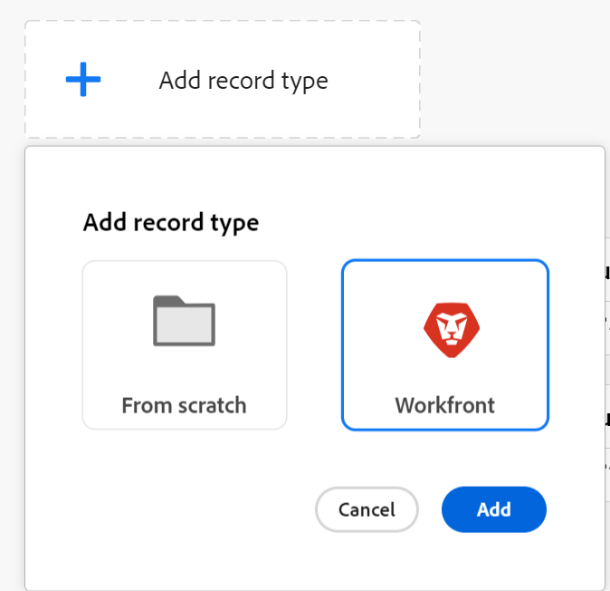
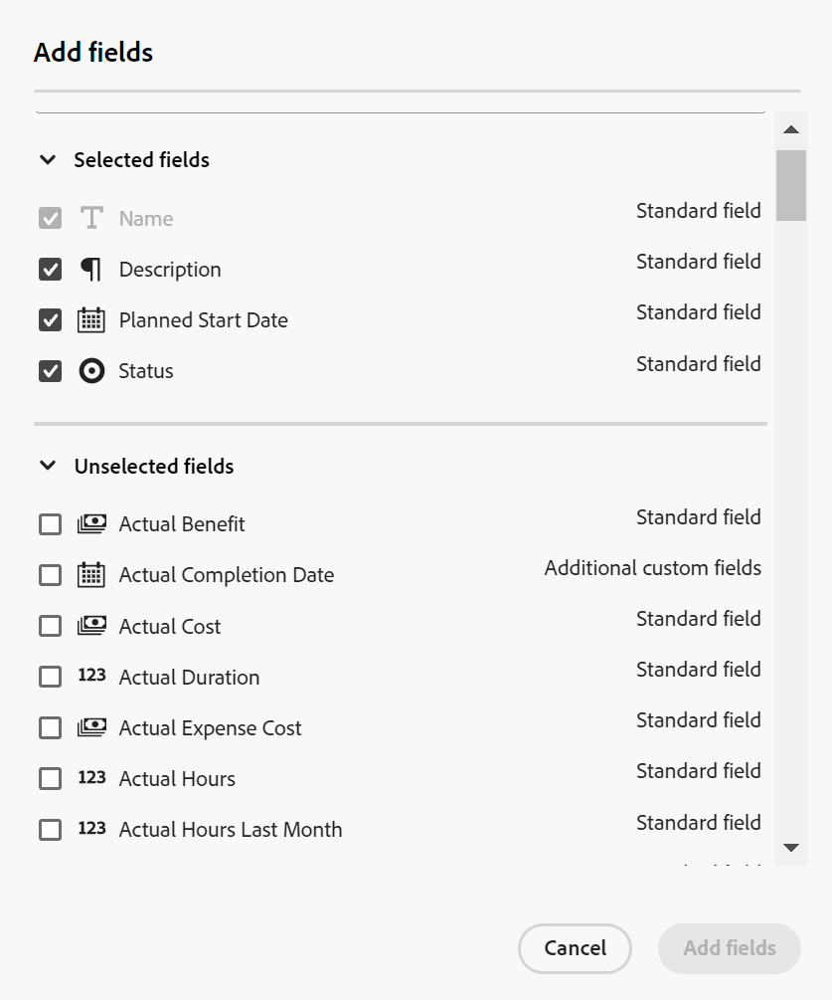

<!--udpate the metadata with real information when making this avilable in TOC and in the left nav-->

# Create operational record types

Record types are one of the objects of Adobe Maestro. Record types can be of one of the following:

* **Operational record types**: Record types that define work. For example, Campaign, Activity, Tactic, Opportunity can be operational record types. 
* **Taxonomies**: Record types that capture attributes about an operational record type. For example, Region, Address, Audience can be taxonomies.  

For more information about Maestro record types, see [Overview of Adobe Maestro record types](../maestro/overview-of-record-types-and-taxonomies.md).

This article describes how to create operational record types. However, creating operational record types and taxonomies is identical. For more information about taxonomies, see [Create a taxonomy](../maestro/create-a-taxonomy.md).

## Access requirements

<table style="table-layout:auto">
 <col>
 </col>
 <col>
 </col>
 <tbody>
  <tr>
   <td role="rowheader">
Adobe Workfront plan*
</td>
   <td>

Any

<!--the above is only for closed beta; when going to GA - activate the following plans:    

Current plan: Prime and Ultimate

Legacy plan: Enterprise
-->
   </td>
  </tr>
  <tr>
   <td role="rowheader">
Adobe Workfront license*
</td>
   <td>
   
Any
 
  
For more information, see <a href="../../administration-and-setup/add-users/access-levels-and-object-permissions/wf-licenses.md" class="MCXref xref">Adobe Workfront licenses overview</a>.
 </td>
  </tr>
  <tr>
   <td role="rowheader">
Product
</td>
   <td>
   
 Adobe Workfront
 </td>
  </tr>
  <tr>
   <td role="rowheader">Access level*</td>
   <td> 
Any
  
</td>
  </tr>
<tr>
   <td role="rowheader">Layout template</td>
   <td> 
Your system administrator must add the Maestro area in your layout template. For information, see the "Enable Maestro for the users in your Workfront instance" section in the article <a href="../maestro/maestro-overview.md">Adobe Maestro overview</a>. 
  
</td>
  </tr>
 </tbody>
</table>

>[!NOTE]
>
>*If you still don't have access, ask your Workfront administrator if they set additional restrictions in your access level. For information on how a Workfront administrator can change your access level, see [Create or modify custom access levels](../administration-and-setup/add-users/configure-and-grant-access/create-modify-access-levels.md).

## Considerations about operational record types

* Operational record types are building blocks of workspaces in Maestro. The record types should reflect the work lifecycle of an organizational unit. For information about workspaces, see [Create workspaces](../maestro/create-workspaces.md).  
* When you create an operational record type, everyone in your organization can view, edit, or delete it. <!--this will change with access levels and permissions-->
* You can add operational record types to a workspace by doing one of the following:
    * Create them from scratch.
    * Import them from other systems. For example, you can create record types by importing projects from Workfront. You cannot import taxonomies from other systems. <!--update this sentence when you can import taxonomies as well as operational records-->
* You must create a workspace before you can create record types for the workspace. 
* All newly created record types come with the following set of fields: 

    * Name
    * Description
    * Start Date
    * End Date
    * Status

    Additionally, you can add custom fields. For more information, see [Create fields for Maestro records](../maestro/create-fields.md).  
* You can have a combined total of 1,000 operational record types and taxonomies in one workspace. This includes record types or taxonomies that you create from scratch or that you import from other systems. 

## Create a record type from scratch

1. Click the **Main Menu** icon  in the upper-right corner of Workfront, <!---or the **Main menu** icon   in the upper-left corner, if available--> then click **Maestro** .

    The last-accessed workspace should open by default. 

1. (Optional) Expand the downward-pointing arrow to the right of an existing workspace name and select the workspace that you want to create record types for.
1. Click **Add record type** > **From scratch** > **Add**. 

    The record type page opens. The record type page displays in the Table view by default. The columns of the table are fields associated with the new record type. Each row is a unique record that you must add.  

    

    By default, the following fields display in the table view columns:

    * Name
    * Description
    * Start Date
    * End Date
    * Status
1. Update the name of the record type in the header of the page, then press Enter. By default, the name of a new record type is **Untitled Operational Record Type**. You can also expand the **More** icon  to the right of the record type name, then click **Edit**. <!--asking Lilit if we can rename this link to "Rename" to match the workspace button-->
1. (Optional) Click the **+** icon in the upper-right corner of the table to add more fields to the record type. For more information, see [Create fields for Maestro records](../maestro/create-fields.md).  

    For additional information about adding records, deleting record types, or updating the view in the record type page, see the following articles:
    * [Create records](../maestro/create-records.md)
    * [Delete record types and taxonomies](../maestro/delete-record-types-and-taxonomies.md)
    * [Manage record views in Adobe Maestro](../maestro/manage-record-views.md) <!--add information here about the sorting and grouping when available-->

1. (Optional) Click the left-pointing arrow to the left of the record type name to go back to the selected workspace. 

## Create a record type by importing it from another application

You can create Maestro record types by importing the following objects from the following applications:

* Projects from Workfront. 

To import objects and create Maestro record types:

1. Click the **Main Menu** icon  in the upper-right corner of Workfront, <!---or the **Main menu** icon   in the upper-left corner, if available--> then click **Maestro** .

    The last-accessed workspace should open by default. 

1. (Optional) Expand the downward-pointing arrow to the right of an existing workspace name and select the workspace that you want to create record types for.
1. Click **Add record type** > **Workfront** > **Add**. 

    

    The **Add record type from source** page opens.
1. Add the following information:

    * In the Basic settings section: 
        * **Name**: Add the name of the new record type as it appears in Maestro. 
    * In the Connection settings section: 
        * **Object type**: Select the object type you want to create the Maestro record from. This creates a linked record to the original application's object. 
        * **Custom form**: Optionally, select custom forms associated with the object selected. Select custom forms if you want to add the fields associated with them to the new record type. You can select more than one form. The custom forms must be created before you can select them from this list. 
1. Click **Add**. 

    The new record type page opens. The record type page displays in the Table view, by default. The columns of the table are fields associated with the new record type.   

    By default, the following fields display in the table view columns when you add a record type from a Workfront project:

    * Name
    * Description
    * Planned Start Date
    * Status
1. (Optional) Click the **Add fields** icon  to the upper-right of the table view, to add fields from the  linked object. 

    

    The **Add fields** box displays. The fields that are already associated with the new record display under the **Selected fields** section.

    >[!IMPORTANT]
    >
    >    You cannot manually update fields imported from the object type or another application. They are automatically updated from their original objects when you import the objects as new records in Maestro. 

1. (Optional) From the **Unselected fields** section, select the fields you want to add to the new record. Built-in fields are marked as **Standard fields** and custom fields display the name of the custom form to the right of the field name.
1. (Conditional) Click **Add fields** to finish adding fields to the new record type. 
    The added fields display as new columns in the record type table view, as well as in the Details page of any record. 

    

