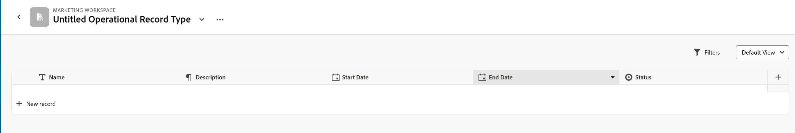

<!--udpate the metadata with real information when making this avilable in TOC and in the left nav-->

# Create operational record types

Record types are the objects of Adobe Maestro. Record types can be of one of the following types:

* Operational record types: Record types that define work. For example, Campaign, Activity, Tactic, Opportunity can be operational record types. 
* Taxonomies: Record types that capture attributes about an operational record type. For example, Region, Address, Audience can be taxonomies.  

This article describes how to create operational record types. However, creating operational record types and taxonomies is identical. For more information about taxonomies, see [Create a taxonomy](../maestro/create-a-taxonomy.md).

## Access requirements

<table style="table-layout:auto">
 <col>
 </col>
 <col>
 </col>
 <tbody>
  <tr>
   <td role="rowheader">Adobe Workfront plan*</td>
   <td>
   
Current plan: Prime or Ultimate

Legacy plan: Enterprise

   </td>
  </tr>
  <tr>
   <td role="rowheader">Adobe Workfront license*</td>
   <td>
   
Any
 
For more information, see <a href="../../administration-and-setup/add-users/access-levels-and-object-permissions/wf-licenses.md" class="MCXref xref">Adobe Workfront licenses overview</a>.
 </td>
  </tr>
  <tr>
   <td role="rowheader">
Product
</td>
   <td>
   
 Adobe Workfront
 </td>
  </tr>
  <tr>
   <td role="rowheader">Access level*</td>
   <td> 
Any
 

<b>NOTE</b>

If you still don't have access, ask your Workfront administrator if they set additional restrictions in your access level. For information on how a Workfront administrator can change your access level, see <a href="../administration-and-setup/add-users/configure-and-grant-access/create-modify-access-levels.md">Create or modify custom access levels</a> 
</td>
  </tr>
 </tbody>
</table>

## Considerations about record types

* Record types are organized in workspaces in Maestro. The record types should reflect the work lifecycle of an organizational unit. 
* When you create a record type, everyone in your organization can view, edit or delete it. <!--this will change with access levels and permissions-->
* You can create record types  by importing them from other systems. For example, you can create record types by importing projects from Workfront. 
* You must create a workspace before you can create record types for the workspace. 
* All newly created record types come with the following set of fields: 

    * Name
    * Description
    * Start Date
    * End Date
    * Status

    Additionally, you can add custom fields. For more information, see [Create fields for Maestro records](../maestro/create-fields.md).    
* You can have a maximum of 1,000 record types and taxonomies in one workspace. This includes record types or taxonomies that you create from scratch or that you import from other systems. 

## Create a record type

1. Click the **Main Menu**  in the upper-right corner of Workfront, then click **Maestro** . 

    The last-accessed workspace should open by default. 

1. (Optional) Expand the downward-pointing arrow to the right of an existing workspace name and select the workspace that you want to create record types for.
1. Click **Add record type**. 

    

    The record type page opens. The record type page displays a table by default. The columns of the table are fields associated with the new record type.  
1. Update the name of the record type in the header of the page. By default, the name of a new record type is **Untitled Operational Record Type**, then press Enter. You can also click the downward-pointing arrow to the right of the record type name, then click **Edit**. <!-- asking Lilit here if we should rename this button "Rename" to match what we have for Workspaces; all that it does is allows you to rename the record type--> 

1. (Optional) Click the **+** icon in the upper-right corner of the table to add more fields to the record type. For more information, see [Create fields for Maestro records](../maestro/create-fields.md).   
1. (Optional) Click the **+ New < record type name >** in the first row of the table to start entering new records of the new record type. For more information, see [Create records](../maestro/create-records.md). 
