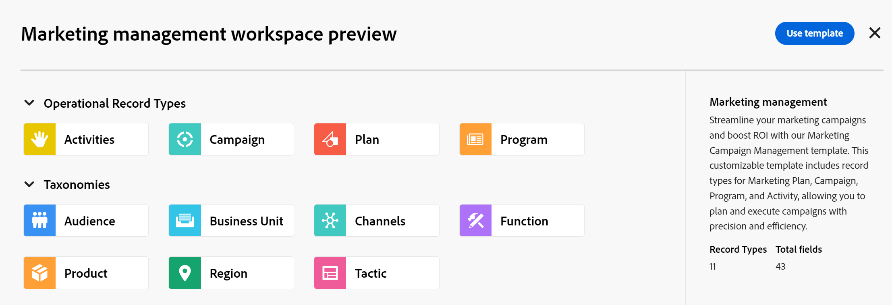

<!--udpate the metadata with real information when making this avilable in TOC and in the left nav-->

# Create workspaces

In Adobe Maestro, workspaces are centralized locations for teams to plan work. 

A workspace is a collection of operational record types and taxonomies used by the team and represents the team's work lifecycle. 

## Access requirements

<table style="table-layout:auto">
 <col>
 </col>
 <col>
 </col>
 <tbody>
  <tr>
   <td role="rowheader">Adobe Workfront plan*</td>
   <td>
   
Current plan: Prime or Ultimate

Legacy plan: Enterprise

   </td>
  </tr>
  <tr>
   <td role="rowheader">Adobe Workfront license*</td>
   <td>
   
Any
 
For more information, see <a href="../../administration-and-setup/add-users/access-levels-and-object-permissions/wf-licenses.md" class="MCXref xref">Adobe Workfront licenses overview</a>.
 </td>
  </tr>
  <tr>
   <td role="rowheader">
Product
</td>
   <td>
   
 Adobe Workfront
 </td>
  </tr>
  <tr>
   <td role="rowheader">Access level*</td>
   <td> 
Any
 

<b>NOTE</b>

If you still don't have access, ask your Workfront administrator if they set additional restrictions in your access level. For information on how a Workfront administrator can change your access level, see <a href="../administration-and-setup/add-users/configure-and-grant-access/create-modify-access-levels.md">Create or modify custom access levels</a> 
</td>
  </tr>
 </tbody>
</table>

## Create a workspace

1. Click the **Main Menu**  in the upper-right corner of Workfront, then click **Maestro** . 

    This opens the Workspaces area of Maestro. 
1. (Optional) Click **Preview** inside any of the following predefined workspace templates:

    * Marketing management
    * Sales management
    * Product management
    
    There is an indication of what operational record types, taxonomies and how many fields are associated with each template.

    

1. Click **Use template** to start creating the workspace from the selected template

    Or

    Click the **x** icon to close the template preview and return to the Workspaces area. 

1. Click **Create workspace** to create a workspace from scratch
    
    Or 

    Click **Use template** to create a workspace from an existing template. 
1. Click inside the name of the workspace in the header of the new workspace to rename it, then press Enter. 
1. (Optional) Click **Add record type** to add record types to the workspace.
    
    For information, see [Create record types](../maestro/delete-record-types.md).

1. (Optional) Click **Add taxonomy** to add taxonomies to the workspace. 

    For information, see [Create taxonomies](../maestro/create-a-taxonomy.md). 