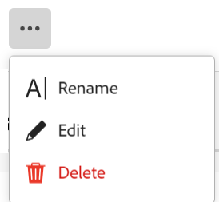

<!--udpate the metadata with real information when making this avilable in TOC and in the left nav-->

# Edit records

You can edit record information in Adobe Maestro. You must create record types before you can start creating and editing records. 
For information, see [Create operational record types](../maestro/create-operational-record-types.md). 

<!-- mention in here that the fields in the Details view are the same as the ones in the table view -- this article is linked from the Manage record views one to refer to this info-->

## Access requirements

<table style="table-layout:auto">
 <col>
 </col>
 <col>
 </col>
 <tbody>
  <tr>
   <td role="rowheader">
Adobe Workfront plan*
</td>
   <td>

Any

<!--the above is only for closed beta; when going to GA - activate the following plans:    

Current plan: Prime and Ultimate

Legacy plan: Enterprise
-->
   </td>
  </tr>
  <tr>
   <td role="rowheader">
Adobe Workfront license*
</td>
   <td>
   
Any
 
  
For more information, see <a href="../../administration-and-setup/add-users/access-levels-and-object-permissions/wf-licenses.md" class="MCXref xref">Adobe Workfront licenses overview</a>.
 </td>
  </tr>
  <tr>
   <td role="rowheader">
Product
</td>
   <td>
   
 Adobe Workfront
 </td>
  </tr>
  <tr>
   <td role="rowheader">Access level*</td>
   <td> 
Any
  
</td>
  </tr>
<tr>
   <td role="rowheader">Layout template</td>
   <td> 
Your system administrator must add the Maestro area in your layout template. For information, see the "Enable Maestro for the users in your Workfront instance" section in the article <a href="../maestro/maestro-overview.md">Adobe Maestro overview</a>. 
  
</td>
  </tr>
 </tbody>
</table>

>[!NOTE]
>
>*If you still don't have access, ask your Workfront administrator if they set additional restrictions in your access level. For information on how a Workfront administrator can change your access level, see [Create or modify custom access levels](../administration-and-setup/add-users/configure-and-grant-access/create-modify-access-levels.md).

## Considerations about editing records

* You can edit records that you or another user created. <!--will change with access levels-->
* If the edited records are linked to other records, the new information of the records that you are editing will reflect on the linked records. 
* You cannot edit records in bulk. <!--this will probably change-->

## Edit records

You can edit a record from the following areas:

* [From the Details page of a record](#edit-a-record-from-the-records-details-page)
* [From the table view of a record type](#edit-a-record-from-the-record-type-table-view) 

### Edit a record from the record's Details page

1. Click the **Main Menu**  in the upper-right corner, or the **Main Menu**  in the upper-left corner, if it is available, then click Maestro. 

    The workspace that you access last opens. 
1. Click a record type. 

    The record type page opens. 
1. (Conditional) From the **View** drop-down menu, select a table view. This should be the default view, unless you viewed the record type in the timeline view when you accessed it last. 

    The records associated with the selected record type display in the table view. 
1. Right-click a record row, then click **View**.

    

    The record **Details** page opens. 
1. Click the **More** menu to the right of the record name, then click **Edit**

    Or

    Click inside any editable field on the Details page to edit the information. 

     <!--ensure the options have not changed or been renamed-->

1. Click **Save changes**. <!--logged a bug for this - this needs to be "Save"-->

### Edit a record from the record type table view

1. Click the **Main Menu**  in the upper-right corner, or the **Main Menu**  in the upper-left corner, if it is available, then click **Maestro**. 

    The workspace that you accessed last opens. 
1. Click a record type. 

    The record type page opens. 
1. (Conditional) From the **View** drop-down menu in the upper-right corner of the table, select a table view. This should be the default view, unless you viewed the record type in the timeline view when you accessed it last. 

    The records associated with the selected record type display in the table view. 
1. Click inside the row of a record to start editing information about the record inline, then press Enter to save your changes. The changes are saved automatically. 

      >[!TIP]
      >
      >Relationship-type fields are not editable. The information for these fields is populated automatically from the linked records. For information, see [Manage Relationship-type fields in Adobe Maestro](../maestro/manage-relationship-fields.md).  

    
