<!--udpate the metadata with real information when making this avilable in TOC and in the left nav-->

<!---
title: Create fields
description: In Adobe Maestro, you can create custom fields for each kind of operational record type or taxonomy. You can then associate the field with Maestro records.
hidefromtoc: yes
hide: yes
author: Alina
feature: (*******************WE NEED A NEW ONE*******************)
role: User, Administrator (************is this right???************)
recommendations: noDisplay, noCatalog
--->

<!--Should the structure of this article be like this one: https://experienceleague.adobe.com/docs/workfront/using/administration-and-setup/customize/custom-forms/custom-form-builder/use-the-custom-form-builder/add-a-custom-field-to-a-custom-form.html?lang=en ??-->

<!--will they add a way to create fields elsewhere than in a table?! - how will that change the structure of this article? -->

<!--Do we need this for FORMULAS: when we release permissions to RECORDS and we release referring lookup fields in a formula field, update considerations to say that lookup fields from linked records depends on the permissions to the record; if they have no permissions to view a linked record, they won't be able to use that records's lookup fields in a formula - not sure is needed??-->

# Create fields

{{maestro-important-intro}}

In Adobe Workfront Planning, you can create custom fields for record types. You can then associate the fields with Workfront Planning records to enhance record information. 

You must create record types before you can create fields to associate with them. For information, see [Create record types](../architecture/create-record-types.md). 

You can create fields in the following ways in Maestro:

* From scratch
* By connecting record types
* By importing record types using an Excel or CSV file
* By creating a record type
* By creating a workspace from a template

For more information about Maestro fields, see [Field overview](/help/quicksilver/maestro/fields/fields-overview.md).

## Access requirements

You must have the following access to perform the steps in this article: 

<table style="table-layout:auto">
 <col>
 </col>
 <col>
 </col>
 <tbody>
    <tr>
<tr>
<td>
   
 Product
 </td>
   <td>
   
 Adobe Workfront
 </td>
  </tr>  
 <td role="rowheader">
Adobe Workfront agreement
</td>
   <td>

Your organization must be enrolled in the Adobe Workfront Planning beta program. Contact your account representative to inquire about this new offering. 

   </td>
  </tr>
  <tr>
   <td role="rowheader">
Adobe Workfront plan
</td>
   <td>

Any

   </td>
  </tr>
  <tr>
   <td role="rowheader">
Adobe Workfront license
</td>
   <td>
   
Any
 
  </td>
  </tr>
  
  <tr>
   <td role="rowheader">
Access level configurations
</td>
   <td> 
There are no access level control for Workfront Planning
  
</td>
  </tr>

  <tr>
   <td role="rowheader">
Permissions
</td>
   <td> 
Manage permissions to a workspace</a> 
  
   
System Administrators have permissions to all workspaces, including the ones they did not create.

</td>
  </tr>
<tr>
   <td role="rowheader">
Layout template
</td>
   <td> 
Your Workfront or group administrator must add the Planning area in your layout template. For information, see <a href="../access/access-overview.md">Access overview</a>. 
  
</td>
  </tr>

 </tbody>
</table>

<!--Maybe enable this at GA - but Maestro is not supposed to have Access controls in the Workfront Access Level: 
>[!NOTE]
>
>If you don't have access, ask your Workfront administrator if they set additional restrictions in your access level. For information on how a Workfront administrator can change your access level, see [Create or modify custom access levels](../administration-and-setup/add-users/configure-and-grant-access/create-modify-access-levels.md). -->

## Create fields from scratch {#create-fields-from-scratch} 

<!--in a table (not sure if this can be done elsewhere?!-->

{{step1-to-maestro}}

  The last-accessed workspace should open by default. 

1. (Optional) Expand the downward-pointing arrow to the right of an existing workspace name and select the workspace whose record types you want to create fields for, then click the record type. 

    All existing records associated with the record type display in the rows of the table view. 

    >[!TIP]
    >
    >    If no records display, you might not have any records yet, or you might have a filter applied that limits what you see on the screen.

    All existing fields associated with the record type display in the columns of the table view. <!--caveat this for when we can hide the fields; mention that they can be hidden if they are not visible by default-->

    
1. Click the **+** icon in the upper-right corner of the table view to add new fields.
1. In the **New field** tab, search for a field type in the **Field type** box, or select from the following field types: 

    * [Single-line text](#single-line-text)
    * [Paragraph](#paragraph)
    * [Multi-select](#multi-select)
    * [Single-select](#single-select)
    * [Date](#date)
    * [Number](#number) 
    * [Percentage](#percentage)
    * [Currency](#currency)
    * [Checkbox](#checkbox) 
    * [Formula](#formula)
    * [People](#people)
    * [Created by](#created-by)
    * [Created date](#created-date)
    * [Last modified by](#last-modified-by)
    * [Last modified date](#last-modified-date)
    
    >[!IMPORTANT]
    >
    >    You cannot change the Field type of the field after you save it. 

1. Continue with adding each field, as described in the sections below.

### Single-line text {#single-line-text}

Single-line text fields capture limited alphanumeric information. For example,  you can capture the Owner, Stakeholder, Team, or Organizational unit information in a single-line text field. The content of a single-line text field can have up to 250 characters. <!-- asked Lilit if we can change this to "Single-line" since this can have numbers and text.-->

1. Start creating a field as described in the section [Create fields from scratch](#create-fields-from-scratch) in this article, then select the **Single-line text** field type.

    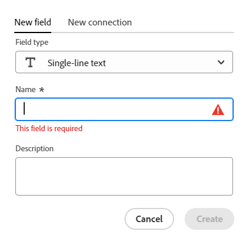 

1. Add the following information in the **New field** tab:
     * **Name**: The name of the field type, as it will appear in a table or the Details page of the record. <!--ensure they updated this; and update the screen shot: it used to be "Label"-->
     * **Description**: Additional information about the field. The description of a field displays when you hover over the field's column header in a table.
1. Click **Create**. 

    The new single-line field is added as a column to the record type, and its values can be associated with records. 

### Paragraph {#paragraph}

Paragraph fields capture additional alphanumeric information about a record, similar to the Description field. 

>[!TIP]
>
>* The content of a paragraph field can have up to 1,000 characters. 
>
>* You can use Rich Text formatting to enhance the content of paragraph fields when they display in the table view or the Details page of a record. For information, see [Edit records](/help/quicksilver/maestro/records/edit-records.md). 

1. Start creating a field as described in the section [Create fields from scratch](#create-fields-from-scratch) in this article, then select the **Paragraph** field type.

    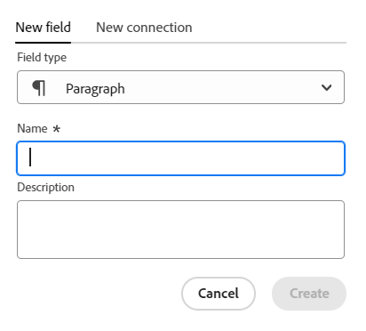
 

1. Add the following information in the **New field** tab:
     * **Name**: The name of the field type, as it will appear in a table or the Details page of the record. <!--ensure they updated this; and update the screen shot: it used to be "Label"-->
     * **Description**: Additional information about the field. The description of a field displays when you hover over the field's column in a table.
1. Click **Create**. 

    The new paragraph field is added as a column to the record type, and its values can be associated with records.   

### Multi-select {#multi-select}

You can use a multi-select field to capture additional information in any format by selecting more than one option from a drop-down menu. 

1. Start creating a field as described in the section [Create fields from scratch](#create-fields-from-scratch) in this article, then select the **Multi-select** field type.

    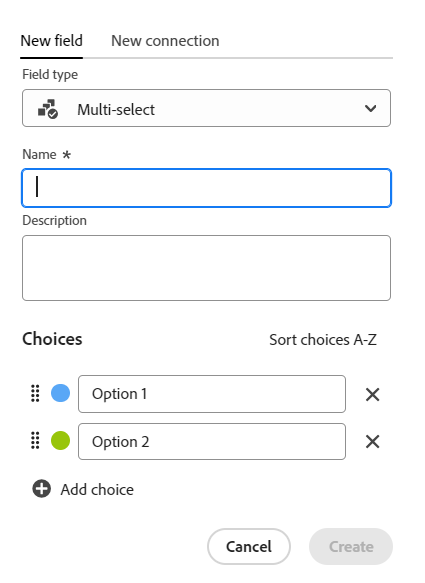
 

1. Add the following information in the **New field** tab:
     * **Name**: The name of the field type, as it will appear in a table or the Details page of the record. <!--ensure they updated this; and update the screen shot: it used to be "Label"-->
     * **Description**: Additional information about the field. The description of a field displays when you hover over the field's column in a table.
     * **Choices**: The options  available to select from the drop-down menu after the field is saved. You can have both numbers and letters for the name of each choice. 
1. Click **Add choice** to add as many choices as needed. There is no limit to how many choices you can add to a multi-select field.
1. (Optional) Manually drag and drop each choice in the desired order, or select the 
**Sort choices A-Z** option if you want the choices to be automatically listed in alphabetical order. <!--Add this if they added this functionality: You cannot edit this option after you save the field.-->
1. (Optional) To remove a choice, click the **x** icon to the right of it.
1. Click the color swatch to the left of a choice to expand the color selector and customize the color of each option. 
1. Click **Create**. 

    The new multi-select field is added as a column to the record type, and its values can be associated with records.  

### Single-select {#single-select}

Single-select fields capture additional information in any format by selecting one option from a drop-down menu. 

1. Start creating a field as described in the section [Create fields from scratch](#create-fields-from-scratch) in this article, then select the **Single-select** field type.

    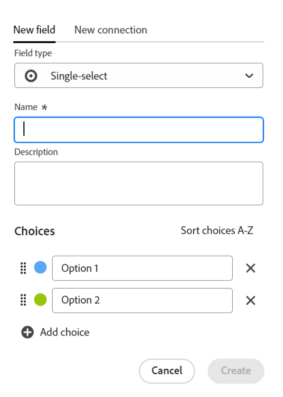
 

1. Add the following information in the **New field** tab:
     * **Name**: The name of the field type, as it will appear in a table or the Details page of the record. <!--ensure they updated this; and update the screen shot: it used to be "Label"-->
     * **Description**: Additional information about the field. The description of a field displays when you hover over the field's column in a table.
     * **Choices**: The options  available to select from the drop-down menu after the field is saved. You can have both numbers and letters for the name of each choice. 
     
1. Click **Add choice** to add as many choices as needed. There is no limit to how many choices you can add to a single-select field.     
1. (Optional) Manually drag and drop each choice in the desired order, or select the **Sort choices A-Z** option if you want the choices to be automatically listed in alphabetical order. <!--Add this if they added this functionality: You cannot edit this option after you save the field.-->
1. (Optional) To remove a choice, click the **x** icon to the right of it.
1. Click the color swatch to the left of a choice to expand the color selector and customize the color of each option. 
1. Click **Create**. 

    The new single-select field is added as a column to the record type, and its values can be associated with records.  

### Date {#date}

You can use a date field to capture additional information in date and time format. 

1. Start creating a field as described in the section [Create fields from scratch](#create-fields-from-scratch) in this article, then select the **Date** field type.

    
 

1. Add the following information in the **New field** tab:
     * **Name**: The name of the field type, as it will appear in a table or the record page. <!--ensure they updated this; and update the screen shot: it used to be "Label"-->
     * **Description**: Additional information about the field. The description of a field displays when you hover over the field's column in a table.
     * **Date Format**: The type of date format you want to display in this field. <!--update this casing - submitted bug for it-->
        
        Select from the following formats:
        * **Locale**: Matches the locale of your browser.
        * **Standard**: 05/16/2023
        * **Long**: May 16, 2023
        * **European**: 16/05/2023
        * **ISO**: 2023-05-16
    * **Include a time field**: Select this option if you want to include a time stamp. This is unselected by default. <!--update this setting name - submitted bug for it to be changed-->
    
        Select from the following options:
        
        * **24hr**: For example: 18:00
        * **12hr**: For example: 6:00 PM

1. Click **Create**. 

    The new date field is added as a column to the record type, and its values can be associated with records.  

### Number {#number}

Number field types capture information in a number format. 

1. Start creating a field as described in the section [Create fields from scratch](#create-fields-from-scratch) in this article, then select the **Number** field type.

    
1. Add the following information in the **New field** tab:

    * **Name**: The name of the field type, as it will appear in a table or the record page. 
    * **Description**: Additional information about the field. The description of a field displays when you hover over the field's column in a table. 
    * **Precision**: The number of decimal places that you want to record for the field. You can display up to 6 decimals.
    * **Allow negative numbers**: Select this option if you want to allow negative numbers in this field. This option is unselected by default. 
    
    >[!NOTE]
    >
    >    If you select Allow negative numbers, and negative values are stored on the records the field is attached to, then you can no longer deselect the setting in the future.

1. Click **Create**.

    The new number field is added as a column to the record type, and its values can be associated with records.    

### Percentage {#percentage}

Percentage field types capture information in a number format followed by a percentage sign. 

1. Start creating a field as described in the section [Create fields from scratch](#create-fields-from-scratch) in this article, then select the **Percentage** field type.

    

1. Add the following information in the **New field** tab:
     * **Name**: The name of the field type, as it will appear in a table or the record page. 
     * **Description**: Additional information about the field. The description of a field displays when you hover over the field's column in a table. 
    * **Precision**: The number of decimal places that you want to record for the field. You can display up to 6 decimals.
    * **Allow negative numbers**: Select this option if you want to allow negative percentage values in this field. This option is unselected by default. 

    >[!NOTE]
    >
    >    If you select Allow negative numbers, and negative values are stored on the records the field is attached to, then you can no longer deselect the setting in the future.

1. Click **Create**. 

    The new percentage field is added as a column to the record type, and its values can be associated with records.   

### Currency {#currency}

Currency field types capture information in a number format preceded by a currency symbol. 

1. Start creating a field as described in the section [Create fields from scratch](#create-fields-from-scratch) in this article, then select the **Currency** field type.

    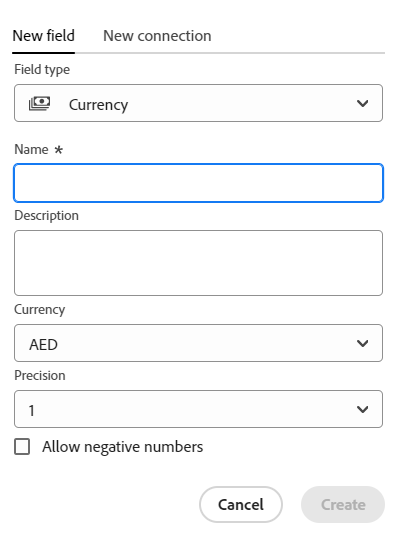

1. Add the following information in the **New field** tab:
     * **Name**: The name of the field type, as it will appear in a table or the record page. <!--ensure they updated this; and update the screen shot: it used to be "Label"-->
     * **Description**: Additional information about the field. The description of a field displays when you hover over the field's column in a table.
     * **Currency**: The type of currency you want to display in this field. This is a list of currencies according to the International Organizaton of Standardization (ISO). 
      * **Precision**: The number of decimal places that you want to record for the field. You can display up to 6 decimals.
    * **Allow negative numbers**: Select this option if you want to allow negative currency values in this field. This option is unselected by default. 

    >[!NOTE]
    >
    >    If you select Allow negative numbers, and negative values are stored on the records the field is attached to, then you can no longer deselect the setting in the future. 

1. Click **Create**. 

    The new currency field is added as a column to the record type, and its values can be associated with records.   

### Checkbox

You can use the Checkbox field type to add a single checkbox option to a record. You can use this field to indicate a specific attribute or status for that particular record. For example, you can use it as a flag for tracking completion, approval, or any other binary attribute for each record. 
 
1. Start creating a field as described in the section [Create fields from scratch](#create-fields-from-scratch) in this article, then select the **Checkbox** field type.
 
    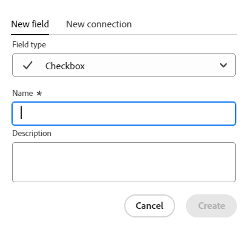

1. Add the following information in the **New field** tab:
     * **Name**: The name of the field type, as it will appear in a table or the record page. <!--ensure they updated this; and update the screen shot: it used to be "Label"-->
     * **Description**: Additional information about the field. The description of a field displays when you hover over the field's column in a table.
1. Click **Create**.

    The new checkbox field is added as a column to the record type, and its values can be associated with records.   

### Formula

Formula fields generate a new value using existing values from other fields in a record type and a function that indicates how the existing values should be calculated.

For more information, see [Formula fields overview](/help/quicksilver/maestro/fields/formula-fields.md).
 
1. Start creating a field as described in the section [Create fields from scratch](#create-fields-from-scratch) in this article, then select the **Formula** field type.
 
    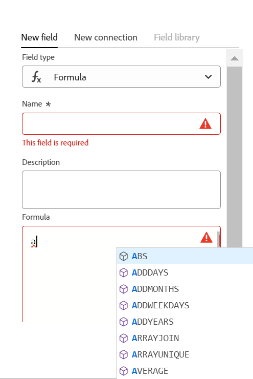

1. Add the following information in the **New field** tab:

   * **Name**: Enter a name for the new field.
   * **Description**: Add information about the new field.
   * **Formula**: Start typing at least one character to access an expression, then select it when it displays in the list. 
  
1. Click the selected expression to reveal the definition and view its formatting. 

   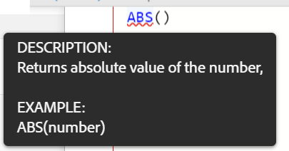

   For more information about what expressions are supported, see [Formula fields overview](/help/quicksilver/maestro/fields/formula-fields.md)

1. Add field names as they display in Workfront Planning to reference them in a formula. 

    >[!NOTE]
    >
    > You cannot add Multi-select type fields in a formula.
    

1. Click **Create**.

     The new formula field is added as a column to the record type, and its values can be associated with records.

### People

You can use the People field type to add a user <!--, job role, or team--> to a record. This is a type-ahead field, and you can add only users<!--, roles, or teams--> that already exist in your Workfront instance.
 
1. Start creating a field as described in the section [Create fields from scratch](#create-fields-from-scratch) in this article, then select the **People** field type.
 
   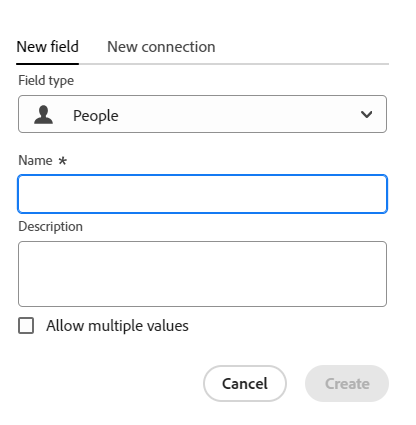

1. Add the following information in the **New field** tab:
     * **Name**: The name of the field type, as it will appear in a table or the record page. 
     * **Description**: Additional information about the field. The description of a field displays when you hover over the field's column in a table.
     * **Allow multiple values**: Select this option if you want to allow users to add more than one user in this field. This option is unselected by default. 
    
    >[!NOTE]
    >
    >    If you select Allow multiple values, and multiple users are stored on the records the field is attached to, then you can no longer deselect the setting in the future, when editing this field. 
    
1. Click **Create**.

    The new People-type field is added as a column to the record type, and its values can be associated with records.   

### Created by

You can use the Created by field type to add the user who created the record to a record. This is a read-only field, and it automatically populates with the name of the user who was logged in when the record was created.
 
1. Start creating a field as described in the section [Create fields from scratch](#create-fields-from-scratch) in this article, then select the **Created by** field type.
 
   

1. Add the following information in the **New field** tab:

     * **Name**: The name of the field type, as it will appear in a table or the record page. <!--this might change and they might prepopulate it with "Created by"-->
     * **Description**: Additional information about the field. The description of a field displays when you hover over the field's column in a table.
    
1. Click **Create**.

    The new Created by-type field is added as a column to the record type and its values are prefilled with the name of the user who created each record.   

### Created date

You can use the Created date field type to add the date when the record was created to a record. This is a read-only field, and it automatically populates with the date (and optionally with the time) when the record was created.
 
1. Start creating a field as described in the section [Create fields from scratch](#create-fields-from-scratch) in this article, then select the **Created date** field type.
 
   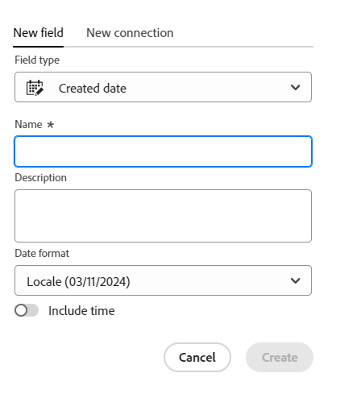

   <!--check the image above - added bug fix for UI text changes-->

1. Add the following information in the **New field** tab:

     * **Name**: The name of the field type, as it will appear in a table or the record page. <!--this might change and they might prepopulate it with "Created date"-->
     * **Description**: Additional information about the field. The description of a field displays when you hover over the field's column in a table.
     * **Date Format**: Select from the following formats:

        * **Locale**: Matches the locale of your browser.
        * **Standard**: 05/16/2023
        * **Long**: May 16, 2023
        * **European**: 16/05/2023
        * **ISO**: 2023-05-16
    * **Include a time field**: Select this option if you want to include a time stamp. This is unselected by default. <!--submitted a UI text change for this - check the UI-->
    
        Select from the following options:
        
        * **24hr**: For example: 18:00
        * **12hr**: For example: 6:00 PM 
    
1. Click **Create**.

    The new Created date-type field is added as a column to the record type and its values are prefilled with the date (or date and time) when the record was created.   

### Last modified by

You can use the Last modified by field type to add the user who last modified the record to a record. This is a read-only field, and it automatically populates with the name of the user who was logged in when the record was last updated.
 
1. Start creating a field as described in the section [Create fields from scratch](#create-fields-from-scratch) in this article, then select the **Last modified by** field type.
 
   

1. Add the following information in the **New field** tab:

     * **Name**: The name of the field type, as it will appear in a table or the record page. <!--this might change and they might prepopulate it with "Created by"-->
     * **Description**: Additional information about the field. The description of a field displays when you hover over the field's column in a table.
    
1. Click **Create**.

    The new Last modified by-type field is added as a column to the record type and its values are prefilled with the name of the user who last modified each record.   

### Last modified date

You can use the Last modified date field type to add the date when a record was last modified to a record. This is a read-only field, and it automatically populates with the date (and optionally with the time) when the record was last modified.
 
1. Start creating a field as described in the section [Create fields from scratch](#create-fields-from-scratch) in this article, then select the **Created date** field type.
 
   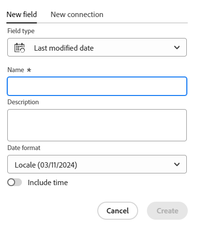

   <!--check the image above - added bug fix for UI text changes-->

1. Add the following information in the **New field** tab:

     * **Name**: The name of the field type, as it will appear in a table or the record page. <!--this might change and they might prepopulate it with "Created date"-->
     * **Description**: Additional information about the field. The description of a field displays when you hover over the field's column in a table.
     * **Date Format**: Select from the following formats:

        * **Locale**: Matches the locale of your browser.
        * **Standard**: 05/16/2023
        * **Long**: May 16, 2023
        * **European**: 16/05/2023
        * **ISO**: 2023-05-16
    * **Include a time field**: Select this option if you want to include a time stamp. This is unselected by default. <!--submitted a UI text change for this - check the UI-->
    
        Select from the following options:
        
        * **24hr**: For example: 18:00
        * **12hr**: For example: 6:00 PM 
    
1. Click **Create**.

    The new Last modified date-type field is added as a column to the record type and its values are prefilled with the date (or date and time) when the record was last modified.   

## Create fields by connecting record types 

You can create linked record fields when you add a new connection between two Maestro record types, or a record type and an object types from other applications. 
        
For information about connecting Workfront Planning record types, see [Connect record types](../architecture/connect-record-types.md)

## Create fields by importing record types using an Excel or CSV file

For more information, see [Create record types](../architecture/create-record-types.md).

## Create fields by creating a record type

When you create a record type, several fields associated with the new record type are also created by default. For more information, see [Create record types](../architecture/create-record-types.md). 

## Create fields by creating a workspace from a template

Adobe Workfront Planning creates fields for record types when you create a workspace from a template. 

For information, see [Create workspaces](/help/quicksilver/maestro/architecture/create-workspaces.md). 