# Adobe Workfront planning capabilities overview

<!--udpate the metadata with real information when making this avilable in TOC and in the left nav-->

<!-- remove the references to closed beta from the entire article-->

<!--update the video in the IMPORTANT below, when we have something better, especially after Open Beta - remove it-->

>[!IMPORTANT]
>
>The information in this article refers to Adobe Workfront planning capabilities, a new offering from Adobe Workfront. 
>
>Currently, the planning capabilities are part of a beta program which is open to a limited number of customers. You must be a Workfront customer to use these capabilities.
>
>Contact your account representative for more information about joining the beta program for the planning capabilities.
>[View a video demonstration of Adobe Workfront planning capabilities.](https://video.tv.adobe.com/v/3424253/){target=_blank}

## Introduction to Adobe Workfront planning capabilities

Adobe Workfront planning capabilities is a new offering from Adobe Workfront. The purpose of the planning capabilities is to unlock comprehensive visibility into the operational details of an organization, and answer critical business questions at each stage of the work management lifecycle. 

Teams and leadership need clear answers to questions like:  

* How many Campaigns are we running in EMEA for Q4?
* Do we have any audience overlaps between concurrent Campaigns?
* How well are the awareness programs doing right now?
* What do the assets look like for a particular Campaign? Which of them must still be approved?

To answer these questions, leadership needs a solution that can provide a holistic view of every stage of work from planning to execution, from delivery to measuring the results. Currently, organizations have tools that can cover some parts of the process, but many do not have good connections to all phases of work, nor can they reliably provide results.  

The following are some of the main capabilities:

* Solve the problem of managing work across all stages and for all the stakeholders that participate in the work process.  
* Fully customize your workflows, from deciding what object types (or record types) your organization uses to configuring how these objects link to one another.  
* Link to object types from other systems, creating a coherent framework for all your processes.  

## Currently available Adobe Workfront planning capabilities features

The following table illustrates the main features that will be available in the planning capabilities, and a timeline of their availability. The list does not include all features.

For information about new features and when they are released, see [Adobe Workfront planning capabilities release activity](/help/quicksilver/maestro/release-activity.md). 

|       Feature                                      |     Available now  |     Available soon   |     In research  |
|----------------------------------------------------|:-----------------------------:|:--------------------------------:|:----------------:|
|     Create workspaces                              |   ✓                           |                                  |                  |
|     Create operational record types                |   ✓                           |                                  |                  |
|     Create taxonomies                              |   ✓                           |                                  |                  |
|     Create individual, named records and taxonomies|   ✓                           |                                  |                  |
|     Create record custom fields                    |   ✓                           |                                  |                  |
|     Import record types and fields using an Excel  or CSV file                              |   ✓                           |                                  |                  |
|     Link records                                   |   ✓                           |                                  |                  |
|     View records in a table                        |   ✓                           |                                  |                  |
|     View records in a timeline                     |   ✓                           |                                  |                  |
|     Filter records                                 |   ✓                           |                                  |                  |
|     Group records in the timeline view             |   ✓                           |                                  |                  |
|     Group records in the table view                | ✓                              |                                 |                  |
|     Sort records in the table view                                 |  ✓                             |                                 |                  |
|     Sort records in the timeline view                                 |                               |   ✓                              |                  |
|     Sort groupings in the table view                                 |                               |   ✓                              |                  |
|     Sort groupings in the timeline view                                 |                               |   ✓                              |                  |
|     Connect workspaces                                |                               |   ✓                              |                  |
|     Connect planning capabilities records and taxonomies  |   ✓                            |  
|   Search for records in the table view    | ✓    |   |
|   Search for records in the timeline view    | ✓    |   |
|     Connect planning capabilities records to Workfront projects, programs, portfolios, companies, groups  |   ✓                            |                                 |                  |
|     Connect planning capabilities records to Adobe Experience Manager assets                                  |      ✓                         |                                  |                 | 
|     Record details page                            |   ✓                           |                                  |                  |
|     Update the layout of the record Details page              |                               |   ✓                              |                  |
|  Share workspaces | ✓| |  |
|  Share views |✓ | |  |
|     Submit requests                                |                               |                                  |   ✓              |
|     Creative brief                                 |                               |                                  |   ✓              |
|     Customize the color and icon of a record                                 |      ✓                         |                                  |                 |
|     Add comments to records                                 | ✓                              |                                  |                 |
|     Add thumbnails to records                                 | ✓                              |                                  |                 |
|     View history of changes on a record                                 | ✓                              |                                  |                 |
|     Rich Text formatting for Paragraph fields                                 |      ✓                         |                                  |                 | 
|     Adobe Workfront planning capabilities modules for Adobe Workfront Fusion                                 |      ✓                         |                                  |                 | 
|     Copy and paste information from one field to another                                  |      ✓                         |                                  |                 | 

## Enable Adobe Workfront planning capabilities for the users in your Workfront instance

Your organization must enroll in the Adobe Workfront planning capabilities closed beta program before you can access the planning capabilities. Contact your account representative for information about enrolling in the beta program. 

For more information about granting access to and enabling others to use the planning capabilities, see [Access overview](/help/quicksilver/maestro/access/access-overview.md). 

## Adobe Workfront planning capabilities terminology

Although the planning capabilities are part of Workfront, it comes with proprietary concepts and terminology. Ensure you are familiar with the planning capabilities concepts before embarking on setting up planning capabilities for your organization. 

The framework for the planning capabilities is fully customizable. You can create all record types, their attributes, and any fields associated with them to suit the exact needs of your organization. 

The following are the main planning capabilities objects and concepts: 

* **Workspace**: A collection of record types and taxonomies that define the operational lifecycle of a certain organization. A workspace is the work frame of an organizational unit. 

    One Workfront instance can have a maximum of 1,000 workspaces.

    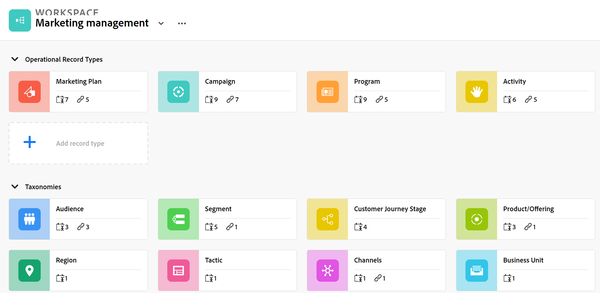 
    
    For more information, see [Create workspaces](../maestro/architecture/create-workspaces.md). 

* **Record Type**: The main planning capabilities object type.  
    
    Unlike Workfront where the object types are predefined, in the planning capabilities, you can create your own object types.  
    
    For example, in Workfront the object types of Program, Portfolio, Project, Task, or Issue are already created.  
    
    In the planning capabilities, you can create any record types that meet your organization's workflows. Later, you can define how the record types relate to one another or form dependencies. 
    
    For more information, see [Overview of operational record types and taxonomies](../maestro/architecture/overview-of-record-types-and-taxonomies.md).

    The planning capabilities have the following record types: 

    * **Operational Record Type**: A record type that represents strategic plans, initiatives, or executed work.  

        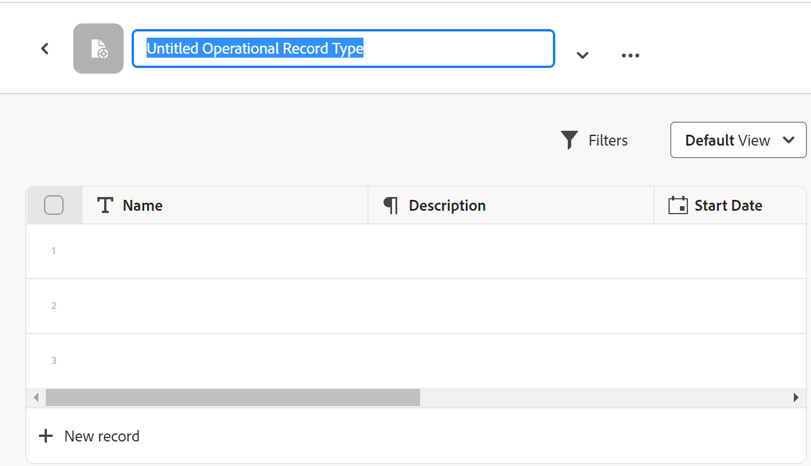

        For example, Campaign, Activity, Program can be operational record types.  

        For more information, see [Create record types](../maestro/architecture/create-record-types.md).

    * **Taxonomy**: A record type that captures attributes about an operational record type. 

        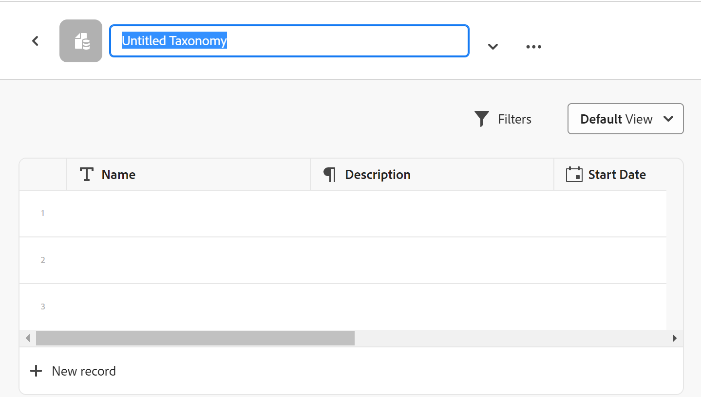

        Although creating taxonomies is identical with creating operational record types, the planning capabilities distinguish between an operational record type and a taxonomy record type. The purpose of taxonomies is to enhance operational record types. <!--this is no longer true, but might be later?!: A taxonomy is a record without dates, like a static list of attributes.-->  

        For example, Audience, Region, or Address can be taxonomy-type record types.  

       For more information, see [Create taxonomy record types](../maestro/architecture/create-a-taxonomy.md).

* **Record**: An instance of a planning capability record type. A record could refer to an operational record type or to a taxonomy.

    
    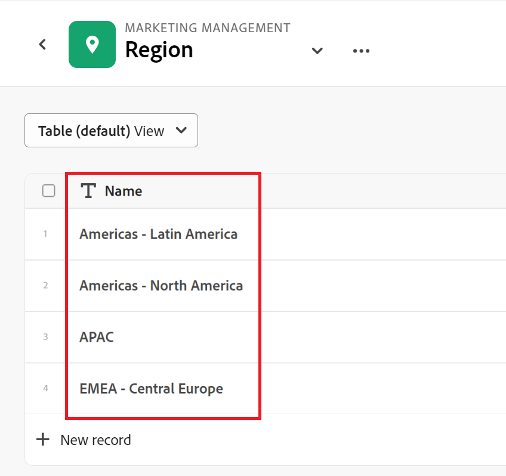
    
    After adding a record type to a workspace, you can start adding records of that type on the record type's page. 

    For example, "Campaign" can be an operational record type and "Summer Campaign for EMEA" is a record of the Campaign record type
    
    Or 
    
    "Region" is a taxonomy-type record type, whereas "Americas-Latin America" or "EMEA - Central Europe" are taxonomy records.  
    
    For more information, see [Create records](../maestro/records/create-records.md).

* **Workspace template**: You can create a workspace using predefined templates. You can use the predefined record types, taxonomies, and fields that come in a template, or you can add your own. 

    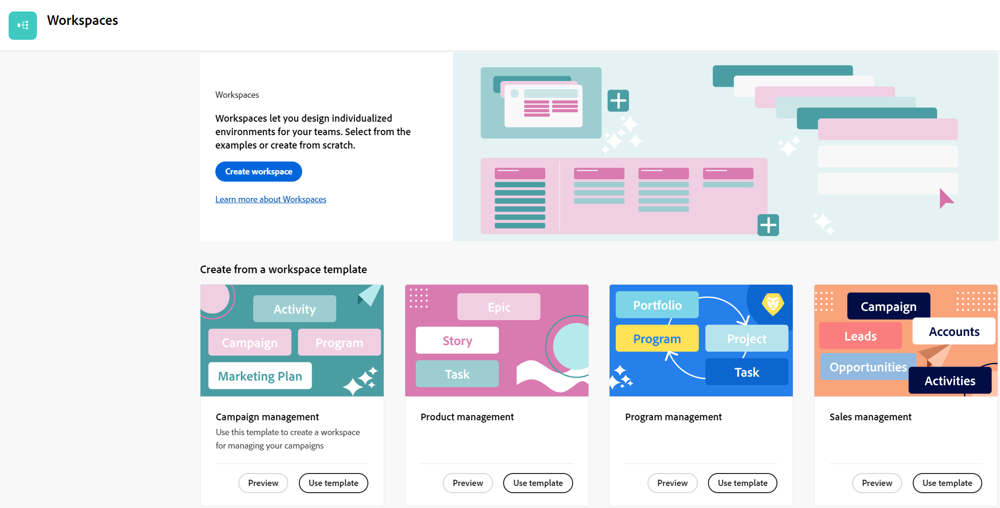

    Adobe Workfront planning capabilities comes with a Sales, Marketing, and Product Management workspace template. 
    
    For more information, see [Create workspaces](../maestro/architecture/create-workspaces.md).

* **Fields**: Fields are attributes that you can add to operational or taxonomy record types that contain information about the record type. <!--check the shot below, "Connection" needs to be in lowercase-->

    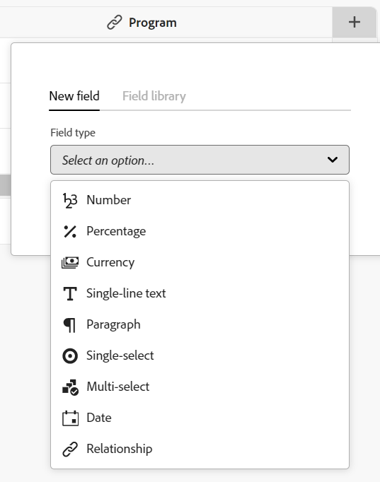

    Considerations about planning capability fields:
    
    * The fields you add for a record type automatically become associated with all records of that type and can be used to capture data about those records. 

    * Fields display as columns in the Table view applied to a record  type page. They also display in the Details page of the record. 

    * Fields are unique to a record type and do not transfer from one record type to another. 

    * Planning capability fields are fully customizable and are accessible only in the planning capabilities. You cannot access planning capability fields from Workfront. 

    For more information, see [Create fields](../maestro/fields/create-fields.md).
    
    A new operational record type is associated with the following predefined fields, by default: 

    * Name
    * Description
    * Start Date
    * End Date
    * Status

    A new taxonomy record type is associated with a Name field, by default. 

    You can create custom fields of the following types:  

    * Single-line text 
    * Paragraph   
    * Multi-select 
    * Single-select 
    * Date 
    * Number 
    * Percentage 
    * Currency
    * Checkbox 
    * Formula 
    * People
    * Created by
    * Created date
    * Last modified by
    * Last modified date
   
* **Linked record types**, **Linked records**, and **Linked record fields**:  You can create a connection between the following entities:
    
    * Two planning capability record types.
    * A planning capability record type and a Workfront project, program, portfolio, company, or group object type. 
    * A planning capability record type and an Adobe Experience Manager asset, folder, or collection. 

        You must have an Adobe Experience Manager license to link record types with Experience Manager objects.

        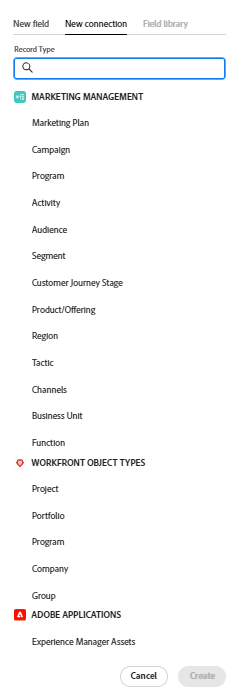

    After you establish a connection between the record types, you can connect individual records of those types to one another. The connection between the records displays as a linked record field.

* **Linked fields** (or lookup fields): After establishing the connection between two record types and you link individual records together, you can reference the linked records' fields on the record you are connecting from.

    For example, if you connect a planning capability campaign with a Workfront project, you can display the Project Owner field of connected projects on the planning capability campaign records. 

    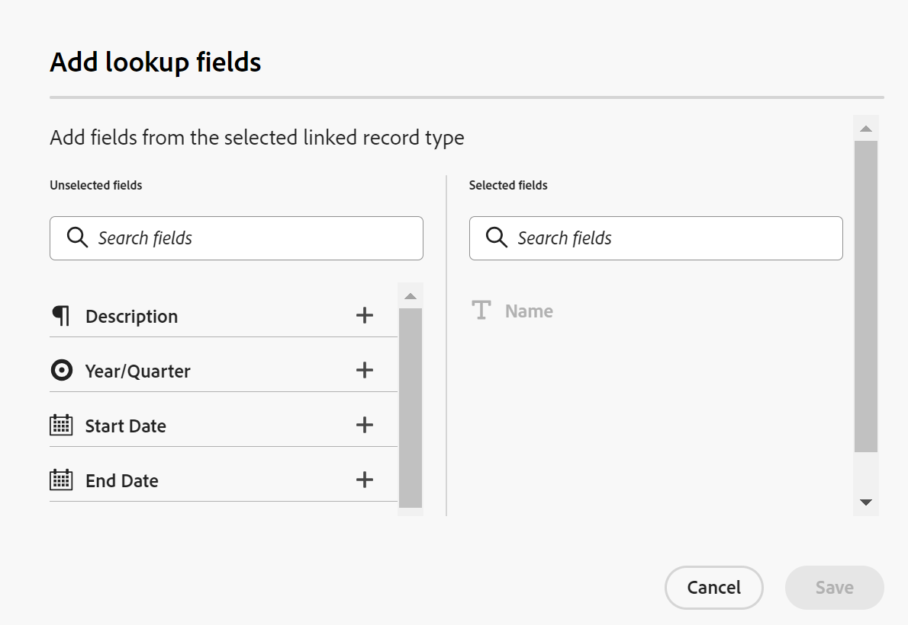

    For information about linking record types, records, and creating linked fields, see the following articles:

    * [Connect record types](../maestro/architecture/connect-record-types.md)
    * [Connect records](../maestro/records/connect-records.md)

<!--not yet:* Fields are reusable across Record Types.  -->

* **Views**: Records display under their respective record type page in different types of views.

    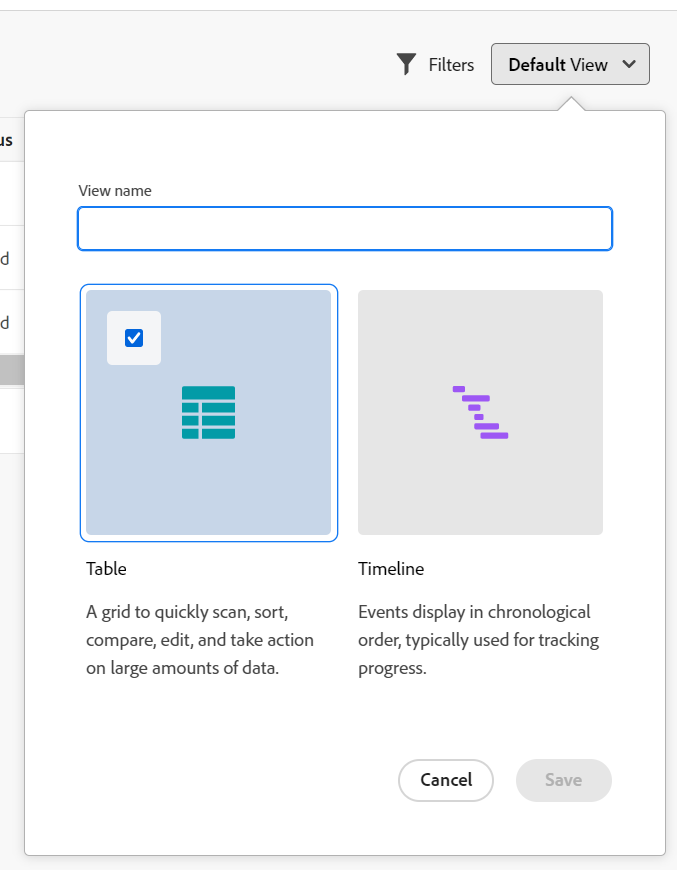

    Views contain personalized settings of a specific view type, such as the list of fields (columns), a list of records (rows), their order (sort), an applied or applicable filter and grouping.  
    
    The following are view types that you can apply to the record type page: 

    * **Table view**: Displays records and their fields in a table format. The rows of the table are the individual records, and the columns are the record fields. This is the default view. 

        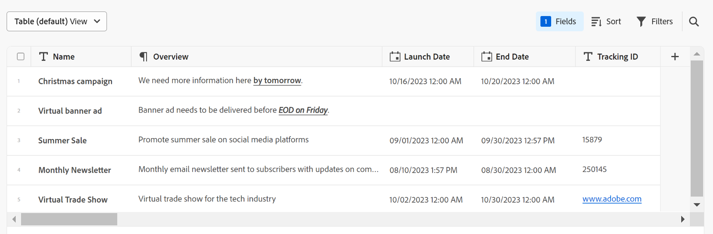

    * **Timeline view**: Displays records that have at least two Date-type fields in a chronological timeline. 

        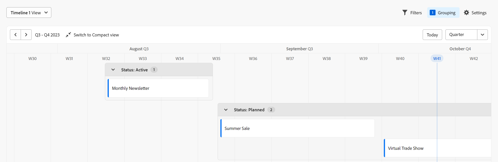

    <!--* **Calendar view**: Displays records that have at least two Date-type fields in a calendar format. 
    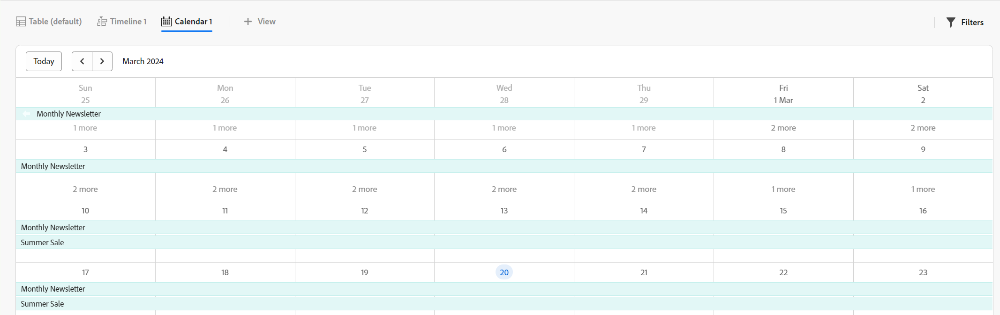-->

For more information, see [Manage record views](../maestro/views/manage-record-views.md).

## Adobe Workfront planning capabilities object limitations

The following table shows the limits for how many objects you can create in the planning capabilities. The limitations are subject to change as we move into the next phases of development.  

|       Adobe Workfront planning capabilities object                                                          |                                                        Limit                                                    |
|-------------------------------------------------------------------------------|:---------------------------------------------------------------------------------------------------------------:|
|     Number of Workspaces for one Workfront instance                                      |   1,000                                                                                                         |
|     Number of Record Types for one workspace                                            |   1,000 (this includes taxonomies for the workspace, or objects that you import from other applications)  |
|     Number of records for one record type                                               |   50,000                                                                                                        |
|     Number of fields for one record type or taxonomy                            |   500                                                                                                           |
|     Number of characters for a text field                                                               |   1,000 characters                                                                                              |
|     Size of file that you can paste in a record type table                    |   1MB                                                                                                           |
|     Size of file that you can import through the API for a record type table  |   1.5MB                                                                                                         |
|     The rate at which API requests can be made                                    |   200 requests per minute                                                                                       |
| Size of CSV of Excel file you can import in a table | 5MB |

## Locate Adobe Workfront planning capabilities

Ensure that your organization has received access to the planning capabilities and that your system or group administrator has added the planning capabilities area to your Main Menu. For information, see [Access overview](/help/quicksilver/maestro/access/access-overview.md).

To locate the planning capabilities:  

1. Log in to Adobe Workfront. 

1. Click the **Main Menu**  in the upper-right corner, or click the **Main Menu**  in the upper-left corner, if it's available. 

1. Click **Maestro** .

    The Workspaces area opens.

1. (Optional and recommended) Continue with some of the following actions, to build your work structure: 

    1. Create a workspace from scratch or using a template. 

    1. Add record types to the new workspace. 

    1. Add taxonomies to the new workspaces. 

    1. Click the name of a record type to open the record's page. The record page opens in the Table view, by default.
    
    1. Customize the Table view by doing any of the following:

        * Add more fields to the record type by clicking the **+** icon in the upper right corner. The columns in the view are fields associated with the record type. 
        * Add records by clicking the **+** icon in the lower-left corner. The rows in the view are unique records of the selected record type. 
        * Click **Filters** to filter the information you display on the record type page. 

    1. Click the name of a record to view more information in the record's Details page. 

    1. Create a Timeline view from the **View** drop-down menu in the upper-right corner of the record type page. 

    1. Customize the timeline view by updating Filters, Groupings, or Settings.  

## Adobe Workfront planning capabilities release activity 

We are releasing new features to the planning capabilities regularly. For an up-to-date list of released features, see [Adobe Workfront planning capabilities release activity](../maestro/release-activity.md).

