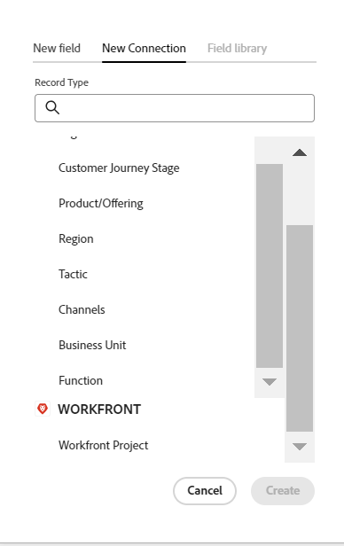
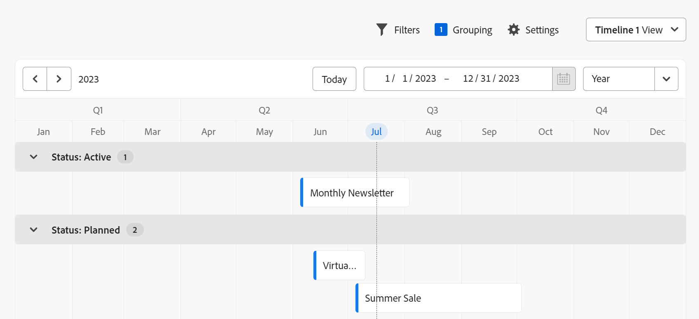

# Adobe Maestro overview

<!--udpate the metadata with real information when making this avilable in TOC and in the left nav-->

<!--see the separate article I wrote to have the PMs vet it for this: https://adobe-my.sharepoint.com/personal/alinaw_adobe_com/_layouts/15/doc.aspx?sourcedoc={79f94807-3d73-4015-afc0-5c016fc63cfc}&action=edit-->

<!--all the links are hidden for now, so I can share this with customer zero. Activate the links before making this public. -->

<!-- remove the references to closed beta from the entire article-->

>[!IMPORTANT]
>
>Currently, Adobe Maestro is part of a closed beta program which is open to a limited number of customers. 

## Introduction to Adobe Maestro

Adobe Maestro is a new offering from Adobe Workfront. The purpose of Maestro is to unlock comprehensive visibility into the operational details of an organization, and answer critical business questions at each stage of the work management lifecycle. 

Teams and leadership need clear answers to questions like:  

* How many Campaigns are we running in EMEA for Q4?
* Do we have any audience overlaps between concurrent Campaigns?
* How well are the awareness programs doing right now?
* What do the assets look like for a particular Campaign? Which of them must still be approved?

To answer these questions, leadership needs a solution that can provide a holistic view of every stage of work from planning to execution, from delivery to measuring the results. Currently, organizations have tools that can cover some parts of the process, but many do not have good connections to all phases of work, nor can they reliably provide end results.  

Maestro wants to solve the problem of managing work across all stages and for all the stakeholders that participate in the work process.  

With Maestro, you can fully customize your workflows, from deciding what object types (or record types) your organization uses to configuring how these objects link to one another.  

Additionally, Maestro can link to object types from other systems, creating a coherent framework for all your processes.  

## Access required to use Maestro during the closed beta program

<!-- the table will change after we implement access levels/ permissions for Maestro-->
<!-- fix the formatting on the table - some lines are way too spaced out-->

<table style="table-layout:auto">
 <col>
 </col>
 <col>
 </col>
 <tbody>
  <tr>
   <td role="rowheader">
Adobe Workfront plan
</td>
   <td>

Any

<!--the above is only for closed beta; when going to GA - activate the following plans:    

Current plan: Prime and Ultimate

Legacy plan: Enterprise
-->
   </td>
  </tr>
  <tr>
   <td role="rowheader">
Adobe Workfront license
</td>
   <td>
   
Any
 
  <!--
For more information, see <a href="../../administration-and-setup/add-users/access-levels-and-object-permissions/wf-licenses.md" class="MCXref xref">Adobe Workfront licenses overview</a>.
--> </td>
  </tr>
  <tr>
   <td role="rowheader">
Product
</td>
   <td>
   
 Adobe Workfront
 </td>
  </tr>
  <tr>
   <td role="rowheader">Access level</td>
   <td> 
Any
  
</td>
  </tr>

<tr>
   <td role="rowheader">Layout template</td>
   <td> 
Your system administrator must add the Maestro area in your layout template. For information, see the "Enable Maestro for the users in your Workfront instance" section in this article. 
  
</td>
  </tr>
 </tbody>
</table>

<!--Activate note when going to GA: 

>[!NOTE]
>
>If you still don't have access, ask your Workfront administrator if they set additional restrictions in your access level. For information on how a Workfront administrator can change your access level, see [Create or modify custom access levels](../administration-and-setup/add-users/configure-and-grant-access/create-modify-access-levels.md). -->

## Maestro terminology

Although Maestro is part of Workfront, it comes with proprietary concepts and terminology. Ensure you are familiar with the Maestro concepts before embarking on setting up Maestro for your organization. 

The framework for Maestro is fully customizable. You can create all record types, their attributes, and any fields associated with them to suit the exact needs of your organization. 

The following are the main Maestro objects and concepts: 

* **Workspace**: A collection of record types and taxonomies that define the operational lifecycle of a certain organization. A workspace is the work frame of an organizational unit. 

    One Workfront instance can have a maximum of 1,000 workspaces.

     
    
    <!--For more information, see [Create workspaces](../maestro/architecture-and-fields/create-workspaces.md).-->

* **Record Type**: The Maestro main object type.  
    
    Unlike Workfront where the object types are predefined, in Maestro, you can create your own object types.  
    
    For example, in Workfront the object types of Program, Portfolio, Project, Task, or Issue are already created.  
    
    In Maestro, you can create any record types that meet your organization's workflows. Later, you can define how the record types relate to one another or form dependencies. 
    
    <!--For more information, see [Overview of operational record types and taxonomies](../maestro/architecture-and-fields/overview-of-record-types-and-taxonomies.md). -->

    Maestro has the following record types: 

    * **Operational Record Type**: A record type that represents strategic plans, initiatives, or executed work.  

        

        For example, Campaign, Activity, Program can be operational record types.  

        <!--For more information, see [Create record types](../maestro/architecture-and-fields/create-record-types.md).-->

    * **Taxonomy**: A record type that captures attributes about an operational record type. 

        

        Although creating taxonomies is identical with creating operational record types, Maestro distinguishes between an operational record type and a taxonomy record type. The purpose of taxonomies is to enhance operational record types. <!--this is no longer true, but might be later?!: A taxonomy is a record without dates, like a static list of attributes.-->  

        For example, Audience, Region, or Address can be taxonomy-type record types.  

        <!-- For more information, see [Create a taxonomy](../maestro/architecture-and-fields/create-a-taxonomy.md).-->

* **Record**: An instance of a Maestro record type. A record could refer to an operational record type or to a taxonomy. 

    
    
    
    After adding a record type to a workspace, you can start adding records of that type on the record type's page. 

    For example, "Campaign" can be an operational record type and "Summer Campaign for EMEA" is a record of the Campaign record type 
    
    Or 
    
    "Region" is a taxonomy-type record type, whereas "Americas-Latin America" or "EMEA - Central Europe" are taxonomy records.  
    
    <!--For more information, see [Create records](../maestro/records/create-records.md). -->

* **Workspace template**: You can create a workspace using predefined templates. You can use the predefined record types, taxonomies, and fields that come in a template, or you can add your own. 

    

    Maestro comes with a Sales, Marketing, and Product Management workspace template. 
    
    <!--For more information, see [Create workspaces](../maestro/architecture-and-fields/create-workspaces.md). -->

* **Fields**: Fields are attributes that you can add to operational or taxonomy record types that contain information about the record type. <!--check the shot below, "Connection" needs to be in lowercase-->

    

    The fields you add for a record type automatically become associated with all records of that type and can be used to capture data about those records. 

    Fields display in the view applied to the records (in columns, if the table view is applied) as well as on the Details page of the record. 

    Fields are unique to a record type and do not transfer from one record type to another. 
    
    A new operational record type is associated with the following predefined fields: 

    * Name
    * Description
    * Start Date
    * End Date
    * Status

    A new taxonomy record type is associated with a Name field. 

    The following are types of fields you can associate with Maestro record types:  

    * Single-line text 
    * Paragraph   
    * Multi-select 
    * Single-select 
    * Date 
    * Number 
    * Percentage 
    * Currency
    * Checkbox  
   
* **Linked records**:  You can create a connection between two Maestro record types, or between a Maestro record type and a Workfront project object. 

    

* **Linked fields** (or lookup fields): After establishing the connection between two records, you can reference the linked records' fields on the record you are connecting from.

    

<!--not yet:* Fields are reusable across Record Types.  -->
<!--For more information, see [Create fields](../maestro/architecture-and-fields/create-fields.md)-->  

* **Views**: Records display under their respective record type page in different types of views. 

    

    Views contain personalized settings of a specific view type, such as the list of fields (columns), a list of records (rows), their order (sort), an applied or applicable filter and grouping.  
    
    The following are view types that you can apply to the record type page: 

    * **Table view**: The rows of the table are the individual records, and the columns are the record fields. This is the default view. 

        

    * **Timeline view**: Displays records that have at least two Date fields in a chronological timeline. 

        

    <!--For more information, see [Manage record views](../maestro/views/manage-record-views.md). -->

## Maestro object limitations

The following table shows the limits for how many objects you can create in Maestro. The limitations are subject to change as we move into the next phases of Maestro's development.  

|       Maestro object                                                          |                                                        Limit                                                    |
|-------------------------------------------------------------------------------|:---------------------------------------------------------------------------------------------------------------:|
|     Number of Workspaces for one Workfront instance                                      |   1,000                                                                                                         |
|     Number of Record Types for one workspace                                            |   1,000 (this includes taxonomies for the workspace, or objects that you import from third-party applications)  |
|     Number of records for one record type                                               |   10,000                                                                                                        |
|     Number of fields for one record type or taxonomy                            |   500                                                                                                           |
|     Number of characters for a text field                                                               |   1,000 characters                                                                                              |
|     Size of file that you can paste in a record type table                    |   1MB                                                                                                           |
|     Size of file that you can import through the API for a record type table  |   1.5MB                                                                                                         |
|     Rate at which API requests can be made                                    |   200 requests per minute                                                                                       |
| Size of CSV of Excel file you can import in a table | 5MB |

## Enable Maestro for the users in your Workfront instance

<!--First, contact your account manager to obtain access to the current Maestro closed beta program.--> 

After your organization has been enrolled in the Maestro beta program, you can add the Maestro area for other users by using a layout template. 

To share the Maestro area using a layout template: 

1. Log in to Workfront as a system administrator.  

1. Add the Maestro icon to the Main Menu using a Layout Template. <!--For information, see [Customize the Main Menu using a layout template](../administration-and-setup/customize-workfront/use-layout-templates/customize-main-menu.md).  -->

1. Assign the  layout template to the users that you want to have access to Maestro. <!--For information, see [Assign users to a layout template](../administration-and-setup/customize-workfront/use-layout-templates/assign-users-to-layout-template.md). -->

    All users who can access Maestro in their Main Menu can start creating workspaces, records types, records, and fields.  
 
<!-- the important below will be removed with access levels/ permissions -->

>[!IMPORTANT]
>
>Currently, there are no access levels or permissions associated with users or the information in Maestro. All users can view, edit, and delete all the information any other user adds to Maestro. 

## Locate Maestro in Adobe Workfront

Ensure that your organization has received access to Maestro and that your system or group administrator has added the Maestro area to your Main Menu.  

To locate Maestro:  

1. Log in to Adobe Workfront. 

1. Click the **Main Menu**  in the upper-right corner, or click the **Main Menu**  in the upper-left corner, if it's available. 

1. Click **Maestro** . 

    The Maestro Workspaces area opens. 

1. (Optional and recommended) Continue with some of the following actions, to build your work structure in Maestro: 

    1. Create a workspace from scratch or using a template. 

    1. Add record types to the new workspace. 

    1. Add taxonomies to the new workspaces. 

    1. Click the name of a record type to open the record's page. The record page opens in the Table view, by default.
    
    1. Customize the Table view by doing any of the following:

        * Add more fields to the record type by clicking the **+** icon in the upper right corner. The columns in the view are fields associated with the record type. 
        * Add records by clicking the **+** icon in the lower-left corner. The rows in the view are unique records of the selected record type. 
        * Click **Filters** to filter the information you display on the record type page. 

    1. Click the name of a record to view more information in the record's Details page. 

    1. Create a Timeline view from the **View** drop-down menu in the upper-right corner of the record type page. 

    1. Customize the timeline view by updating Filters, Groupings, or Settings.  

## Features currently available in Maestro

The following table illustrates the main features that will be available in Maestro, as well as a timeline of their availability. The list does not include all features.  

|       Feature                                      |     Available now  |     Available soon   |     In research  |
|----------------------------------------------------|:-----------------------------:|:--------------------------------:|:----------------:|
|     Create workspaces                              |   ✓                           |                                  |                  |
|     Create operational record types                |   ✓                           |                                  |                  |
|     Create taxonomies                              |   ✓                           |                                  |                  |
|     Create individual, named records and taxonomies|   ✓                           |                                  |                  |
|     Create record custom fields                    |   ✓                           |                                  |                  |
|     Import record types and fields using an Excel file                              |   ✓                           |                                  |                  |
|     Link records                                   |   ✓                           |                                  |                  |
|     View records in a table                        |   ✓                           |                                  |                  |
|     View records in a timeline                     |   ✓                           |                                  |                  |
|     Filter records                                 |   ✓                           |                                  |                  |
|     Group records in the timeline view             |   ✓                           |                                  |                  |
|     Group records in the table view                |                               |   ✓                              |                  |
|     Sort records                                   |                               |   ✓                              |                  |
|     Link workspaces                                |                               |   ✓                              |                  |
|     Connect Maestro records to Workfront projects  |   ✓                            |                                 |                  |
|     Record details page                            |   ✓                           |                                  |                  |
|     Update the layout of the record Details page              |                               |   ✓                              |                  |
| Access levels and permissions | | | ✓ |
|     Submit requests                                |                               |                                  |   ✓              |
|     Creative brief                                 |                               |                                  |   ✓              |
|     Customize the color and icon of a record                                 |      ✓                         |                                  |                 |

## Maestro release activity 

This section lists the features and patches that have been released after the launch of the Maestro closed beta program, on May 22, 2023. 

The features are released weekly and are listed in the order of their release, with the most recent first. Customers who are participating in the Maestro closed beta program can access all features in their Preview and Production environments. 

### Week of August 14, 2023

#### Reorder columns in the table view

You can now reorder columns in the Maestro table view. Consider the following when reordering columns: 

* The Name field is always the first field in the table view of a record type page 

* You cannot move the Name field to another position 

* The Name field is frozen and is not part of the horizontal scroll. 

### Week of August 7, 2023

#### Import record types from an Excel file 

Preview and production: August 10, 2023

You can now import an Excel file to create record types in a workspace. The sheets of the file become the record types, and the columns of the file become their respective fields.  

#### Improved experience for connecting record types and projects 

Preview and production: August 10, 2023

We have improved the way you connect record types, including connecting to Workfront projects. As part of this improvement, we made the following changes when adding a field for a record type from the table view:  

* Removed the Relationship-type field from the "New field" tab.  

* Add a "New connection" tab where you can directly select the record or object type you want to connect to, eliminating the need for a Relationship-type field. 

### Week of July 10, 2023

#### Update the appearance of a record type

Preview and production: July 13, 2023

You can now select a custom icon for a record type, as well as a custom color for the record type icon.  

#### New Checkbox field type

Preview and production: July 13, 2023 

You can now add a Checkbox field type to Maestro record types. You can use the Checkbox field type to add a single checkbox option to a record. You can use this field to indicate a specific attribute or status for that particular record. For example, you can use it as a flag for tracking completion, approval, or any other binary attribute for each record.  

### Week of June 26, 2023

#### Quick activation of the contextual menu in a table

Preview and production: June 28, 2023
 
We have enabled the ability to activate the contextual menu by right-clicking anywhere in a record row, when viewing the records in the table view or a record type. You can now quickly view, delete, or copy a link to the record's Details page when you access the contextual menu from anywhere in the table view of a record type. Prior to this enhancement, the contextual menu was accessible only from the More menu in the Name column of a record.  

### Week of June 19, 2023

#### Record field names are unique

We have introduced a requirement now that the field names of a Maestro record type should have unique names. Fields that belong to different record types do not have to have unique names.  

### Week of June 5, 2023

#### Connect Maestro records with Workfront projects

Preview and production: June 5, 2023

You can now connect a Maestro record with Workfront projects. You must first create a connector Maestro record type to establish the connection between Maestro records and Workfront projects. Then, you can connect any Maestro records from all other record types to the connector record using the Relationship field. Consider the following:

* You must have a connector record type for Workfront for each Workspace. 
* You can connect multiple Maestro records to the same Workfront project, and multiple projects to the same Maestro record. 
* You cannot edit projects in Maestro. All project changes performed in Workfront are visible in Maestro, when reviewing the linked records. 

### Week of May 29, 2023

#### Two-date requirement for creating a Timeline view

Preview and production: May 31, 2023  

You must have at least two date fields associated with a record type in order to create a Timeline view. 

    
