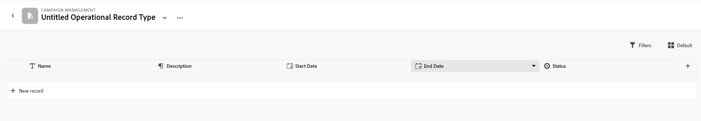

# Adobe Maestro overview

<!--udpate the metadata with real information when making this avilable in TOC and in the left nav-->

<!--see the separate article I wrote to have the PMs vet it for this: https://adobe-my.sharepoint.com/personal/alinaw_adobe_com/_layouts/15/doc.aspx?sourcedoc={79f94807-3d73-4015-afc0-5c016fc63cfc}&action=edit-->

<!--all the links are hidden for now, so I can share this with customer zero. Activate the links before making this public. -->

## Introduction to Adobe Maestro

Adobe Maestro is a new offering from Adobe Workfront whose purpose is to unlock comprehensive visibility into the operations details of an organization, and answer critical business questions at each stage of the work management lifecycle.  

Teams and leadership need clear answers to questions like:  

* How are my campaigns, current sales, or current developing products doing? Are we on track? 

* Which work should I prioritize next to have highest return on investment?  

To answer these questions, leadership needs a solution that can ensure a holistic view of every stage of work from planning to execution, from delivery to measuring the results. Currently, organizations have tools that can cover some part of the process, but not many have good connections to all phases of work nor can reliably provide end results.  

Maestro wants to solve the problem of managing work across all phases and for all the stakeholders that participate in the work process.  

With Maestro, you can fully customize your workflows, from deciding what object types your organization uses to deciding how these objects link to one another.  

Additionally, Maestro can link to object types from other systems, creating a coherent framework for all your processes.  

## Access required to use Maestro

<!-- the table will change after we implement access levels/ permissions for Maestro-->
<!-- fix the formatting on the table - some lines are way too spaced out-->

<table style="table-layout:auto">
 <col>
 </col>
 <col>
 </col>
 <tbody>
  <tr>
   <td role="rowheader">
Adobe Workfront plan*
</td>
   <td>

Any

<!--the above is only for closed beta; when going to GA - activate the following plans:    

Current plan: Prime and Ultimate

Legacy plan: Enterprise
-->
   </td>
  </tr>
  <tr>
   <td role="rowheader">
Adobe Workfront license*
</td>
   <td>
   
Any
 
  <!--
For more information, see <a href="../../administration-and-setup/add-users/access-levels-and-object-permissions/wf-licenses.md" class="MCXref xref">Adobe Workfront licenses overview</a>.
--> </td>
  </tr>
  <tr>
   <td role="rowheader">
Product
</td>
   <td>
   
 Adobe Workfront
 </td>
  </tr>
  <tr>
   <td role="rowheader">Access level*</td>
   <td> 
Any
  
</td>
  </tr>

<tr>
   <td role="rowheader">Layout template</td>
   <td> 
Your system administrator must add the Maestro area in your layout template. For information, see the "Enable Maestro for the users in your Workfront instance" section in this article. 
  
</td>
  </tr>
 </tbody>
</table>

<!--Activate note when going to GA: 

>[!NOTE]
>
>If you still don't have access, ask your Workfront administrator if they set additional restrictions in your access level. For information on how a Workfront administrator can change your access level, see [Create or modify custom access levels](../administration-and-setup/add-users/configure-and-grant-access/create-modify-access-levels.md). -->

## Maestro terminology

Although Maestro is part of Workfront, it comes with proprietary concepts and terminology. Ensure you are familiar with the Maestro concepts before embarking in setting up Maestro for your organization. 

The work frame for Maestro is fully customizable. You can create all object types, their attributes and any fields associated with them to suit the exact needs of your organization. 

The following are the main Maestro objects and concepts: 

* **Workspace**: A collection of record types and taxonomies that defines the workflow in a certain organization. This is the work frame of an organizational unit. 

    
    
    One Workfront instance may have 1,000 workspaces. 
    
    <!--For more information, see [Create workspaces](../maestro/create-workspaces.md).-->

* **Record Type**: The Maestro main object type.  
    
    Unlike Workfront where the object types were predefined, in Maestro, you can create your own object types.  
    
    For example, in Workfront the object types of Program, Portfolio, Project, Task, or Issue are already created.  
    
    In Maestro, you can create any object types that meet your organization's workflows. Later, you will be able to define how the record types relate to one another or form dependencies. 
    
    <!--For more information, see [Overview of operational record types and taxonomies](../maestro/overview-of-record-types-and-taxonomies.md). -->

    Maestro has the following record types: 

    * **Operational Record Type**: A record type that represents work objects.  

        

        For example, Campaign, Activity, Program can be operational record types.  

        <!--For more information, see [Create operational record types](../maestro/create-operational-record-types.md).-->

    * **Taxonomy**: A record type that captures attributes about an operational record type. 

        

        Although creating taxonomies is identical with creating operational record types,Maestro distinguishes between an operational record type and a taxonomy record type. The purpose of taxonomies is to enhance operational record types. <!--this is no longer true, but might be later?!: A taxonomy is a record without dates, like a static list of attributes.-->  

        For example, Audience, Region, or Address can be taxonomy-type record types.  

        <!--For more information, see [Create a taxonomy](../maestro/create-a-taxonomy.md).-->

* **Record**: An instance of a Maestro record type. 

    
    
    
    When a record type is added to a workspace, all its records also become visible in the record type's page. 

    For example, "Campaign" can be an operational record type and "Summer Campaign for EMEA" is a record of the Campaign record type 
    
    Or 
    
    "Region" is a taxonomy-type record type, whereas "Americas-Latin America" or "EMEA - Central Europe" are taxonomy records.  
    
    <!--For more information, see [Create records](../maestro/create-records.md). -->

* **Workspace template**: Templates define the initial workspaces, record types, taxonomies, fields and are created by Workfront for a customer after the onboarding questions are answered. 

    

    Maestro comes with a Sales, Marketing, and Product Management workspace template. 
    
    <!--For more information, see [Create workspaces](../maestro/create-workspaces.md). -->

* **Fields**: Fields are attributes that you can add to operational or taxonomy record types that contain information about the record type. 

    

    The fields added for a record type automatically become associated with all records of that type and can be used to capture data in those records. 

    Fields display in the view applied to the records (in columns, if the table view is applied) as well as on the Details page of the record. 
    
    When you create a record type, it comes with the following predefined fields: 

    * Name
    * Description
    * Start Date
    * End Date
    * Status

    The following are types of fields you can associate with Maestro record types:  

    * Number 
    * Percentage 
    * Currency 
    * Single-line text 
    * Paragraph 
    * Single-select 
    * Multi-select 
    * Date 
    * Relationship

    >[!NOTE]
    >
    >    * You can establish a connection between record types by adding a Relationship-type field to a record type. With this connection, you can reference the records and the fields of the linked record types from the original record type. 
    >
    >    <!--not yet:* Fields are reusable across Record Types.  -->

    <!--For more information, see [Create record type fields](../maestro/create-fields.md).-->   

* **Views**: Records display under their respective record type page in different types of views. 

    

    Views contain personalized settings of a specific view type, such as the list of fields (columns), a list of records (rows), their order (sort), an applied or applicable filter and grouping, or a timeline.  
    
    The following are views of records on the page of a record type: 

    * Table view. This is the default. 
    * Timeline view 

    Views include the filters and the groupings that are applied to the records displayed on the page.  

    <!--For more information, see [Manage record views](../maestro/manage-record-views.md). -->

## Maestro object limitations

The following table shows the limits for how many objects you can create in Maestro. The limitations are subject to change as we move into the next phases of Maestro's development.  

|       Maestro object                                                          |                                                        Limit                                                    |
|-------------------------------------------------------------------------------|:---------------------------------------------------------------------------------------------------------------:|
|     Number of Workspaces for one Workfront instance                                      |   1,000                                                                                                         |
|     Number of Record Types for one workspace                                            |   1,000 (this includes taxonomies for the workspace, or objects that you import from third-party applications)  |
|     Number of records for one record type                                               |   10,000                                                                                                        |
|     Number of fields for one record type or taxonomy                            |   500                                                                                                           |
|     Number of characters for a text fields                                                               |   1,000 characters                                                                                              |
|     Size of file that you can paste in a record type table                    |   1MB                                                                                                           |
|     Size of file that you can import through the API for a record type table  |   1.5MB                                                                                                         |
|     Rate at which API requests can be made                                    |   200 requests per minute                                                                                       |
| Size of CSV of Excel file you can import in a table | 10MB |

## Features currently available in Maestro

The following table illustrates the features that will be available in Maestro as well as a timeline of their availability:

|       Feature                                      |     Available in closed beta  |     Available after closed beta  |     In research  |
|----------------------------------------------------|:-----------------------------:|:--------------------------------:|:----------------:|
|     Create workspaces                              |   ✓                           |                                  |                  |
|     Create operational record types                |   ✓                           |                                  |                  |
|     Create taxonomies                              |   ✓                           |                                  |                  |
|     Create individual  records and taxonomies      |   ✓                           |                                  |                  |
|     Create record custom fields                    |   ✓                           |                                  |                  |
|     Link records                                   |   ✓                           |                                  |                  |
|     View records in a table                        |   ✓                           |                                  |                  |
|     View records in a timeline                     |   ✓                           |                                  |                  |
|     Filter records                                 |   ✓                           |                                  |                  |
|     Group records in the timeline view             |   ✓                           |                                  |                  |
|     Group records in the table view                |                               |   ✓                              |                  |
|     Sort records                                   |                               |   ✓                              |                  |
|     Link workspaces                                |                               |   ✓                              |                  |
|     Connect Maestro records to Workfront projects  |                               |   ✓                              |                  |
|     Record details page                            |   ✓                           |                                  |                  |
|     Update record details page layout              |                               |   ✓                              |                  |
| Access levels and permissions | | | ✓ |
|     Submit requests                                |                               |                                  |   ✓              |
|     Creative brief                                 |                               |                                  |   ✓              |

## Enable Maestro for the users in your Workfront instance

First, contact your account manager to obtain access to the current Maestro closed beta program. After your organization has been enrolled in the Maestro beta program, you can add the Maestro area to other users by using a layout template. 

To share the Maestro area using a layout template: 

1. Log in to Workfront as a system administrator.  

1. Add the Maestro icon to the Main Menu using a Layout Template. <!--For information, see [Customize the Main Menu using a layout template](../administration-and-setup/customize-workfront/use-layout-templates/customize-main-menu.md).  -->

1. Assign the  layout template to the users that you want to have access to Maestro. <!--For information, see [Assign users to a layout template](../administration-and-setup/customize-workfront/use-layout-templates/assign-users-to-layout-template.md). -->

    All users who can access Maestro in their Main Menu can start creating workspaces, records types, records, and fields.  
 
<!-- the important below will be removed with access levels/ permissions -->

>[!IMPORTANT]
>
>Currently, there are no access levels or permissions associated with users or the information in Maestro. All users can view, edit, and delete all the information any other user adds to Maestro. 

## Locate Maestro in Adobe Workfront

Ensure that your organization has received access to Maestro and that your system or group administrator has added the Maestro area to your Main Menu.  

To locate Maestro:  

1. Log in to Adobe Workfront. 

1. Click the **Main Menu**  in the upper-right corner, or click the **Main Menu**  in the upper-left corner, if it's available. 

1. Click **Maestro**. 

    The Maestro Workspaces area opens. 

1. (Optional and recommended) Continue with some of the following actions, to build your work structure in Maestro: 

    1. Create a workspace from scratch or using a template. 

    1. Add record types to the new workspace. 

    1. Add taxonomies to the new workspaces. 

    1. Click the name of a record type to open the record's page. The record page opens in the Table view, by default.
    
    1. Customize the Table view by doing any of the following:

        * Add more fields to the record type by clicking the **+** icon in the upper right corner. The columns in the view are fields associated with the record type. 
        * Add records by clicking the **+** icon in the lower-left corner. The rows in the view are unique records of the selected record type. 
        * Click **Filters** to filter the information you display on the record type page. 

    1. Click the name of a record to view more information in the record's Details page. 

    1. Create a Timeline view from the **View** drop-down menu in the upper-right corner of the record type page. 

    1. Customize the timeline view by updating Filters, Groupings, or Settings. 

    
