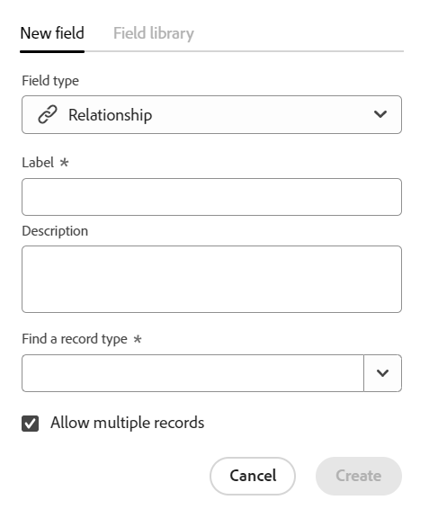
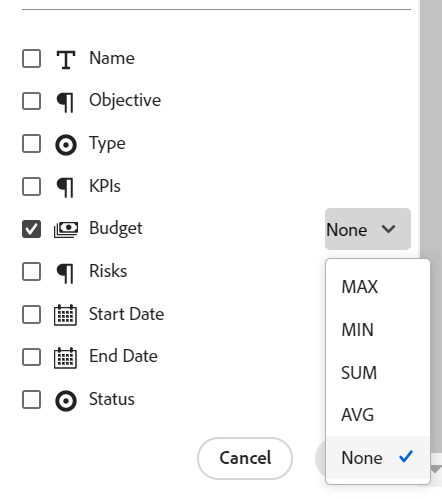
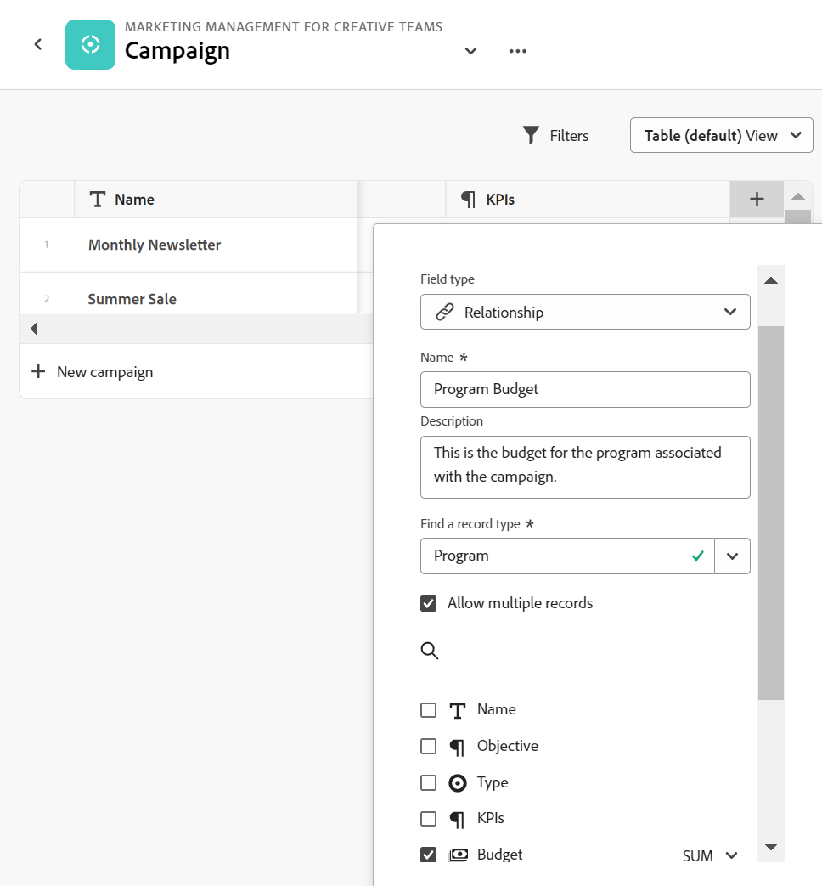
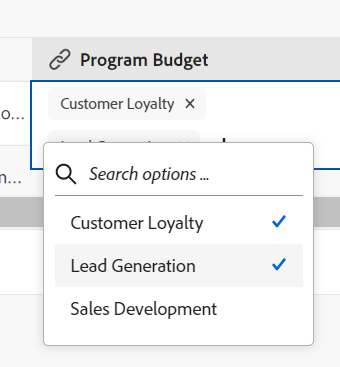
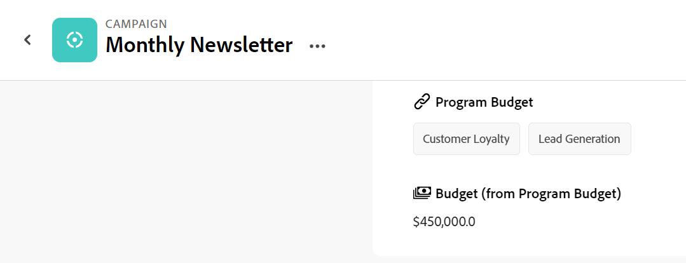
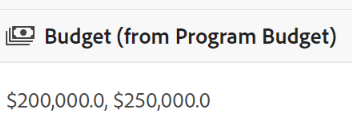

<!--udpate the metadata with real information when making this avilable in TOC and in the left nav-->

# Manage Relationship-type fields in Adobe Maestro

You can use a Relationship-type field to connect the following: 

* Maestro record types and their fields. 
* Maestro record types with objects from another applications and their fields. For more information, see [Connect Maestro records to Workfront objects](../maestro/connect-maestro-records-to-workfront-objects.md). <!--consider renaming this article to maybe something generic when we can link from other apps as well-->

By doing this, you can display fields from the linked record or object on another Maestro record.

## Access requirements

<table style="table-layout:auto">
 <col>
 </col>
 <col>
 </col>
 <tbody>
  <tr>
   <td role="rowheader">
Adobe Workfront plan*
</td>
   <td>

Any

<!--the above is only for closed beta; when going to GA - activate the following plans:    

Current plan: Prime and Ultimate

Legacy plan: Enterprise
-->
   </td>
  </tr>
  <tr>
   <td role="rowheader">
Adobe Workfront license*
</td>
   <td>
   
Any
 
  
For more information, see <a href="../../administration-and-setup/add-users/access-levels-and-object-permissions/wf-licenses.md" class="MCXref xref">Adobe Workfront licenses overview</a>.
 </td>
  </tr>
  <tr>
   <td role="rowheader">
Product
</td>
   <td>
   
 Adobe Workfront
 </td>
  </tr>
  <tr>
   <td role="rowheader">
Access level*
</td>
   <td> 
Any
  
</td>
  </tr>
<tr>
   <td role="rowheader">
Layout template
</td>
   <td> 
Your system administrator must add the Maestro area in your layout template. For information, see the "Enable Maestro for the users in your Workfront instance" section in the article <a href="../maestro/maestro-overview.md">Adobe Maestro overview</a>. 
  
</td>
  </tr>
 </tbody>
</table>

*If you still don't have access, ask your Workfront administrator if they set additional restrictions in your access level. For information on how a Workfront administrator can change your access level, see [Create or modify custom access levels](../administration-and-setup/add-users/configure-and-grant-access/create-modify-access-levels.md).

## Considerations about Relationship-type fields

* You can view fields other users create and fields created by you are visible to everyone who has access to Maestro. 
* A relationship-type field is a connection from one record type to another. The relationship-type field displays the record type you connect to. For this reason, we will refer to the relationship-type field as the "linked record field."
* You can add fields from the record types you connect. For this reason, we will refer to the fields that belong to the connected record types as "linked fields".
* You can select the records you connect to in the linked record type field. 
* You cannot select the values for the linked fields, as they automatically populate from the original record type they belong to.  
* You can edit linked record fields. You cannot edit linked fields. 

## Create a Relationship-type field

You can create a Relationship-type field to connect two record types and their fields together. 

1. Start creating a field for a record type, as described in the article [Create fields in Adobe Maestro](../maestro/create-fields.md), then select the **Relationship** field type. <!--check screen shot - logged a bug for a couple of changes here-->

    

1. Add the following information:
     * **Name**: The name of relationship-type field, as it will appear in the table view or the Details page of a record of the original record type. This creates the linked record column in the table view of the original record type or the linked record field for the original records. <!--ensure they updated this; and update the screen shot: it used to be "Label"-->

    >[!TIP]
    >
    >We recommend that you include the name of the record you are linking to in the name of the relationship-type field to capture what record type the new field is coming from. The name of the linked record is not visible in the new linked record field or its linked fields. 

     * **Description**: Additional information about the relationship-type field. The description of a field displays when you hover over the field's column in a table. 
     * **Find a record type**: The record type that you want to link to. This is the linked record. <!-- logged a bug to rename this to Linked record type-->
     * **Allow multiple records**: This allows you to select multiple records when the linked record type field displays on the original records. This is selected by default.

1. (Optional) Select the fields that belong to the linked record type that you want to display as linked fields on the original records. Use the **search** icon  to search for a field. 

    This creates the linked field columns in the table view of the record type. A column or a linked field is added for each field you add from the linked record. 

    If you don't select any of the fields, the Name of the linked record is the only visible field in the original record's table view and in the Details page of the record.  

1. (Optional and conditional) If you select to link a number, currency, percentage, or date-type field, also select how you want the values for the linked fields to be displayed, when users select more than one linked record in the linked record field. 

    

    Select from the following:

    * **None**: Displays the values that come from multiple records separated by commas. This is the default selection. 
    * **MAX**: Displays the highest value from all the values that come from multiple records selected in the linked record field. 
    * **MIN**: Displays the lowest value from all the values that come from multiple records selected in the linked record field. 
    * **SUM**:  Displays the total of all the values that come from multiple records selected in the linked record field.
    * **AVG**: Displays the average of all the values that come from multiple records selected in the linked record field.

    >[!NOTE]
    >
    >For example, you can link the Program record (linked record) from the Campaign record (original record). You also choose to link the Program Budget field from the Campaign record, and you select Program 1 with a Budget of $120,000 and Program 2 with a Budget of $100,000. You can view the following Budget information in the linked field from the original record, depending on which aggregator you choose: 
    >
    >* **None**: $120, 000, $100,000
    >* **MAX**: $120,000
    >* **MIN**: $100,000
    >* **SUM**: $220,000
    >* **AVG**: $110,000  <!--LEFT HERE on June 12-->

1. Click **Create**.

    The following fields (or columns) are added to the original record type in the table view:
        
    * The linked record field with the name you selected in step 2. <!--ensure this stays accurate--> 
    * The linked field from the linked record, which is named according to this pattern: 

        `<Name of the original field on the linked record> (from <Name of your linked field>)`

### Example of creating and updating a Relationship-type field

This section describes an example of how to create a field by linking record types together, as well as how to populate a linked field.  

For example, you have a record type named Campaign as your original record type. 

You also have another record type called Program, which has a currency field called Budget. 

You want to create a field on the record type of Campaign where you can show the values that users select for the Budget field on the record type Product. 

To do this:

1. Start by opening the table view for the Campaign record type. 
1. Click the **+** icon in the upper-right corner of the table view to add a new field, then expand the **Field type** drop-down menu and select **Relationship**. 
1. Add the following information, for example:

    * **Name**: Program Budget. This is the name of the linked record field. 
    * **Description**: This is the budget of the program associated with this campaign. 
    * * **Allow multiple records**: Leave this option selected. This allows users to select multiple records when the linked record type field displays on the original records.
1. From the list of fields associated with the **Program**, select the **Budget** field. This creates a field called **Budget (from Program Budget)**, which is the name of the linked field. 
1. (Optional and conditional) Select **SUM** in the drop-down menu to the right of the field name. When users select multiple programs in the **Program Budget** linked record field, the **Budget (from Program Budget)** field adds all their Budget values together and displays the total. <!-- check the shot below - added a bug with a couple of UI changes here-->

    

    This generates two fields in the Campaign record table view and two fields in the Details page of a campaign: 

    * Program Budget (the linked record field)
    * Budget (from Program Budget) (the linked field) 
1. To populate the **Program Budget** field, go to the **Campaign** record type table view. 
1. Create a campaign by adding a new row in the table, then expand the **Program Budget** field. Select a program or multiple programs from the list. 

    

1. Click outside the **Program Budget** field to save the values.
    The values for the **Budget** field on the programs selected displays as a total in the **Budget (from Program Budget)** field on the campaign. The same fields display on the Details page of a campaign.

    

    >[!TIP]
    >
    >When you do not select an aggregator for the multiple values, all values display separated by commas. 
    >
    >
