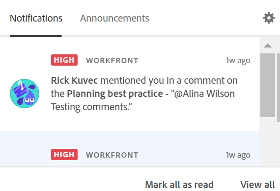

# Manage Adobe Workfront Planning in-app notifications

{{maestro-important-intro}}

When someone tags you in a record comment, you may receive an in-app notification for that tag. 

>[!IMPORTANT]
>
>Your company must be an Adobe Unified Experience customer to be able to receive notifications from Workfront Planning. 
>
>For information, see [Adobe Unified Experience for Workfront](/help/quicksilver/workfront-basics/navigate-workfront/workfront-navigation/adobe-unified-experience.md). 

For information about tagging others in a record comment, see [Manage record comments](/help/quicksilver/maestro/records/manage-record-comments.md). 

## Access requirements

You must have the following access to perform the steps in this article: 

<table style="table-layout:auto">
 <col>
 </col>
 <col>
 </col>
 <tbody>
    <tr>
<tr>
<td>
   
 Product
 </td>
   <td>
   
 Adobe Workfront
 
   
In order to receive notifications from Workfront Planning, your organization's instance of Workfront must be onboarded to the Adobe Unified Experience. For information, see <a href="/help/quicksilver/workfront-basics/navigate-workfront/workfront-navigation/adobe-unified-experience.md">Adobe Unified Experience for Workfront</a>.
</td>
  </tr>  
 <td role="rowheader">
Adobe Workfront agreement
</td>
   <td>

Your organization must be enrolled in the Adobe Workfront Planning beta program. Contact your account representative to inquire about this new offering. 

   </td>
  </tr>
  <tr>
   <td role="rowheader">
Adobe Workfront plan
</td>
   <td>

Any

   </td>
  </tr>
  <tr>
   <td role="rowheader">
Adobe Workfront license
</td>
   <td>
   
Any
 
  </td>
  </tr>
  
  <tr>
   <td role="rowheader">
Access level configuration
</td>
   <td> 
There are no access level controls in Workfront Planning. 
  
</td>
  </tr>
<tr>
   <td role="rowheader">
Permissions
</td>
   <td> 
View or higher permissions to a workspace</a> 
  
   
System Administrators have permissions to all workspaces, including the ones they did not create

</td>
  </tr>

<tr>
   <td role="rowheader">
Layout template
</td>
   <td> 
Your Workfront or group administrator must add the Planning area in your layout template. For information, see <a href="../access/access-overview.md">Access overview</a>. 
  
</td>
  </tr>
 </tbody>
</table>

## Manage in-app notifications

1. (Conditional) After someone tags you in a comment on a record, go to in-app **Notifications** icon  in Adobe Experience Cloud. 

    

1. Click the notification. 

    The record details page opens in Workfront Planning. You can make updates to the record, or reply to the comment. 

1. (Optional) Click **Mark all as read** to indicate that you have read all notifications.
1. (Optional) Click **View all** to go to the **Notifications** page in Adobe Experience Cloud. 