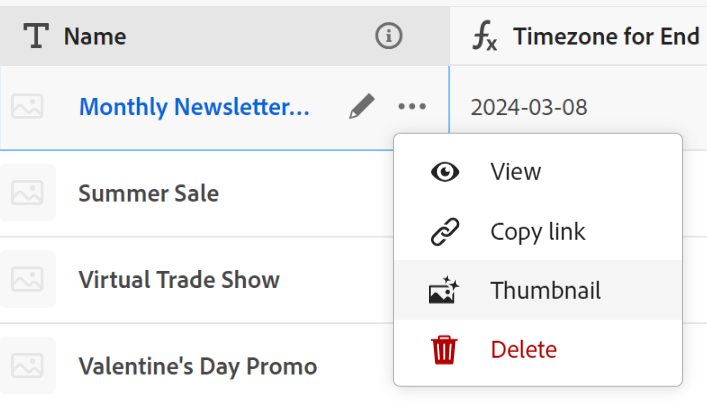
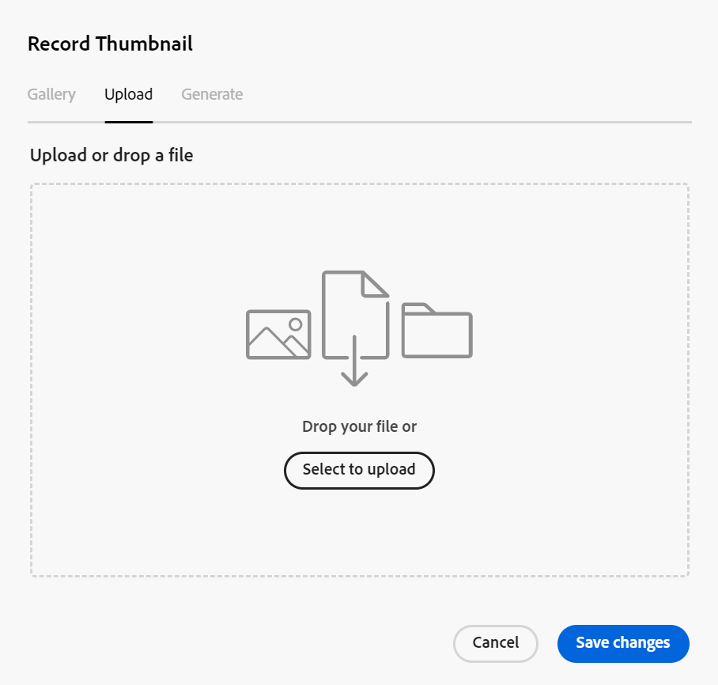
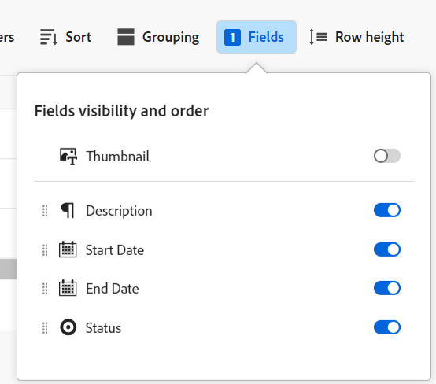

<!--update the metadata with real information-->

# Add thumbnails to records

{{maestro-important-intro}}

You can associate records with unique thumbnails in Adobe Maestro, to make them easily recognizable. 

You must create record types before you can start creating and editing records. 
For information, see [Create record types](../architecture/create-record-types.md).

## Access requirements

<!--************double-check permissions here - asking Isk and Lilit what permissions users need for adding thumbnails-->

You must have the following access to perform the steps in this article: 

<table style="table-layout:auto">
 <col>
 </col>
 <col>
 </col>
 <tbody>
    <tr>
<tr>
<td>
   
 Product
 </td>
   <td>
   
 Adobe Workfront
 </td>
  </tr>  
 <td role="rowheader">
Adobe Workfront agreement
</td>
   <td>

Your organization must be enrolled in the Adobe Maestro closed beta program. Contact your account representative to inquire about this new offering. 

   </td>
  </tr>
  <tr>
   <td role="rowheader">
Adobe Workfront plan
</td>
   <td>

Any

   </td>
  </tr>
  <tr>
   <td role="rowheader">
Adobe Workfront license
</td>
   <td>
   
Any
 
  </td>
  </tr>
  
  <tr>
   <td role="rowheader">
Access level configurations
</td>
   <td> 
There are no access controls for Maestro 
  
</td>
  </tr>
<tr>
   <td role="rowheader">
Permissions
</td>
   <td> 
Contribute or higher permissions to a workspace 
  
   
System Administrators have permissions to all workspaces, including the ones they did not create

</td>
  </tr>
<tr>
   <td role="rowheader">
Layout template
</td>
   <td>  
All users, including Workfront administrators,  must be assigned a layout template that includes the Maestro area in the Main Menu. 
 
For information, see <a href="/help/quicksilver/maestro/access/access-overview.md">Access overview</a>. 
  
</td>
  </tr>

 </tbody>
</table>

## Considerations about record thumbnails

To visually distinguish between records in a table view,  you can associate a unique thumbnail image with each record. 

Consider the following: 

* You can add only image files as thumbnails.
   <!--above: when you know exactly what type of files are allowed, add the exact extensions above-->
* You can add a thumbnail image to individual records in the table view. 
* Thumbnails belong to the record information and they display in views where records display. For example, thumbnails display alongside record information in the following areas:

   * The primary field of a record in the table view
   * The record bar in the timeline view. 
* You cannot add record thumbnails from the record's Details page or in the timeline view. 
* Thumbnails do not display in the record's Details page. 

## Add a thumbnail to a record

{{step1-to-maestro}}

1. Select the workspace for whose records you want to add thumbnails, then click the record type card. 

   This opens the record type page. 
1. Select a table view from the **View** drop-down menu. All records of the type you selected display in a table. 
1. Hover over the primary field information, click the **More** menu , then click **Thumbnail**. 

   

      >[!TIP]
      >
      >   The primary field is the field that displays in the first column of a table view. The primary field is always frozen and cannot be hidden or relocated. 

   The **Record thumbnail** box opens.

    

   <!--update screen shot with correct casing-->

1. In the **Upload** tab, drag and drop a file to add as a thumbnail
   Or
   Click **Select to upload**, then browse for an image file to add. The file must be saved on your computer. 
1. (Optional) Use the sizing tool to crop and resize the image.
1. Click **Use image** to add the image as a thumbnail. 
   This closes the **Record thumbnail** box.
1. (Conditional) If you have at least Contribute permissions to the table view, click **Fields** in the upper-right corner of the table view. 
1. Select the **Thumbnail** toggle to display the thumbnail. This is deselected by default. 

   

   The thumbnail displays to the left of the primary field value. 
1. (Optional and conditional) If you do not have Contribute or higher permissions to the view, select a new view from the **View** drop-down menu, or create a view. 
1. (Optional) To remove the thumbnail, hover over the primary field and click the **More** menu > **Thumbnail** > the **Remove** icon , then click **Save changes**. 
