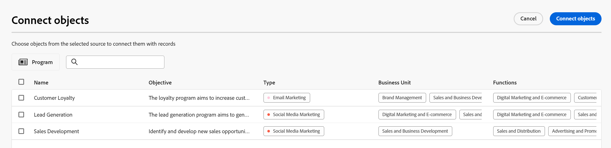
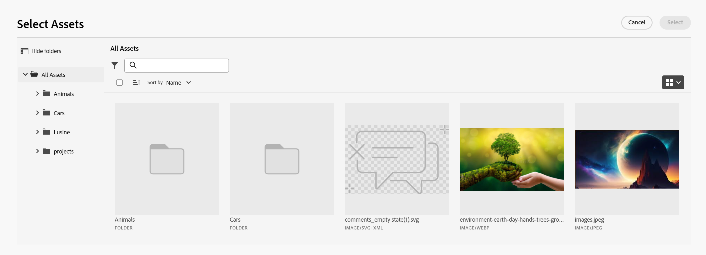
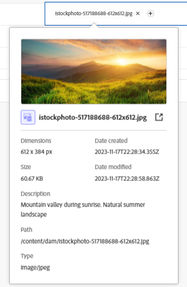
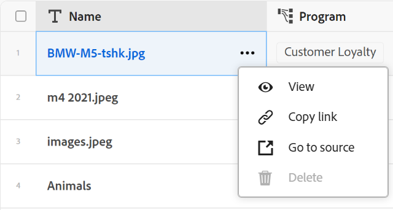

<!--when you make this live, update the metadata above to this: 
---
title: Connect records and objects
description: In addition to connecting Maestro records to one another, you can also connect Maestro records to objects from other applications.  
topic: Architecture
role: User
hidefromtoc: yes
hide: yes
---
-->
<!--udpate the metadata with real information when making this available in TOC and in the left nav-->

<!--if you change steps here, also update steps in the "Connect records" article-->

# Connect records 

>[!IMPORTANT]
>
>The information in this article refers to Adobe Maestro which is a new offering from Adobe Workfront. 
>
>Currently, Adobe Maestro is part of a beta program which is open to a limited number of customers. You must be a Workfront customer to use Maestro capabilities.
>
>Contact your account representative for more information about joining the beta program for Maestro.
>
>For information, see [Adobe Maestro overview](../maestro-overview.md).

You can connect Adobe Maestro records to one another or to objects from other applications. 

You must first connect two record types together or a record type to an object type from another application, and then you can use the Table view of the record type to connect records to one another or records to other objects. 

For information about connecting record types to one another or to object types from other applications, see [Connect record types](../architecture/connect-record-types.md). 

For an example of connecting record types, see [Example of connecting record types and records](../architecture/example-connect-record-types-and-records.md).

You can connect the following: 

* Maestro operational records 
* Maestro operational records to taxonomy records
* Maestro operational records and objects from other applications. 

  You can connect Maestro records to objects of the types listed below from the following applications:
  
  * Adobe Workfront

    * Projects
    * Portfolios
    * Programs
    * Company
    * Group

  * Adobe Experience Manager Assets

    * Image files
    * Folders

  <!--when you add more objects, fix the Access Requirements below which right now refer only to projects-->

## Access requirements

You must have the following access to perform the steps in this article: 

<table style="table-layout:auto">
 <col>
 </col>
 <col>
 </col>
 <tbody>
    <tr>
<tr>
<td>Product
 </td>
   <td>
   
 Adobe Workfront
 
   
To connect Maestro records with Experience Manager Assets, you must have an Adobe Experience Manager Assets license and your organization's instance of Workfront must be onboarded to the Adobe Business Platform or the Adobe Admin Console.

   </td>
  </tr>  
 <td role="rowheader">
Adobe Workfront agreement
</td>
   <td>

Your organization must be enrolled in the Adobe Maestro closed beta program. Contact your account representative to inquire about this new offering. 

   </td>
  </tr>
  <tr>
   <td role="rowheader">
Adobe Workfront plan
</td>
   <td>

Any

   </td>
  </tr>
  <tr>
   <td role="rowheader">
Adobe Workfront license
</td>
   <td>
   
Any
 
  </td>
  </tr>
  
  <tr>
   <td role="rowheader">
Access level configuration
</td>
   <td> 
There are no access level controls for Maestro
  
</td>
  </tr>
<tr>
   <td role="rowheader">
Permissions
</td>
   <td> 
Manage permissions to a workspace</a> 
  
   
System Administrators have permissions to all workspaces, including the ones they did not create

</td>
  </tr>

<tr>
   <td role="rowheader">
Layout template
</td>
   <td> 
Your Workfront or group administrator must add the Maestro area in your layout template. For information, see <a href="../access/access-overview.md">Access overview</a>. 
  
</td>
  </tr>

 </tbody>
</table>

<!--Maybe enable this at GA - but Maestro is not supposed to have Access controls in the Workfront Access Level: 
>[!NOTE]
>
>If you don't have access, ask your Workfront administrator if they set additional restrictions in your access level. For information on how a Workfront administrator can change your access level, see [Create or modify custom access levels](../administration-and-setup/add-users/configure-and-grant-access/create-modify-access-levels.md). -->

## Connect records

### Considerations about connecting records

* After you connect record types, the connected record types display as linked record fields in the table of the record types they are linked from. 
* You can browse and add records and objects of the linked record and object types from the linked record fields. 
* You can add fields from the linked record types to the table of the record type you are linking from. 
* You cannot manually update the values of linked fields on the records you are linking from. 

  The values of the linked fields from the linked records populate the Maestro record that you are linking from automatically from the Maestro workspace you configure or from the third-party application. 

* Everyone with access to Maestro and Manage permissions to the workspace can see the connections that you make between Maestro records or between Maestro records and other applications' objects. They can view connected records and objects regardless of their permissions on the third-party applications you are connecting to. <!--check with PM-->
* You can view and edit everyone else's connections, if you have Manage permissions to the workspace where the connected records are. 
* You can connect one Maestro record to one or multiple objects from another application.
* To link Maestro records with other records or objects, you must have the following:

  * At least one Maestro workspace, record type, and record. 

      For more information, see the following articles:

      * [Create workspaces](../architecture/create-workspaces.md)
      * [Create record types](../architecture/create-record-types.md)
      * [Create records](../records/create-records.md)

  * Connections between record types, or between record types and objects from other applications. For information, see [Connect record types](../architecture/connect-record-types.md)
  
### Connect Maestro records

{{step1-to-maestro}}

  The last-accessed workspace should open by default. 

1. (Optional) Expand the downward-pointing arrow to the right of an existing workspace name and select the workspace that you want to connect records from.
1. Click the card of a record type to open the record type page. 
1. Select a **Table** view from the **View** drop-down menu in the upper-right corner of the record type page. 
1. (Optional) Add records to the record type that you selected by adding a new row to the table. For information, see [Create records](../../maestro/records/create-records.md). 
1. From a record listed in the table view, go to the linked record column and hover over the cell corresponding to the record that you want to link with other records, then click the **+** icon. 

    The **Connect objects** box displays. 

    

1. Start typing the name of a record in the search box, then select it when it displays in the list

    Or

    Select the name of one or multiple records in the box, then click **Connect objects** in the upper-right corner of the Connect objects box. 

    The following are added:

    * The linked records display in the linked record field of the record that you selected in step 5. <!--accurate?--> Updating the linked records automatically updates the linked fields for the records that you are linking from. You cannot manually edit linked fields. 
        
        >[!TIP]
        >
        >*  We use "linked fields" and "lookup fields" interchangeably. 
        >
        >* If you enabled the **Allow multiple records** setting when you connected the record types, the values of fields for the multiple selected objects are either displayed separated by commas or are aggregated according to the aggregator you chose.
    
1. (Optional) Close the Maestro record type page and go to the workspace you selected. 
1. Click the card for the record type that you linked to. 

    For example, if you connected the **Campaign** record with the Product record, click the **Product** card. 
  
    The record type card should open in the Table view. If not, select a table view. 
  
    Notice that the **Campaign** linked record field displays the names of the campaigns you linked to products in the Product record type page. Updating the Campaign information automatically updates the Campaign linked record field for the Product record type. 

### Connect Maestro records to Workfront objects

<!--when we will have more applications to link to from Maestro, change the title to soemthing like: Connect Maestro records to objects from other applications-->

After you created a connection between a Maestro record type and a Workfront object type, you can connect individual Maestro records to objects in Workfront. The Workfront fields you connected are automatically populated on the Maestro records you are linking the objects from.

{{step1-to-maestro}}

  The last-accessed workspace should open by default. 

1. (Optional) Expand the downward-pointing arrow to the right of an existing workspace name and select the workspace that you want to connect records from.
1. Click the card of a record type to open the record type page. 
1. Select a **Table** view from the **View** drop-down menu in the upper-right corner of the record type page.

1. (Optional) Add individual records to the record type that you selected by adding a new row to the table. For information, see [Create records](../../maestro/records/create-records.md). 
1. (Conditional) If you connected the selected record type with a Workfront object, go to  the linked object column and hover over the cell corresponding to the record that you want to link with objects from Workfront, then click the **+** icon. 

    The **Connect objects** box displays. 

    

    For more information about connecting record types with objects from a third-party application, see [Connect record types](../architecture/connect-record-types.md). 

1. Start typing the name of a Workfront object in the search box, then select it when it displays in the list

    Or

    Select the name of one or multiple objects in the box, then click **Connect objects** in the upper-right corner of the Connect objects box. 

    The following are added: 

    * The selected Workfront objects are added to the linked record field. 
    * If you added them when you connected the record type with Workfront, the linked fields (or the lookup fields) are automatically populated with information from Workfront. 
    * A new record type called "< Name of the Workfront object type >" is created in the same workspace as the Maestro record you are linking from. The name of the object is part of this record type's name. For example, linking to Workfront projects creates the **Project** record type in Maestro. 

      This is a read-only record type and it displays Workfront objects that are selected in the new linked object field you created from the Maestro record. The linked fields of the linked object also display on the read-only linked Workfront records.

      >[!IMPORTANT]
      >
      > The read-only Workfront object record type is created only when individual projects are added to Maestro records. Simply creating a connection between a Maestro record type and a Workfront object type does not create the Workfront record type. 

       Any existing information from the fields of the Workfront objects displays in the linked or lookup fields. 

        >[!TIP]
        >
        >
        >* If you enabled the Allow multiple records setting, the values of the multiple objects are either displayed separated by commas or are aggregated according to the aggregator you chose.
        >
        >* A linked record field to the Maestro linked records is not created for the linked Workfront objects in Workfront. 
      
    
1. (Optional) Close the Maestro record type page and go to the Workspace you selected. 
1. (Optional) Click the card for the Workfront object record type. For example, click the **Project** card, if you linked to Workfront projects. The read-only Workfront record type card should open in the table view. 

    The records listed in the Workfront record type page are read-only Workfront objects that have been linked from Maestro records. The fields linked from the Workfront record type also display as read-only columns and they are populated automatically when they are populated in Workfront.

1. (Optional) To open the Workfront object record Details page in Maestro, do one of the following:

    * From the record type you linked from, go to the Workfront object linked record field and click the name of the Workfront object.
    * From the **Table** view of the Workfront record type page, click the name of the Workfront object

      Or

      Click the **More** menu to the right of the Workfront object name,then click **View**. 

      

    This opens the Maestro Details page of the linked Workfront object. This is a read-only page. 

1. (Optional) To open the linked Workfront object in Workfront, do one of the following:

    * From the **Table** view of the Workfront record type page, click the name of the Workfront object to open the Project record in Maestro
  
    Or

    Click the **More** menu to the right of the Workfront object name, then click **Go to source**. 

    

    This opens the Workfront object page. You can edit information about the Workfront object, if you have permissions to do so. 

1. (Optional) From the read-only Workfront object record page in Maestro, click the **Add fields** icon  in the upper-right corner of the table view, to add or remove Workfront fields from the Workfront record type.

    >[!NOTE]
    >
    >  The fields you add or remove in the Workfront object record type page are not added nor removed from the Maestro record type that links to the Workfront object type. The fields are only visible on the read-only Workfront record type page, so you can review them in Maestro.

1. (Optional and conditional) If you added at least two date fields to the Workfront object, Click the **View** drop-down menu in the Workfront object record type page and select the **Timeline** view or **Create view** to create a timeline view.  For information, see [Manage the timeline view](/help/quicksilver/maestro/views/manage-the-timeline-view.md).

    The Workfront linked objects display in the timeline view.

### Connect Maestro records to Adobe Experience Manager objects

<!--when we will have more applications to link to from Maestro, change the title to soemthing like: Connect Maestro records to objects from other applications-->

>[!IMPORTANT]
>
>You must have an Adobe Experience Manager Assets license, and your organization's instance of Workfront must be onboarded to the Adobe Business Platform or the Adobe Admin Console to be able to connect Maestro records to Adobe Experience Manager Assets.
>
>If you have questions about onboarding to the Adobe Admin Console, see the [Adobe Unified Experience FAQ](/help/quicksilver/workfront-basics/navigate-workfront/workfront-navigation/unified-experience-faq.md).

After you created a connection between a Maestro record type and Adobe Experience Manager Assets, you can connect individual Maestro records to Experience Manager assets. The asset fields you connected from Experience Manager Assets when you created the connection automatically populate on the Maestro record type you linked from.

{{step1-to-maestro}}

  The last-accessed workspace should open by default. 

1. (Optional) Expand the downward-pointing arrow to the right of an existing workspace name and select the workspace that you want to connect records from.
1. Click the card of a record type to open the record type page. 
1. Select a **Table** view from the **View** drop-down menu in the upper-right corner of the record type page.

1. (Optional) Add individual records to the record type that you selected by adding a new row to the table. For information, see [Create records](../../maestro/records/create-records.md). 
1. (Conditional) If you connected the selected record type with Experience Manager Assets, go to the linked object column and hover over the cell corresponding to the record that you want to link with other objects from Experience Manager, then click the **+** icon. 

    The **Select Assets** box displays. <!--update screen shot with actual assets-->

    

    For more information about connecting record types with objects from a third-party application, see [Connect record types](../architecture/connect-record-types.md). 

1. Click to select some of the following types of assets:

    * Images
    * Folders

    You can select multiple assets. 

    >[!IMPORTANT]
    >
    > You can connect only assets you have access to view in Experience Manager. Once connected, all Maestro users can view the assets in Maestro, regardless of their access in Experience Manager Assets. 

1. Click **Select**. 

    The following are added: 

    * The selected Experience Manager assets are added to the linked record field. 
    * The linked fields (or lookup fields) populate with information from the Experience Manager connected assets. 
    * A new record type called "Experience Manager Assets" is created in the same workspace as the Maestro record you are linking from. <!--is this still added?-->

      This is a read-only record type and it displays Experience Manager assets that are selected in the new linked object field you created from the Maestro record. The linked fields of the linked object also display on the read-only linked Experience Manager records.

      >[!IMPORTANT]
      >
      > The read-only Experience Manager Assets record type is created only when individual assets are added to Maestro records. Simply creating a connection between a Maestro record type and Experience Manager Assets does not create the Experience Manager Assets record type. 

       Any existing information from the fields of the Experience Manager assets displays in the linked or lookup fields. 

        >[!TIP]
        >
        >
        >* If you enabled the Allow multiple records setting, the values of the multiple objects display separated by commas.
        >
        >* A linked record field to the Maestro linked records is not created for the linked Experience Manager assets in the Experience Manager Assets application. 
     
    
1. (Optional) Close the Maestro record type page and go to the workspace you selected. 
1. Click the card for the Experience Manager Assets record type. The read-only Experience Manager Assets record type card should open in the Table view. 

    The records listed in the Experience Manager Assets record type page are read-only assets. The fields linked from the Experience Manager Assets record type also display as read-only columns and they are populated automatically when they are populated in Experience Manager.

1. (Optional) Go to the record type you linked to Experience Manager Assets from and click the name of an asset in the linked record field. The Experience Manager details of the asset display in a pop-up window. <!--update screen shot with hi-rez picture-->

    

    The following fields display for an image file:

    * A thumbnail of the image
    * The image file name
    * Dimensions
    * Size
    * Description
    * The file path in Experience Manager
    * The asset type
    * Date created
    * Date modified 

1. (Optional) To open the Experience Manager Assets record Details page in Maestro, do the following: 
  
    1. Go to the **Experience Manager Assets** Maestro record type card in the same workspace you originally selected and click to open the record type page.
    The Experience Manager Assets Maestro record type page is read-only.
    1. From the table view, click the name of an asset

        Or

        Hover over the name of an asset, click the **More** menu  to the right of the asset name, then click **View**.  
        This opens the asset's Maestro **Details** page. This is a read-only page. 
1. (Optional) To open the Experience Manager assets record Details page in Experience Manager, do one of the following: 

    * Go to the Maestro record type page of the record you are linking from, click the name of an asset in the linked record field to open the pop-up window, then click the **Open** icon  to open the asset. 
    * Go to the **Experience Manager Assets** Maestro record type card in the same workspace you originally selected and click to open the record type page, click the name of an asset to open the Maestro **Details** page, then click **Go to source** in the upper-right corner of the screen. 

      
    * Go to the **Experience Manager Assets** Maestro record type card in the same workspace you originally selected and click the card to open the Experience Manager Assets record type page, hover over the name of an asset, click the **More** menu, then click **Go to source**. 

      

    The asset opens in Experience Manager Assets. 

1. (Optional) Click the **Add fields** icon  in the upper-right corner of the table view on the Experience Manager Assets record type page, to add or remove Experience Manager fields.

    >[!NOTE]
    >
    >  The fields you add or remove in the Experience Manager Assets record type page are not added nor removed from the Maestro record type that links to the Experience Manager asset. The fields are only visible on the read-only Experience Manager Assets record type page, so you can review them in Maestro.

1. (Optional and conditional) If you added at least two date fields to the Experience Manager linked asset, click the **View** drop-down menu in the Experience Manager Assets record type page and select the **Timeline** view or **Create view** to create a timeline view.  For information, see [Manage the timeline view](/help/quicksilver/maestro/views/manage-the-timeline-view.md). 
The Experience Manager Assets linked assets display in the timeline view.