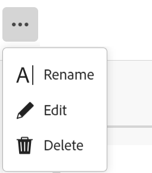

<!--udpate the metadata with real information when making this available in TOC and in the left nav-->

# Delete records

>[!IMPORTANT]
>
>Currently, Adobe Maestro is part of a closed beta program which is open to a limited number of customers. 
>
>Contact your account representative for more information about joining the beta program for Maestro.
>
>For information, see [Adobe Maestro overview](../maestro-overview.md).

You can delete records that are no longer relevant in Adobe Maestro. 

## Access requirements

You must have the following access to perform the steps in this article: 

<table style="table-layout:auto">
 <col>
 <tbody>
<td>
   
 Adobe product
 </td>
   <td>
   
 Adobe Workfront
 </td>
  </tr>  
 <td role="rowheader">
Adobe Workfront agreement
</td>
   <td>

Your organization must be enrolled in the Adobe Maestro closed beta program. Contact your account representative to inquire about this new offering. 

   </td>
  </tr>
  <tr>
   <td role="rowheader">
Adobe Workfront plan
</td>
   <td>

Any

   </td>
  </tr>
  <tr>
   <td role="rowheader">
Adobe Workfront license
</td>
   <td>
   
Any
 
  </td>
  </tr>
  
  <tr>
   <td role="rowheader">Access level</td>
   <td> 
Any
  
</td>
  </tr>
<tr>
   <td role="rowheader">Layout template</td>
   <td> 
Your system administrator must add the Maestro area in your layout template. For information, see <a href="../access/grant-access.md">Grant access to Adobe Maestro</a>. 
  
</td>
  </tr>
 </tbody>
</table>

<!--Maybe enable this at GA - but Maestro is not supposed to have Access controls in the Workfront Access Level: 
>[!NOTE]
>
>If you don't have access, ask your Workfront administrator if they set additional restrictions in your access level. For information on how a Workfront administrator can change your access level, see [Create or modify custom access levels](../administration-and-setup/add-users/configure-and-grant-access/create-modify-access-levels.md). -->

<!-- Notes to add for the table: for the "Workfront plans" row: the above is only for closed beta; when going to GA - activate the following plans:    

Current plan: Prime and Ultimate

Legacy plan: Enterprise
-->

<!-- Notes for the table: for the "Workfront access" row: 
For more information, see <a href="../../administration-and-setup/add-users/access-levels-and-object-permissions/wf-licenses.md" class="MCXref xref">Adobe Workfront licenses overview</a>.
--> 

## Considerations about deleting records

* You can delete records that you or another user created. 
* You cannot recover deleted records. <!--the above statements (and in the metadata description) will change with access levels and recycle bin??-->
* If the deleted records are linked to other records, the linked records are not deleted, but the information from the deleted record is also deleted. 
* You cannot delete records in bulk. <!--this will probably change-->
* You cannot delete records from the timeline view. 

## Delete records

You can delete a record from the following areas:

* [From the Details page of a record](#delete-a-record-from-the-records-details-page)
* [From the table view of a record type](#delete-a-record-from-the-record-type-table-view) 

### Delete a record from the record's Details page

1. Click the **Main Menu**  in the upper-right corner, or the **Main Menu**  in the upper-left corner, if it is available, then click Maestro. 

    The workspace that you access last opens. 
1. Click a record type. 

    The record type page opens. 
1. Do one of the following:

    * From a Table view, click the name of a record. 
    * From the Table view, hover over the name of a record, then click the **More** menu , then click **View**

        
    * From a Timeline view, click a record bar. 

    The record **Details** page opens.  
  
1. Click the **More** menu  to the right of the record name, then click **Delete**, then **Delete** again to confirm. 

     <!--ensure the options have not changed or been renamed-->
    The record is deleted and cannot be recovered. 

### Delete a record from the record type table view

1. Click the **Main Menu**  in the upper-right corner, or the **Main Menu**  in the upper-left corner, if it is available, then click **Maestro**. 

    The workspace that you accessed last opens. 
1. Click a record type. 

    The record type page opens. 
1. (Conditional) From the **View** drop-down menu in the upper-right corner of the table, select a Table view. This should be the default view, unless you viewed the record type in the timeline view when you accessed it last. 

    The records associated with the selected record type display in the table view. 
1. Right-click a record row, then click **Delete**. 

    

    The record is deleted and cannot be recovered. 
