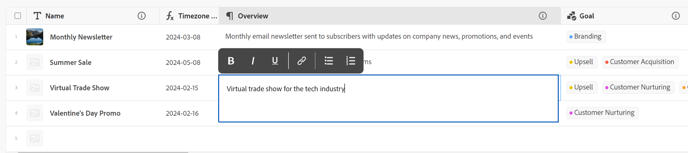
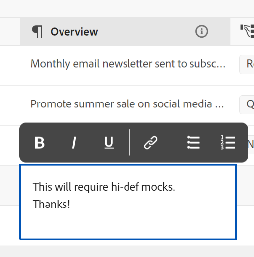

<!--update the metadata with real information when making this avilable in TOC and in the left nav-->

# Edit records

{{maestro-important-intro}}

You can edit record information in Adobe Workfront Planning by editing the values of the fields associated with the records. 

You must create record types before you can start creating and editing records. 

For information, see [Create record types](../architecture/create-record-types.md).

For information about creating records, see [Create records](/help/quicksilver/maestro/records/create-records.md). 

<!-- mention in here that the fields in the Details view are the same as the ones in the table view -- this article is linked from the Manage record views one to refer to this info-->

## Access requirements

You must have the following access to perform the steps in this article: 

<table style="table-layout:auto">
 <col>
 </col>
 <col>
 </col>
 <tbody>
    <tr>
<tr>
<td>
   
 Product
 </td>
   <td>
   
 Adobe Workfront
 </td>
  </tr>  
 <td role="rowheader">
Adobe Workfront agreement
</td>
   <td>

Your organization must be enrolled in the Adobe Workfront Planning beta program. Contact your account representative to inquire about this new offering. 

   </td>
  </tr>
  <tr>
   <td role="rowheader">
Adobe Workfront plan
</td>
   <td>

Any

   </td>
  </tr>
  <tr>
   <td role="rowheader">
Adobe Workfront license*
</td>
   <td>
   
New: Light or higher

   Or
   
Current: Work or higher
 
  </td>
  </tr>
  
  <tr>
   <td role="rowheader">
Access level configurations
</td>
   <td> 
There are no access controls for Adobe Workfront Planning
  
</td>
  </tr>
<tr>
   <td role="rowheader">
Permissions
</td>
   <td> 
Contribute or higher permissions to a workspace</a> 
  
   
System Administrators have permissions to all workspaces, including the ones they did not create

</td>
  </tr>
<tr>
   <td role="rowheader">
Layout template
</td>
   <td> 
Your Workfront or group administrator must add the Planning area in your layout template. For information, see <a href="../access/access-overview.md">Access overview</a>. 
  
</td>
  </tr>

 </tbody>
</table>

*For more information, see [Access requirements in Workfront documentation](/help/quicksilver/administration-and-setup/add-users/access-levels-and-object-permissions/access-level-requirements-in-documentation.md). 

## Considerations about editing records

* You can edit records that you created or records created by others, if you were given permissions to the workspace. 
* You can edit record fields from the following areas:

    * The record's box in a record view
    * The record's page
    * Inline, in a table view. 

* The following types of fields are automatically updated, and you cannot edit their values manually: 
    * Linked fields from other records
    * Formula-type fields
    * System fields (Created by, Created date, Last modified by, Last modified date) 
* If the records you display are linked to other records, the new information of the records that you are editing reflects on the linked records. 
* You cannot edit records in bulk. <!--this will probably change-->
* URLs are recognized as links in single-line text field types only when they start with the following: http://, https://, ftp://, or www. . 
* You can edit the order of the fields in a record page and add a cover image for a record. For more information, see [Manage the record page](/help/quicksilver/maestro/records/manage-the-record-page.md).

## Edit records

You can edit a record from the following areas:

* [From the table view of a record type](#edit-a-record-from-the-table-view-of-a-record-type)
* [From the record's box in a view](#edit-a-record-from-the-records-box-in-a-view)
* [From the record's page](#edit-a-record-from-the-records-page)

### Edit a record inline in the table view of a record type

{#step1-to-maestro}

  The workspace that you accessed last opens. 

1. (Optional) Click the downward-pointing arrow to the right of the workspace name to select the workspace whose records you want to update. 
1. Click a record type card. 

    The record type page opens. 
1. (Conditional) Click the tab of a table view or click **+ View** to create a table view. The table view should be the default view, unless you viewed the record type in another type of view when you accessed it last.

    The records associated with the selected record type display in the table view. 
1. Click inside the row of a record to start editing information about the record inline.

    

    >[!NOTE]
    >
    >  You cannot edit information for the following fields, as they are read-only and Workfront updates them automatically: 
    >  
    >  * Linked fields that are created by connecting record types. For more information, see [Connect record types](../architecture/connect-record-types.md).
    >  * Fields of the following types: Created by, Created date, Last modified by, Last Modified date, Formula fields.

1. (Optional and conditional) When you edit a Paragraph-type field, use the following **Rich Text** formatting options: 

    * Bold
    * Italic
    * Underline 
    * Add a link
    * Add a bulleted list
    * Add a numbered list

    

1. (Optional) Double-click a connected record field to add connected records or objects to another record. For more information, see [Connect records](/help/quicksilver/maestro/records/connect-records.md). 
1. Press **Enter** on your keyboard or click outside of a row to save your changes. The changes are saved automatically. A **Saved** indicator displays briefly in the upper-right corner of the table view to show that the changes were saved. 

1. (Optional) To copy and paste information from one field to another, do one of the following:

    * Copy one or multiple existing values of a field, then paste them into a field of the same type on another record
    * Click the column header of a column to select it and copy it, then click the column header of another column and paste the contents of the copied column. The columns must contain similar field types. 
    * With your Shift key pressed, click to select several rows in a table, copy the information in the selected rows, then click a different row and paste the selected information in the new row and the following rows after that. 

    >[!NOTE]
    >
    >Consider the following:   
    >
    >* Use the following keyboard shortcuts for copying and pasting information:
    >   * Copy: CTRL + C (⌘ + C for Mac)
    >   * Paste: CTRL + V (⌘ + V for Mac) 
    >* You cannot copy information from another source, other than a record field of the same type as the field you paste the information in.  
    >
    >* You cannot copy and paste field values in the record page. This functionality is supported only in the table view of a record type.  
    >* You cannot copy and paste field values for the following field types:   
    >
    >
    >    * Linked fields that are created by connecting record types. You can copy and paste linked record fields. For more information, see [Connect record types](../architecture/connect-record-types.md). 
    >    * Fields of the following types: Created by, Created date, Last modified by, Last Modified date 
    
1. (Optional) Use the following keyboard shortcuts to undo or redo editing or copying and pasting record information: 

    * CTRL + Z (⌘ + Z for Mac) to undo a change 
    * CTRL + Shift + Z (⌘ + Shift + Z for Mac) to redo a change 

    >[!TIP]
    >
    >    You can use the keyboard shortcuts multiple times in a row to undo multiple changes.

1. (Optional) Add a thumbnail to a record. For information, see [Add a thumbnail to a record](/help/quicksilver/maestro/records/add-thumbnails-to-records.md).

### Edit a record from the record's box in a view

{{step1-to-maestro}}

The workspace that you access last opens. 

1. (Optional) Click the downward-pointing arrow to the right of the workspace name to select the workspace whose records you want to update. 

1. Click a record type card. 

    The record type page opens. 

1. From a view of any type, click the name of a record 

    Or 
    
    From the table table view, click the **Open details** icon  to the left of a record name. The record's box opens in the view.

     

    >[!TIP]
    >
    >You can view the **Open details** icon to the left of the Name field of a record in a table view only when the Name field is a primary field. 

1. Start editing the field information in the record's box. Workfront automatically saves your changes. 

1. (Optional) Click the **Open in new tab** icon  <!--check the icon; they are changing it--> in the upper-right corner of the record's box to open the record's page in a new tab. Continue editing the record as described in [Edit a record from the record's page](#edit-a-record-from-the-records-page) section in this article. 

### Edit a record from the record's page

{{step1-to-maestro}}

The workspace that you access last opens. 

1. (Optional) Click the downward-pointing arrow to the right of the workspace name to select the workspace whose records you want to update. 

1. Click a record type card. 

    The record type page opens. 

1. Do one of the following:

    * From any view, access the record's box, as described in the [Edit a record from the record's box in a view](#edit-a-record-from-the-records-box-in-a-view) section in this article. Then, click the **Open in new tab** icon  <!--check the icon; they are changing it--> in the upper-right corner of the record box to open the record's page in a new tab. 

    * From the **Table** view, hover over the name of a record, then click the **More** menu , then click **View**

        
    
        The record page opens.

        

1. Click the **More** menu  to the right of the record name, then click **Edit**

    Or

    Click inside any editable field on the record page to edit the information. 

     <!--ensure the options have not changed or been renamed-->

1. Click **Save changes**. 