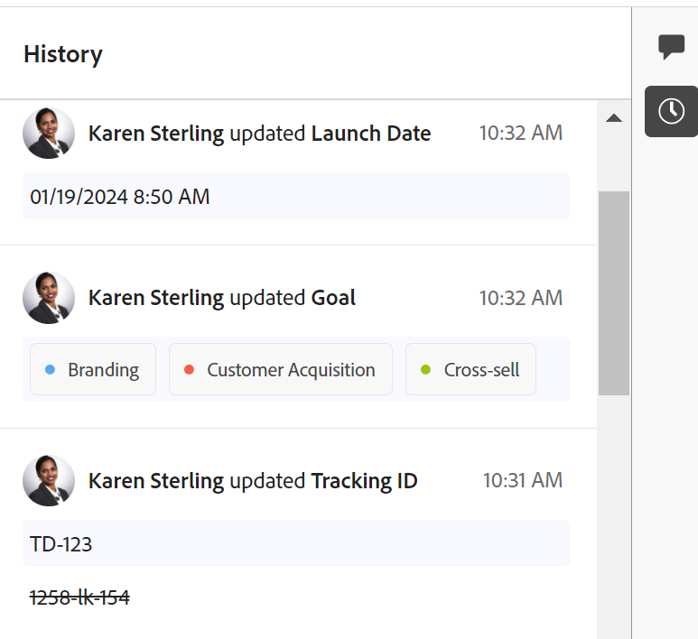

# History section overview

{{maestro-important-intro}}

<!--update the metadata with real information when making this available in TOC and in the left nav-->

<!--update the system updates articles when we release to open beta - check the long commenting stream article list and see articles that document where in the system we have system updates; "Maestro records" should be there-->

<!--The highlighted information on this page refers to functionality not yet generally available. It is available only in the Preview environment for all customers. 

For information about the current release schedule, see [First Quarter 2024 release overview](/help/quicksilver/product-announcements/product-releases/24-q1-release-activity/24-q1-release-overview.md). -->

You can collaborate on Adobe Workfront Planning records, by adding comments or replies in the right panel of a record. You can also view other changes made to the record and recorded by the system in this area.

The right panel of a record displays the following sections:

* **Comments**: Displays comments and replies users add to records. For more information about managing comments in Workfront Planning records, see [Manage record comments](/help/quicksilver/maestro/records/manage-record-comments.md). 
* **History**: Displays system-recorded changes that users  make to the record fields. 

## Locate the History section of a record

{{step1-to-maestro}}

   The last accessed workspace opens by default. 

1. Choose a table view from the **View** drop-down menu.
1. Click the name of a record in the table view. 

    The record's page opens. The Comments area opens by default in the right panel. 
1. Click the **Show History** icon . All changes made to the record's fields display in the right panel, starting with the most recent one. 
1. (Optional) Click the **Hide History** icon  to close the right panel.

## Considerations about the History section 

You can review the changes made to record fields in the History section of the right panel of a record's page. 

* Workfront Planning records the following information in the History section: 

    * Any field changes 

    * The old and the new values of fields, when the values change. The old values display in strikethrough format. 

    * The full name of the user who made the change 

    * A date and time stamp of when the change occurred. 

* Fields of the following types always display the old value (in strikethrough format) and the new value:

    * Text
    * Paragraph
    * Currency
    * Date
    * Number
    * Percentage
    * Single-select

* Fields of the following types show the old value in strikethrough format only if at least one of the multiple values was removed: 

    * Multi-select
    * Linked record fields
    * People
 
    If the change only added values to the field, the old value does not display and only the new field value displays.  

* Checkbox-type fields never display the old value in strikethrough format. If the field is edited, only the current state at the moment the change was made displays. 

    For more information about Workfront Planning fields, see [Create fields](/help/quicksilver/maestro/fields/create-fields.md). 

* Changes to fields of the following types do not display in the History section: 

    * Linked (lookup) fields
    * Formula
    * Created by
    * Created on date
    * Last modified by
    * Last modified date

* If a field is removed from the system, the updates made on that field remain in the History section. There is no indication that the field was removed in the History section of a record.
