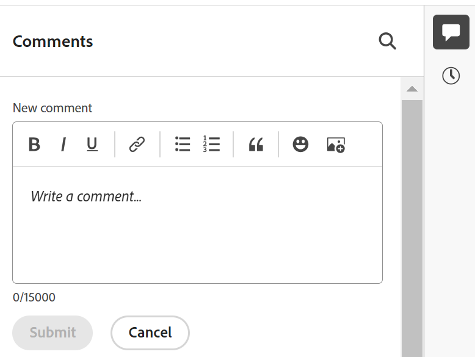
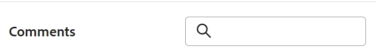

# Manage record comments

{{maestro-important-intro}}

<!--update the metadata with real information when making this available in TOC and in the left nav-->

<!--update the system updates articles when we release to open beta - check the long commenting stream article list and see articles that document where in the system we have system updates; "Maestro records" should be there-->

<!--The highlighted information on this page refers to functionality not yet generally available. It is available only in the Preview environment for all customers. 

For information about the current release schedule, see [First Quarter 2024 release overview](/help/quicksilver/product-announcements/product-releases/24-q1-release-activity/24-q1-release-overview.md). -->

You can collaborate on Adobe Workfront planning records, by adding comments or replies in the right panel of a record. You can also view other changes made to the record and recorded by the system in this area.

The right panel of a record displays the following sections:

* **Comments**: Displays comments and replies users add to records.
* **History**: Displays system-recorded changes that users  make to the record fields. For more information, see [History section overview](/help/quicksilver/maestro/records/history-section-overview.md).

## Considerations about commenting on a record

* You can add comments and replies to records in Workfront planning, in the Comments section of a record. 

* Comments added to linked records do not display on the records you are linking from. For example, if you comment on a Workfront planning Product record that is linked to a Campaign record, the comment displays only on the Product record in Workfront planning and not on the Campaign record from which you are linking. 

* You can add comments to Workfront planning records created as a result of a connection between a record and an object from another application. 
   
   For example, you can comment on the Project Workfront planning record after you connect Workfront projects with Workfront planning records. For more information, see [Connect records](/help/quicksilver/maestro/records/connect-records.md). 

* Comments added to linked objects in other applications do not display in Workfront planning and comments added to linked objects in Workfront planning do not display in other applications.  
   
   For example, comments added to projects in Workfront do not display on the same project linked to a campaign in Workfront planning, and comments added to the project Workfront planning record don't display in Workfront. 

* You can tag users to bring their attention to an update. Tagged users do not receive an in-app notification or an email about your update. <!--this might change??-->
   
* You can add an update to records and review the history of changes from the following areas of Workfront planning:

   * From the Details page of a record. 

   <!--* From the table view.-->

## Access requirements

You must have the following access to perform the steps in this article: 

<table style="table-layout:auto">
 <col>
 </col>
 <col>
 </col>
 <tbody>
    <tr>
<tr>
<td>
   
 Product
 </td>
   <td>
   
 Adobe Workfront
 </td>
  </tr>  
 <td role="rowheader">
Adobe Workfront agreement
</td>
   <td>

Your organization must be enrolled in the Adobe Workfront planning beta program. Contact your account representative to inquire about this new offering. 

   </td>
  </tr>
  <tr>
   <td role="rowheader">
Adobe Workfront plan
</td>
   <td>

Any

   </td>
  </tr>
  <tr>
   <td role="rowheader">
Adobe Workfront license
</td>
   <td>
   
Any
 
  </td>
  </tr>
  
  <tr>
   <td role="rowheader">
Access level configuration
</td>
   <td> 
There are no access level controls in Workfront planning. 
  
</td>
  </tr>
<tr>
   <td role="rowheader">
Permissions
</td>
   <td> 
View or higher permissions to a workspace</a> 
  
   
System Administrators have permissions to all workspaces, including the ones they did not create

</td>
  </tr>

<tr>
   <td role="rowheader">
Layout template
</td>
   <td> 
Your Workfront or group administrator must add the Planning area in your layout template. For information, see <a href="../access/access-overview.md">Access overview</a>. 
  
</td>
  </tr>
 </tbody>
</table>

### Manage comments on records

{{step1-to-maestro}}

   The last accessed workspace opens by default. 
1. Choose a table view from the **View** drop-down menu.
1. Click the name of a record in the table view. 

    The record's **Details** page opens. The Comments area opens by default in the right panel. 

1. (Conditional) If the right panel does not open by default, click the **Show Comments**  icon in the upper-right corner to open the Comments section. 

1. Start entering a comment in the **New comment** box. 
   
   

   >[!TIP]
   >
   >Navigating away from the Comments section before you finish typing and submitting a comment keeps the comment on the page in draft mode even after you log off and log back on. Any images that are added to the comment are also saved in the draft. Drafts are saved for 7 days after which they are discarded and cannot be recovered. Drafted comments are only visible to the user entering them.

1. (Optional) To undo or redo a change, use the following shortcut keys:
      * CTRL + Z (⌘+z for Mac) to undo a change 
      * CTRL + Y (⌘+y for Mac) to redo a change 
1. (Optional) Add **@** followed by the name of a user to tag someone in the update.  
1. (Optional) Use the options in the Rich Text toolbar to format your text, add emojis, links, or images to your update, to enhance your content. For more information, see the "Use Rich Text in a Workfront update" section in the article [Update work](../../workfront-basics/updating-work-items-and-viewing-updates/update-work.md). 

      >[!TIP]
      >
      >If another user submits a comment to the same item you are updating, there is a red line with a "New" indicator to inform you of the newer comments. 
      >
      >The indicator displays only after the comment was submitted on the item, and not when the comment is still composed. 
      >
      >

1. Click **Submit** to add the update to the record. 
1. (Optional) To edit a comment, click the **More** menu  in the upper-right corner of the comment, then click **Edit**.

   >[!IMPORTANT]
   >
   >You can edit your comment only within 15 minutes from submitting it.  

1. Edit the information in the comment, add or remove images or remove any of the tagged users. An "edited" indicator is added to the left of the comment.
   
      >[!TIP]
      >
      >Comments from the current year do not display the year in the date stamp. Hovering over a timestamp displays the full date, including the year.

1. (Optional and conditional) To search for an existing comment, start typing a keyword in the search box in the upper-right corner of the **Comments** area.     

   
     
1. (Optional) Click **Reply** or start typing a comment in the **Add reply ...** area, to reply to an existing comment, then follow steps 4-8 above. <!--(**************accurate??***********)-->  

1. (Conditional and optional) If other users have added comments that display outside of the visible area in the Comments section while you were adding your comments, click **View** inside the **new comments banner** at the bottom of the screen  to display these comments.

    

    Additional comments display at the bottom of the screen.
  
1. (Optional) Click the **Like** icon to like an update or acknowledge that you read it. The icon updates with the number of likes.
1. (Conditional and optional) If you included additional people in your comment, click the avatars of the users included in the update to display a list of users that the comment is shared with. 
1. (Optional) Click the **More** icon  in the upper-right corner of the comment and click one of the following options, to copy a information from a comment: 

    * **Copy link**: This copies a link to the comment to your clipboard.
    * **Copy body text**: This copies the text of the comment to your clipboard.
    * **Quote reply**: This copies the content of your comment into a new reply. Images are not included in the copied reply. 

    For more information, see [Update work](../../workfront-basics/updating-work-items-and-viewing-updates/update-work.md). 
1. (Optional) Click the **More** icon  in the upper-right corner of the comment, then click **Delete** to delete the comment. 
1. (Optional) Click the **Hide Comments** icon  to close the right panel. 

## History section overview

You can review the changes made to the record in the History section of the right panel of a record. 

For more information, see [History section overview](/help/quicksilver/maestro/records/history-section-overview.md).
